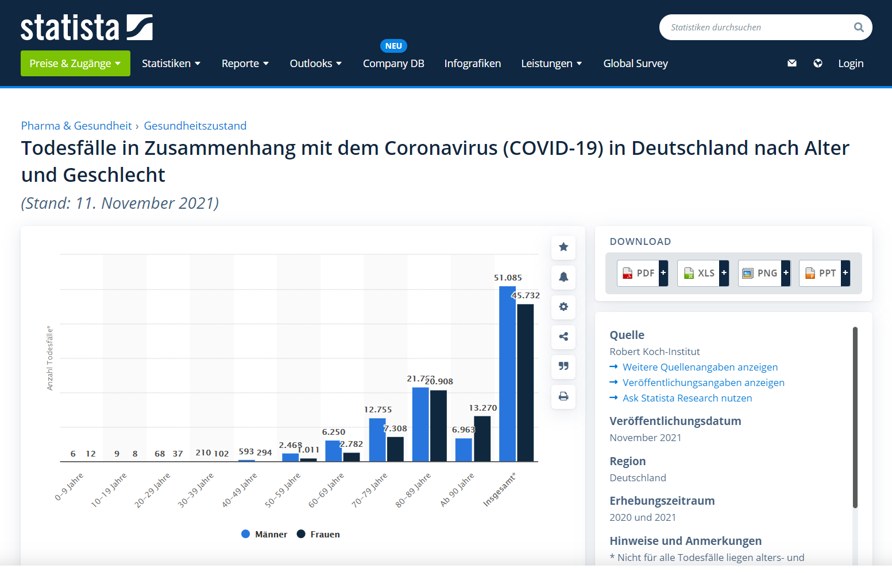
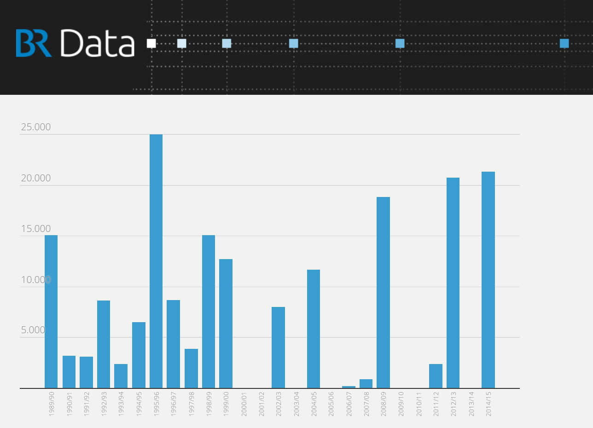
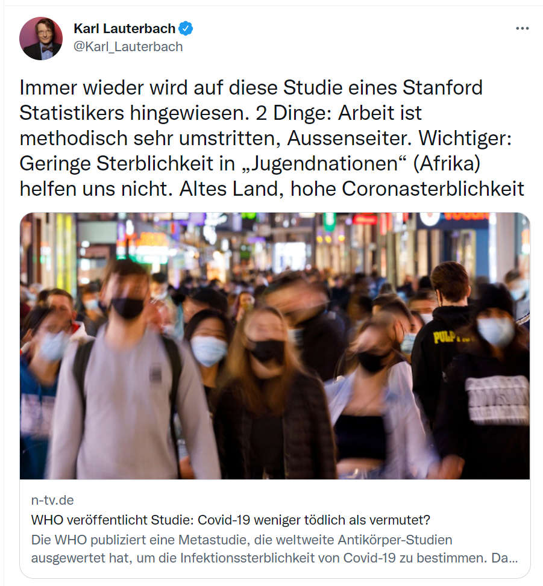
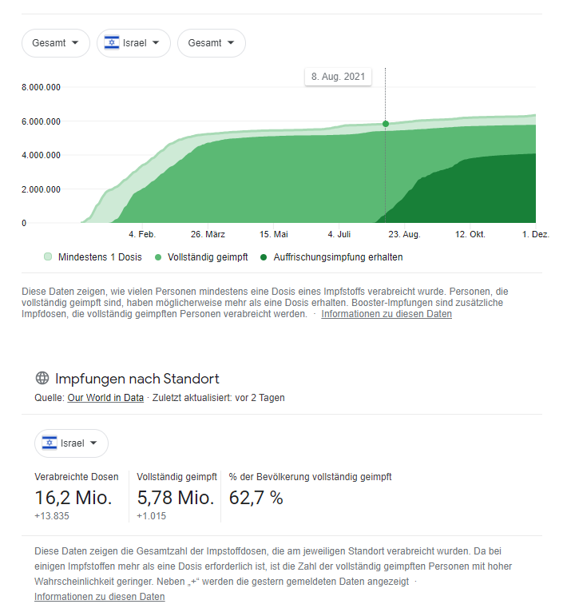
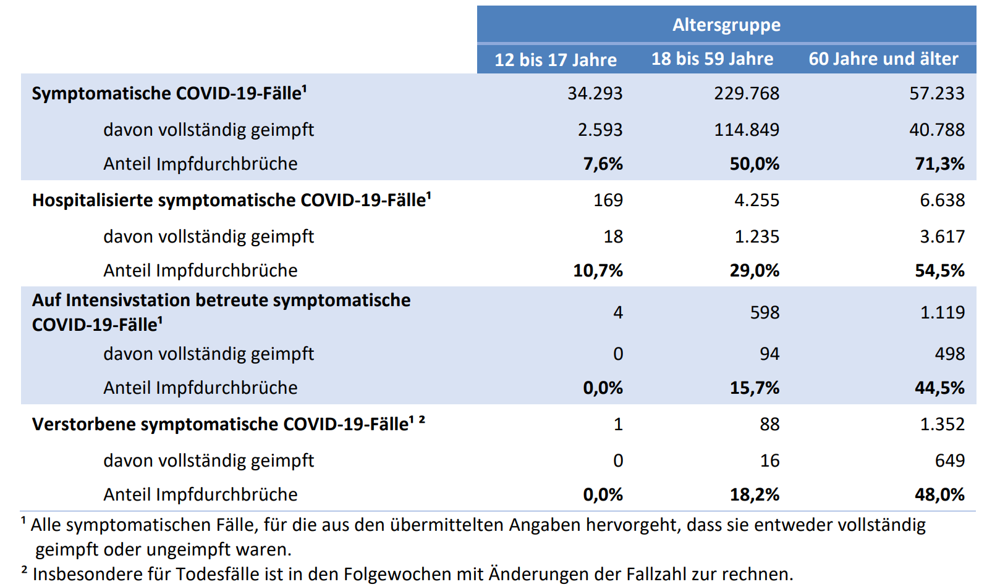
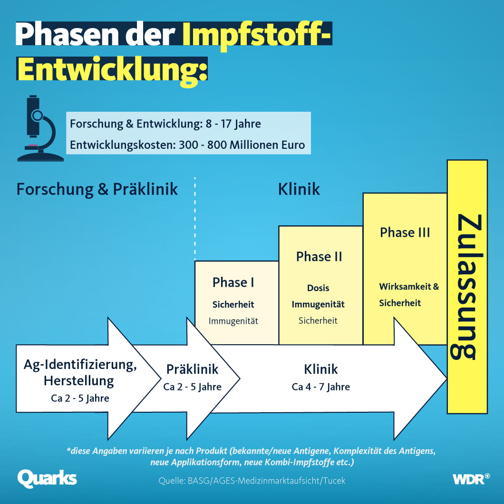
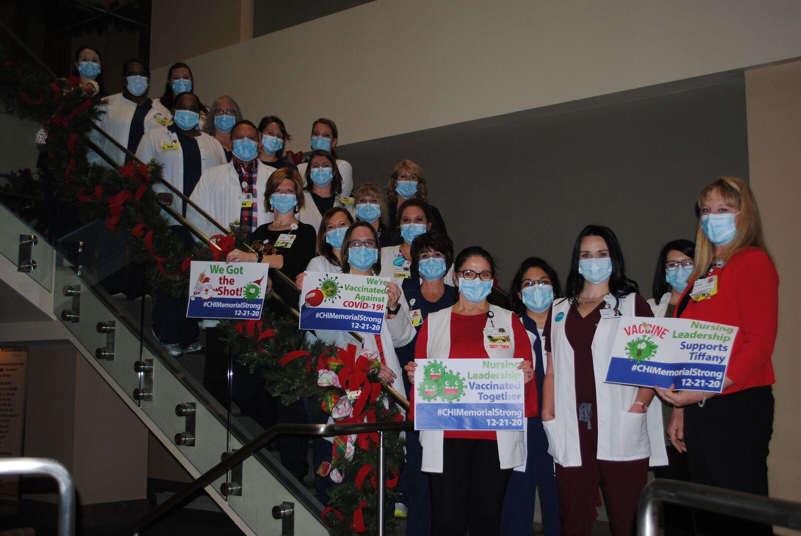
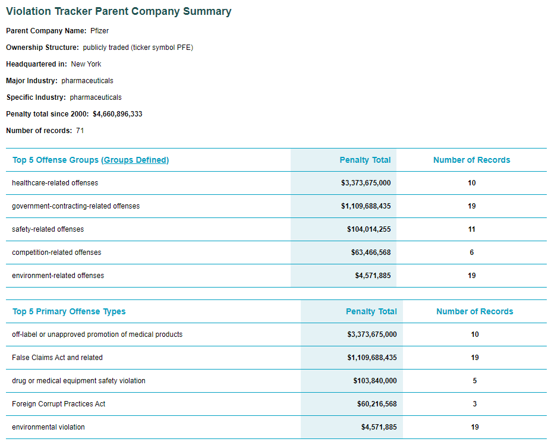
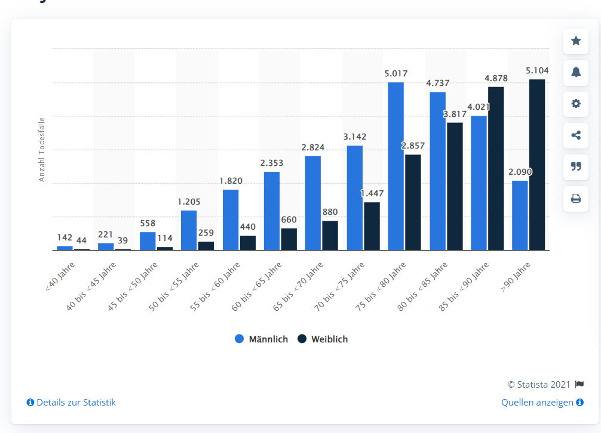

= Warum bin ich nicht gegen COVID geimpft?
:toc: left
:sectnums:
:xrefstyle: short

[quote, Noam Chomsky]

Impfverweigerer sollten den Anstand haben, sich aus der Gemeinschaft zu entfernen. [..] Wie sie an Nahrungsmittel kommen, ist ihr Problem.footnote:abc[Der inzwischen hochbetagte Intelektuelle gilt als Vordenker der politschen Linken https://thecord.ca/noam-chomsky-makes-comments-about-people-who-refuse-to-be-vaccinated-against-covid-19/[Orginalquelle], deutsche Übersetzung https://reitschuster.de/post/wie-das-impf-narrativ-kollabiert/[reitschuster.de] ]

== Wir müssen reden... Vorbemerkungen

Angesichts immer schärfer Vorwürfe gegen die COVID-Impfverweigerer im öffentlichen Diskurs und dem Gefühl in der medialen Darstellung misrepräsentiert zu werden, möchte ich hier als Betroffener meine Position begründen. Ziel ist nicht die Missionierung, vielmehr möchte ich für Toleranz werben und dafür, dass die Entscheidung über die Impfung freiwillig bleibt.

Ich versuche meine Familie und mich möglichst gesund durch diese schwierige Zeit bringen und verweigere die Impfung, weil ich die Gefahren gegenüber dem Nutzen als größer bewerte. Der vielfach in wohlmeinender Absicht geäußerte Analogie mit Rauchern, Trinkern, Extremsportlern geht fehl - ich gehe nicht aus Genusssucht oder Abenteuerlust Risiken ein, sondern versuche im Gegenteil, Risiken zu minimieren.

*Impfverweigerer sind keine Egoisten - sie bewerten Risiken und Nutzen der Impfung anders*

Politikern und Medien bringen vor, das Recht auf körperliche Unversehrtheit bedrohe das allgemeine Interesse nach Aufrechterhaltung des Gesundheitssystems.
Die Impfverweigerung deuten sie als Egoismus, der zulasten der Gesellschaft ausgelebt werde.

Das ist falsch! Mein Ziel ist der Erhalt meiner Gesundheit, damit kann ich nicht gleichzeitig das Gesundheitssystem belasten. Allerdings lehne ich die vorgeschlagenen Mittel, insbesondere die Impfung aufgrund einer Nutzen-Risiko-Betrachtung als untauglich ab - die Gründe für meine Bewertung werde ich unten ausführlich darlegen. Ausgehend von dieser Einschätzung ist es mir sogar moralisch geboten, mich nicht an dieser in meinen Augen schädlichen Maßnahme zu beteiligen.

Nun wären Transparenz, und ein Austausch von Argument und Gegenargument das probate Mittel im Umgang mit unterschiedlichen Meinungen. Dabei ist es auch mit guten Argumenten unrealistisch, 100{nbsp}% Zustimmung zu erhalten und am Ende ist das zu akzeptieren - schließlich sieht sich unsere Gesellschaft als pluralistisch und tolerant. Wer diesen Dissens nicht zu akzeptieren bereit ist, kann gleich jede Mitbestimmung eines Patienten in medizinischen Fragen streichen und das Votum von Expertengremien an ihre Stelle setzen.

Stattdessen geht man lieber den Weg von Zwang und Zensur - das führt ggf. kurzfristig zur Unterwerfung, aber eben nicht zu Überzeugung und wer sich erpresst fühlt, der wird das auferlegt Joch bei erster Gelegenheit wieder abwerfen. Ich plädiere dafür, den rationalen Diskurs wieder aufzunehmen, der in einer demokratischen Gesellschaft die Meinungsbildung moderieren sollte.

*Eine nicht verhandelbare Wahrheit, festlegt von Experten ist Ideologie, nicht Wissenschaft*

In den letzten Jahren setzt sich die Vorstellung durch, es gebe eine objektive Wahrheit, die durch Medien und Politik unter Berufung auf (ausgewählte) Wissenschaftler vorgegeben wird.
Wer sich dieser Wahrheit verweigert, wird zunächst mit geheucheltem Verständnis als "falsch informiert" bezeichnet, wenn er sich als renitent erweist wird er jedoch als Verschwörungstheoretiker lächerlich gemacht, ausgegrenzt und schließlich bekämpft.

Eine argumentative Debatte wird mit pauschalen Argumenten verweigert (unwissenschaftlich, https://odysee.com/@BehindTheMatrix:7/Sachsens-Ministerpr%C3%A4sident-Michael-Kretschmer-fordert-sch%C3%A4rfere-Ma%C3%9Fnahmen-gegen-Hetze-im-Netz.-(Telegram-12.12.2021):2[demokratiegefährdend] oder gleich https://www.youtube.com/watch?v=kArDFWTH2wE[menschenfeindlich]), an dessen Stelle tritt die Diffamierung, moralische Abwertung, schließlich die Verbannung aus dem Diskurs durch Zensur. Staatlicherseits vorzugeben, welche Meinungsäußerung als "falsch" delegitmiert wird erinnert an das "Ministerium für Wahrheit" in George Orwells "1984" und sollte in einer Demokratie nichts verloren haben.

Die Mehrheit folgt dem medialen Trommelfeuer, ist aber sichtlich nicht der Treiber für die Meinungsbildung.
Noch im Sommer 2021 hatte die Idee einer Impfpflicht keine Mehrheit, mittlerweile hat sich das Blatt jedoch gewendet.
Die Meinungsbildung findet von Oben nach Unten statt. Die für diese Beeinflussung verwendeten Methoden sind auch bekannt und beschrieben (Astroturfing, Verschiebung des Overtone-Fensters, Nudging) und entsprechen nicht der Idee eines demorkatischen Prozesses.

*Es ist moralisch geboten, unbequeme Fragen zu stellen*

Ich kann nachvollziehen, dass es für einen schwer Erkrankten, oder jemanden, der einen Angehörigen verloren hat, nur schwer erträglich ist, wenn die Krankheit relativiert wird - wenn man sich aber um diese Abwägung "drückt" riskiert man, dass unkontrolliert an anderer Stelle Schaden entsteht.
Auch Opfer von Impfschäden haben Anspruch auf Verständnis, und auch Mitmenschen, die "nur" durch Einschränkung ihrer Grundrechte betroffen sind haben einen Anspruch darauf, dass die Maßnahmen auf Verhältnismäßigkeit geprüft werden.

Von Beginn der Pandemie an ist die offenkundige notwendige Güterabwägung zwischen Nutzen und Schaden von Maßnahmen nie thematisiert worden. Die alarmierende Aussage "es sterben Menschen" ist nicht hinreichend.

Um Verhälnismäßigkeit zu bewerten muss man die Wirksamkeit der Maßnahmen kennen.
Hier vermisse ich, dass wenigstens nachträglich untersucht wird, was Lockdowns, Maskenmandate und Kontaktbeschränkungen genau gebracht haben.

Die Abwägung zwischen dem einen oder anderem Schaden ist ein Thema der rationalen Ethik und insofern ein philosophisch anspruchsvolles Problem. Was ethisch geboten ist und was nicht, ist keineswegs so klar ist, wie es die Politiker darstellen.

Ich schildere nun meine Gedanken zu dieser Abwägung.
Wenn nicht anders gesagt, beziehen sich Zahlen auf Deutschland. Der Verständlichkeit halber werde in der Folge selbst von Kritikern und Befürwortern der *Impfung* sprechen und damit ein Framing der Pharma-Lobby übernehmen. Dieses spricht gerne von Impf-Kritikern und leugnet damit die Neuartigkeit der mRNA Impfstoffe und den Fakt, dass wir bei keinem traditionellen Impfstoff derart viele Nebenwirkungen beobachtet haben. Daher an dieser Stelle der Hinweis: Ich bin durchgeimpft, Ich habe mein Kind durchimpfen lassen - ich bin kein Impf-Kritiker, aber ich verweigere die COVID-Impfung und beharre darauf, dass die Covid-Vakzine **keine gewöhnlichen Impfstoffe** sind. Analogien, z.B. zur Impfpflicht

== Welche Fragestellungen sind relevant für die Impfentscheidung?

Es gibt hier 3 Gruppen an Fragestellungen.

=== Fragen der persönlichen Betroffenheit

Diese Fragen sollten ausschlaggebend für die Entscheidung sein.

* Wie gefährlich ist Corona für mich und meine Familie?

* Wie wirksam schützt die Impfung vor diesen Gefahren?

* Gibt es Alternativen zur Impfung?

* Welche Gefahr geht von der Impfung aus?

=== Fragen nach der gesellschaftlichen Verantwortung

Diese Fragen sind nachrangig, d.h. bei einer eindeutigen Aussage der Fragen zur persönlichen Betroffenheit würde ich diesen foglen. Erst, wenn die erste Fragegruppe zu keinem schlüssigen Ergebnis kommt, werden diese Fragestellungen relevant.

* Ist das Impfen wirklich ein Beitrag für die Rückkehr zur gesellschaftlichen Normalität?

* Sehe ich vielleicht auch nachteilige Auswirkungen auf die Gesellschaft, die von der Impfkampagne ausgehen? (Stichwort: Schaffung eines Präzedenzfalls für angeordnete medizinische Maßnahmen / Zwangsimpfung für Kinder)

=== Vertrauen und Weltbild

Hier handelt es sich um Meta-Fragen, die implizit bei der Beantwortung aller anderen Fragen mitschwingen. Da wir vielfach keine gesicherten Informationen haben, muss ich die Vertrauenswürdigkeit derjenigen bewerten, die mich zu etwas drängen wollen.

* Wie vertrauenswürdig sind Politiker, Medien und Pharma-Konzerne - Raten sie mir um meiner selbst willen zur Impfung? Bin ich für sie Mittel zum Zweck?

* Folge ich dem "Narrativ" der einen- oder der anderen Seite?

* Wie sind meine Grundwerte und in welcher Wechselwirkung stehen sie zur Pandemiebekämpfung?

== Hypothesen und Begründungen

Ich werde hier eine Reihe von Hypothesen aufstellen, also Aussagen die wahr oder falsch sein können.
Zu jeder Hypothese führe ich die Begründungen an, die mich zu der Annahme bringen, dass sie richtig ist.
Diese Hypothesen bilden dann die Basis für die Beantwortung der oben genannten Fragen.

Nochmal: Die hier getroffenen Aussagen stellen kein absolutes Wissen dar, sondern sind Glaubenssätze (in der Philosophie auch Doxa genannt) - diese stehen zur Disposition, wenn bessere Argumente kommen.
Diese Offenheit würde ich mir natürlich idealerweise auch von meinem Opponenten in einem Streit wünschen.
So könnte man gemäß der Aristotelischen Formel "These und Antithese bilden die Synthese" gemeinsam zu einem inhaltlichen Fortschritt gelangen.

=== COVID ungefähr so gefährlich wie eine schwere Influenza-Welle

Diese Aussage ruft oft eine sehr emotionale Abwehrreaktion hervor.
Ich möchte nicht leugnen, dass Menschen leiden und keine Opfer verhöhen.

Allerdings ist dieser Vergleich nötig, um die abstrakten Zahlen von Tausenden von Toten (die selbstverständlich erstmal Angst machen) in etwas Bekanntes einordnen zu können.

*Corona-Leugner oder nicht?*

Es gibt ja die Hypothese, dass es COVID gar nicht gibt und dass es sich um die Grippewelle 2020 handele. Ich finde diese Gedanken plausibel, gerade wenn man sich vor Augen führt, dass https://www.achgut.com/artikel/indubio_folge_186_08_12_2021_ein_test_als_fetish[man die Krankheitsbilder klinisch kaum voneinander abgrenzen kann], und nur der PCR-Test die eine von der anderen Krankheit differenziert. Ich kann aber zu dieser Diskussion wenig beitragen und halte sie auch nicht für sonderlich relevant. Mich interessiert die Gefährlichkeit der Epidemie - ob der Erreger neu oder alt ist, spielt eine nachrangige Rolle.

==== Übersterblichkeit

===== Es gab 2020 keine Übersterblichkeit

* Das Statistische Bundesamt stellt Daten zur Sterblichkeit bereit, entweder als Grafik aufbereitet, oder in Rohdaten.
Diese habe ich 2020 fortlaufend beobachtet und keine Übersterblichkeit festgestellt.

* Im November oder Dezember 2020 (ich habe das damals nicht dokumentiert) wurden rückwirkend die Zahlen ab September angehoben, sodass sich ab diesem Zeitpunkt eine Übersterblichkeit ergeben hat - allerdings nur bezogen auf den Herbst, nicht auf das Gesamtjahr.
Diese als Datenbereinigung begründete Korrektur passte seinerzeit in das Narrativ der Medien, die Angst vor der zweiten Welle schürten und einen Lockdown herbeischrieben, der ja dann in Form der Bundesnotbremse auch kam.
Natürlich ist es mir nicht möglich, die Berechtigung für diese Korrektur zu prüfen, aber mein Vertrauen in die Zahlen wurde dadurch erschüttert.

* Zwar ist die entsprechende Graphik für 2020 nicht mehr abrufbar, stattdessen kann ich auf das Video "https://www.youtube.com/watch?v=nEPiOEkkWzg&t=0s[Die Pandemie in Rohdaten]" verweisen, das in seiner Analyse wesentlich tiefer geht und zu der *Schlussfolgerung gelangt, es habe keine Übersterblichkeit gegeben.* Dieses Video wurde übrigens zunächst als Fehlinformation von YouTube gesperrt und wurde erst auf juristischen Druck wieder freigeschaltet.
Medienberichte und sogenannte Fakten-Checker haben das Video als unseriös dargestellt, ich empfehle jedem, sich ein eigenes Bild zu machen.

* Die Bundesregierung https://rumble.com/vnzfyv-regierung-zu-anstieg-der-bersterblichkeit-im-vorjahresvergleich-da-fehlen-d.html[verweigert eine Stellungnahme zu dem Thema unter Verweis auf "fehlende Vergleichsdaten"].

* Einige Wochen später wird diese Einschätzung auch durch den  https://www.mdr.de/wissen/in-deutschland-keine-uebersterblichkeit-durch-covid-100.html[mdr] geteilt.

===== 2021 beobachten wir eine deutliche Übersterblichkeit

* Die aktuelle Graphik ist unten dargestellt.
Man sieht, dass im Gegensatz zum Jahr mit Impfung der Verlauf der Sterblichkeit oberhalb derer der Vorjahre verläuft. Das diese Übersterblichkeit durch die gefährlichen Virus-Varianten Delta und Omicron induziert wird, kann man durch Betrachtung der COVID-Sterbezahlen, die ebenfalls eingezeichnet sind ausschließen.

* Es steht natürlich im Raum, das die  Übersterblichkeit durch die Impfkampagne verursacht wurde. Dr. Rolf Steyer und Dr. Gregor Kappler haben im Auftrag der thüringer Landtagsabgeordneten Dr. Ute Bergner deutsche Bundesländer verglichen und eine Korrelation zwischen hoher Impfquote und hoher Übersterblichkeit gefunden. Der Vollständigkeit halber sei erwähnt, dass dieser Analyse von den üblichen Faktencheckern widersprochen wird, z.B. https://correctiv.org/faktencheck/2021/12/07/im-thueringer-landtag-vorgestellte-analyse-zeigt-nicht-dass-eine-hohe-impfquote-zu-erhoehter-sterblichkeit-fuehrt/[Correctiv]. Weiter geht der
der Youtuber https://www.youtube.com/channel/UCRUDDX1GNzPlYG-WNVEV5VA["Der subjektive Student"], der Daten des RKI und des Bundesamt für Statistik betrachtet und auf einen zeitlichen Zusammenhang zwischen der Impfkampagne und Spitzen in der Sterblichkeit hinweist - https://www.youtube.com/watch?v=4EGk_-cV07o[Youtube] hat das Video zensiert - machen Sie sich auf https://odysee.com/@INFORMATION:9/SubjektiveStudent:9[Odysee] selbst ein Bild, ob das berechtigt war. Darüber https://www.youtube.com/watch?v=K8_oCgQec9o[zeigt er auf], dass die Presse anders über das Thema Übersterblichkeit berichtet als im Vorjahr - für mich ein Indiz für die Voreingenommenheit. Ich glaube nicht, dass der Zusammenhang zwischen Übersterblichkeit und Impfkampagne nach den vorliegenden Analysen bewiesen ist, aber ein beunruhigender Anfangsverdacht besteht. Der Staat, der hier in beispielloser Weise ein innovatives Arzneimittel unter Notzulassung mit https://de.nachrichten.yahoo.com/welt%C3%A4rztechef-ungeimpfte-brauchen-zuckerbrot-statt-091715983.html[Zuckerbrot und Peitsche] an den Mann gebracht hat, schuldet uns Aufklärung.

* Wenn man über die Übersterblichkeit nachdenkt, fällt mir ein, dass in 2021 der Topos https://report24.news/2021-das-jahr-der-ploetzlich-und-unerwartet-verstorbenen/["plötzlich und unerwartet verstorben"] durchs Netz ging. Natürlich stellen anekdotische Berichte über weniger prominente Todesfälle mit diesem Satz in der Traueranzeige keinen Beweis für den Zusammenhang zur Impfung, aber sie lösen auch in mir Ängste aus. Entsprechend kamen beim https://www.news.de/promis/856025624/mirco-nontschew-ist-tot-irre-spekulationen-um-todesursache-verschwoerungstheorie-nach-todesermittlungsverfahren-um-toten-comedian/1/[Tod von Mirko Nontschew Spekulationen über eine kürzliche Booster-Impfung auf, die als geschmacklos verurteilt wurden]. Natürlich ist es generell zu verurteilen, wissentlich Falschmeldungen zu verbreiten, aber angesichts der gerade laufenden Booster-Welle ist die Annahme eines zeitlichen Zusammenhangs naheliegend und keine "irre Theorie". Ich dieser Verurteilung entgegen, denn sie unterbindet eine Diskussion die hochgradig berechtigt ist  - umgekehrt sieht man keine Pietätsprobleme, wenn prominente https://www.mdr.de/nachrichten/deutschland/panorama/prominente-stars-gestorben-zweitausendeinundzwanzig100.html[Corona-Tote] genannt werden oder die https://www.faz.net/aktuell/gesellschaft/menschen/diese-prominenten-hatten-covid-19-16996028.html[Krankengeschichten von Stars berichtet werden] - schließlich dient das dem Narrativ von der gefährlichen Epidemie.

* Selbst der https://www.br.de/nachrichten/wissen/was-steckt-hinter-der-uebersterblichkeit-im-september,Sn7heCB[BR] tut sich schwer, einen Zusammenhang zwischen Impfung und Übersterblichkeit wegzuerklären, aber er bemüht sich redlich. Gerade dass aus jeder Zeile des Artikels das Bemühen spricht, Impfschäden als Ursache auszuschließen, ist eine Selbst-Entlarvung. Eine ergebnisoffene Analyse sieht anders aus.

* Zurück zur Übersterblichkeitsstatistik (vgl. <<uebersterblichkeit21>>) ist auch die grün eingekreiste Erhebung in den Sommermonaten.
Diese gibt die Übersterblichkeit im August an, denn Kanke oder Hochbetagte versterben verstärkt bei hohen sommerlichen Temperaturen.
Hier ist dann der Vergleich zur gepunkteten COVID-Linie interessant, denn die ebenfalls eingekreiste Erhebung Anfang des Jahres (also noch fast ohne Impfung) ist nur minimal höher.
Die 2. Covid-Welle im Winter 20/21, die gleichzeitig den bisherigen Höhepunkt der Pandemie bildete in etwa so ausgeprägt war, wie sommerliche "Hundstage".
Freilich dauerte sie 2 Monate und nicht 2 Wochen - insofern liegt auch die Opferzahl höher - aber ein Sterbegeschehen das krass ausserhalb des Üblichen lag, gab es in Deutschland selbst Anfang 2021 auf dem Höhepunkt der Pandemie nicht.

.Übersterblichkeitsstatistik des Statistischen Bundesamts abgerufen Mitte November 2021 - Meine Kommentierung in Grün
[#uebersterblichkeit21,reftext='{figure-caption} {counter:refnum}']
image::./images/Destatis-Übersterblichkeit-Highlighted.png[width=80%,align="center"]

*In Summe lässt sich festhalten, dass das Sterbegeschehen im Jahr mit Impfung höher war, als im Jahr Ohne Impfung und das Corona derzeit keinen deutlichen Einfluss mehr auf die Übersterblichkeit hat.*

//.Die Graphik der Corona-Toten in Deutschland zeigt den Gesamtverlauf über zwei Jahre. Man sieht das Maximum am Jahreswechsel und den Abfall mit der Schulter im Frühjahr - dies entspricht der Graphik in der Übersterblichketisstatistik.
//[#covitdeathsgermany,reftext='{figure-caption} {counter:refnum}']
//image::./images/corona-tote-deutschland.png[width=80%,align="center"]

==== Altersstruktur der Todesopfer

Die absolute Mehrzahl der Opfer ist hochbetagt.
Dast Durschnittssterbealter in der 2. Welle betrug 84,5 Jahren - unten stehende Graphik zeigt, dass mehr als 85% über 70 Jahre alt sind.
Unter 60-jährige bilden weniger als 5% der Todesfälle.

.Todesfälle in Zusammenhang mit dem Coronavirus (COVID-19) in Deutschland nach Alter und Geschlecht (Quelle: de.statista.com)
[#coviddeathbyage,reftext='{figure-caption} {counter:refnum}']

Die Graphik zeigt also, dass von ca. 100.000 Todesfällen ungefähr 1.300 Fälle unter 50 Jahre alt waren (1,3{nbsp}%) und weniger als 150 Fälle unter 30 Jahren waren (0,15{nbsp}%). Die ohnehin minimalen Fallzahlen in den jungen Alterskohorten relativieren sich weiter, wenn man sich vor Augen hält, dass diese Statistik alle Toten mit positivem Corona-Test enthält, unabhängig von der Todesursache. Bei den Kindern z.B. liegt zu vermuten, dass hier Krebspatienten mit dem Virus verstorben sind und dann als Corona-Tote zählen. Es ist aber nicht zulässig, diese Todesfälle möglichen Impfschäden gegenüberzustellen, denn die beste Impfung hätte sie vermutlich nicht retten können.

Diese Verteilung ist mehrfach interessant:

* Die als Corona-Opfer gezählten Toten gehören in der Mehrzahl Alterskohorten an, in denen eine hohe Sterblichkeit nichts auffälliges ist. Wir werden weiter unten auf die Frage stoßen, welcher Prozentsatz AN und welcher MIT Corona gestorben ist. Diese Altersstruktur legt für mich nahe, dass die hohen Schätzungen (85{nbsp}%) unplausibel sind.

* Die Abwägung von Risiken und Nutzen der Impfung müsste nach Alterskohorten getroffen werden. Für die unter 30-jährigen - so wird hier deutlich - ist der potentielle Nutzen minimal. Eine Impfung für Kinder und vielleicht sogar eine Impfpflicht (Österreich macht da gerade vor, dass bei Kindern keine Ausnahme gemacht wird) sind meiner Einschätzung nach ein Skandal.

* Eigentlich müsste man auf die Impfquote unter den über 70-jährigen schauen, wenn es um Schutz vor der Krankheit ging. Genauso hätten auch andere Schutzmaßnahmen auf diese Gruppen fokussieren müssen.

==== Todeszahlen

Um einen Vergleichspunkt zu haben, betrachten wir zunächst die Jährlichen Grippe-Toten.
Wir sehen, dass nur alle paar Jahre eine wirkliche Grippe-Welle auftritt, diese dann aber zwischen 10 und 25 Taunsend Menschenleben kostet. die 25.000 wurde 2018 erneut erreicht (nicht im Scope dieses alten Diagramms), trat in den letzten 30 Jahren also 2x auf.

.Die Alle paar Jahre auftretenden Grippewellen können in Deutschland zwischen 10-25 Tausend Tote kosten. Nicht im Scope dieser Darstellung ist die Saison 2018/19 mit ca. 25.000 Toten. Es handelt sich um Schätzzahlen des RKI, die durch Testungen bestätigten Fallzahlen bilden nur einen Bruchteil ab.

Nach sogut wie 2 Jahren Corona nennt Google ca. 100.000 Corona-Tote in Deutschland - das sind also 50.000 pro Jahr.

*An oder Mit Corona gestorben?*

Leider wurde bei der Zählung der Corona-Toten nie ein Unterschied zwischen Patienten gemacht, die AN Corona gestorben sind und Patienten, die MIT Corona gestorben sind.
Diese 2020 viel diskutierte Auslassung wurde damit begründet, dass die Abgrenzung im Einzelfall nicht möglich sei. Erstaunlicherweise wird 2021 jedoch bei geimpften Patienten, die Covid-Positiv versterben sehr wohl unterschieden - da ist die Abgrenzung dann plötzlich doch möglich und als Impfdurchbruch wird der Sterbefall nur dann gewertet, wenn eine Erkrankung mit einschlägiger Symptomatik zum Tod führte.

Ich bin auch bei Betrachtung der Übersterblichkeit und des Sterbealters (s.o.) überzeugt, dass ein Großteil der Opfer auch ohne Corona nicht mehr leben würde.
Es ist sicher 2020 kein Patient in eine Intensivstation aufgenommen worden, ohne auf Corona getestet zu werden und aus statistischen Gründen ist natürlich anzunehmen, dass auch Opfer des "normalen" Sterbegeschehens mit der in der in der Bevölkerung üblichen Rate infiziert und ggf. auch symptomlos sind.
Es ist unstrittig, dass diese Patienten bei Tod als Corona-Tote gezählt wurden.
Umgekehrt sehe ich hingegen keine Möglichkeit einer Dunkelziffer, da 2020 sicher kein Patient ohne Corona-Test in ein Krankenhaus kam.
Leider kann ich diese mir logisch erscheinenden Schlüsse nicht belegen.

Die Wissenschaft beziffert das Verhältnis zwischen https://www.welt.de/wissenschaft/article214363586/Covid-19-Tote-in-Deutschland-86-sterben-nicht-mit-sondern-an-Corona.html[85%] und https://www.welt.de/politik/deutschland/plus233426581/Seit-Juli-2021-Corona-bei-80-Prozent-der-offiziellen-Covid-Toten-wohl-nicht-Todesursache.html[20%], so dass hier festzuhalten bleibt, dass eine große Unsicherheit bezüglich der Zahl der AN Corona verstorbenen Patienten herrscht. nimmt man an, dass 50% und damit 25.000 Tote pro Jahr echte Corona-Tote waren, so entspricht Corona eben einer starken Grippewelle.
In meinen Augen ist die 50%-Einschätzung bereits eine Worst-Case-Annahme. footnote:opferzahlenhinweis[Ich möchte ausdrücklich betonen, dass ich die Zahl von 50.000 Toten pro Jahr nur im Rahmen dieser Argeumentation verwende - in Wirklichkeit bin ich überzeugt, dass die Zahlen viel, viel geringer sind - ich kann das nur nicht beweisen.]

Wenn wirklich jemand der Ansicht ist, bei mehr als 50% der Corona-Fälle sei dies auch die Todesursache, dann möge er mir erklären, warum in der Übersterblichkeit (s.o.) keine Erhöhung sichtbar ist.
Nur um einem vorzugreifen: Eine Reduktion tödlicher Verkehrsunfälle durch den Lockdown 2020 ist unplausibel.
Wir hatten 2020 ca. 300 Verkehrstote weniger als 2019 - das sind nicht ansatzweise die Größenordnungen, die die behaupteten Corona-Toten in der Übersterblichkeit kompensieren könnten.

Indirekt bestätigt wird diese Rechnung von Mainstream-Medien, die diese Rechnung relativeren, z.B. https://www.aerzteblatt.de/blog/112935/Sterben-mehr-Menschen-an-COVID-19-als-an-der-saisonalen-Grippe[hier].
Dabei wird auf den Umstand hingewiesen, dass wir hier Schätzungen (Grippe) mit Testdaten (Corona) vergleichen.
Bei der Grippe betragen die Schätzzahlen in der Tat das Vielfache der Testzahlen - diese Argumentation ist jedoch wenig stichhaltig, weil in 2021/22 eine praktisch 100%ige Corona-Testabdeckung angenommen werden kann.

==== Mortalität

Eine weitere Messgröße ist die Mortalität, also der Prozentsatz der Infizierten, der schließlich an der Kranheit verstirbt.
Um Ostern 2020 wurde die COVID-19 Case-Cluster-Study (aka Heinsberg-Studie) präsentiert, die von Forschern rund um Professor Hendrik Streeck von der Universität Bonn durchgeführt wurde.
Es wurde durch Untersuchung eines frühen Corona-Hotspots eine Mortalität von 0,37 ausgewiesen - ein Wert, wie er für eine Influenza erwartet wird.

Wie üblich wurde diese Studie https://www.tagesschau.de/investigativ/swr/heinsberg-studie-103.html[angegriffen]. Das in Deutschland Maßgebliche RKI nennt 1,5 % in den Medien wurde mit Verweis auf New York (mehr zu den regionalen Hotspots unten) häufig 1,8 % genannt.

Eine Übersichts-Studie aus dem Oktober 2020 kommt nach der Auswertung von 61 Studien zu einem Spektrum zwischen 0 und 1,54% Mortalität. Und man kann beobachten, wie die Politik sich die passenden Zahlen aus dem Spektrum herauspickt und dann jeden Widerspruch als "unwissenschaftlich" abwehrt. Das trifft auch andere Wissenschaftler. John Ioannidis, ein namhafter Epidemiologe von der University of Stanford, der selbst in einer https://www.n-tv.de/wissen/Covid-19-weniger-toedlich-als-vermutet-article22104272.html[Studie] eine Mortalität von 0,15% ausweist, wird umgehend vom Mainstream angegriffen, z.B. bezeichnet ihn die https://www.faz.net/aktuell/wissen/forscher-john-ioannidis-verharmlost-corona-und-provoziert-17290403.html[FAZ als "Verharmloser"]. Lauterbach bezeichent Ioannidis, der zu den https://www.einsteinfoundation.de/medien/fragebogen/john-ioannidis/[meistzitiertesten Wissenschaftlern der Welt] gehört auf Twitter als "Außenseiter"

.Lauterbach über John Ioannidis auf Twitter

//.John Ioannidis wird deutlich öfter zitiert, als Christian Drosten
//image::./images/citations-Ioannis.png[width=80%,align="center"]

Diese Vereinnahmung eines Teils der Wissenschaft für das eigene Narrativ bei gleichzeitiger Delegitimierung von Widerspruch der eigentlich das Wesen der Wissenschaft ausmacht hat https://www.tichyseinblick.de/daili-es-sentials/die-post-wissenschaftliche-gesellschaft/["Tichys Einblick" treffend als wissenschaftsfeindlich charaktersiert].

Zurück zur Frage der Mortalität: Die Mortalität der Grippe (0,37%) liegt im Spektrum der Studienergebnisse für die Mortalität für Corona. Auffällig ist die uneinheitliche Studienlage und das in der Öffentlichkeit verzerrte Bild, bei dem nur die dramatischsten Ergebnisse Eingang in den Diskurs finden.

==== Behandlungsmethoden und Prävention

Die Mortalität einer Krankheit ist ja keine Naturkonstante, sondern hängt davon ab, wie man behandelt. Bei einer neuen Krankheit würde ich daher erwarten, dass die Mortalität gerade zu Beginn durch schnell sinkt.

Auffällig ist, dass die Behandlung von Corona im Mainstream nie groß thematisiert wurde. 2020 drang kurzzeitig durch, dass die anfangs zu bereitwillig vorgenommene künstliche Beatmung (die einen schweren Eingriff darstellt) möglicherweise für eine höhere Sterblichkeit verantwortlich sei - man muss sich vor Augen führen, dass die betroffenen zumeist hochbetagt und vorerkrankt sind. Diese Debatte ist aber schnell wieder verschwunden.

Sehr früh - schon während des ersten Lockdowns in Deutschland - hat sich die Politik festgelegt, dass allein die Impfung de Situation verbessern könne. Verbesserte Behandlungsmethoden waren kein Thema.

Zwei Medikamente sind in der zwischenzeit aufgetaucht, die einzelnen Berichten zu Folge gute Erfolge erzielen.

* Das Malaria-Mittel Hydroxychloroquine
* Das Parasiten-Mittel Ivermectin

Beide Mittel sind seit vielen Jahrzehnten beim Menschen eingesetzt und haben sehr geringe Nebenwirkungen.

**Hydroxychloroquine**

Hydroxychloroquine wurde sogar von Präsident Trump als Hoffnung in der Behandlung von Corona bezeichnet, wobei die Medien daraus die Empfehlung bastelten, Trump habe die Leute aufgefordert, https://www.achgut.com/artikel/ivory_will_es_wissen_wie_sichMedien_selbst_demontieren[Chlorbleiche zu saufen]. Ich kenne die Orginalzitate nicht und habe nur viel gelesen, was darüber berichtet wurde - ob hier Trumps große Schnauze oder die Missgunst der Medien die Schuld tragen möchte ich an dieser Stelle nicht erläutern - jedenfalls war Hydroxychloroquine damit ausserhalb von Trumps Anhängerschaft erfolgreich diskretitiert.

.https://today.yougov.com/topics/politics/articles-reports/2020/04/30/americans-reject-disinfectant[Umfragen] zeigen, dass Demokraten Hydroxychloroquine als gefährlich einschätzen
image::./images/trump.png[width=50%,align="center"]

Offenbar gab es aufgrund von
https://www.achgut.com/artikel/indubio_folge_186_08_12_2021_ein_test_als_fetish[Überdosierung] Probleme mit dem Mittel - ich behaupte nicht, dass das Mittel die Lösung ist, ich schildere nur meinen Eindruck, dass es gar nicht in Betracht gezogen wird.

**Ivermectin**

Schon früh wurde in meiner Blase das Medikament Ivermectin als potentiell aussichtsreiches Mittel gegen Corona genannt. Der Mainstream hat diese Spekulationen von Anfang an als Blödsinn abgetan https://www.uni-wuerzburg.de/aktuelles/pressemitteilungen/single/news/kein-wundermittel-gegen-covid-19/[pressemitteilung uni würzburg], https://www.medizin-transparent.at/ivermectin-corona/[medizin-transparent]. Dabei wurde häufig süffisant darauf hingewiesen, dass es sich um ein Würmermittel handelt ( https://www.zdf.de/nachrichten/panorama/corona-medikament-wurmmittel-100.html[zdf] https://www.rnd.de/gesundheit/ivermectin-gegen-corona-wie-das-wuermermittel-gegen-covid-19-wirken-koennte-fachleute-warnen-MGIL5LD5NBGYHICHOYLL4OOXVU.html[rnd]) für mich der offenkundige Versuch, die Idee als absurd abzutun.

Wie plausibel ist das? Da ist man schier am Verzweifeln über die ganzen Toten, von Behandlungsmethoden will man aber nichts wissen...? Ich kann nicht beurteilen, ob diese Mittel wirklich eine Hoffnung darstellen, aber ich sehe in der Reaktion keinerlei Interesse an irgendeiner Alternative zur einzig seelig machenden Impfkampagne. Die Zukunft wird weisen, was an diesen Mitteln dran ist.

Eine immer wieder auftretende Stilblüte lässt sich an dieser Episode auch illustrieren: Das Muster "Es gibt keine Beweise" ( https://www.medizin-transparent.at/ivermectin-corona/[Ivermectin gegen Corona: möglicherweise wirkungslos], https://www.cochrane.de/de/news/ivermectin-keine-evidenz-f%C3%BCr-wirksamkeit-gegen-covid-19[Ivermectin: Keine Evidenz für Wirksamkeit gegen COVID-19]) Dabei werden häufig gerade von denjenigen, die das offizielle Narrativ hinterfragen immer Beweise gefordert, oft von den Leuten, die Transparenz entgegenarbeiten.

==== Aber die regionalen Hot-Spots zeigen doch die Gefährlichkeit

Ein wesentlicher Treiber für die Panik in 2020 war die Situation in einigen regionalen Hotspots (Wuhan, Lombadei, New York, Wisconsin). Hier stellt sich natürlich die Frage, warum ich dennoch zu meiner "entwarnenden" Bewertung gelange. Hierzu als erstes eineige generelle Überlegungen:

* In Deutschland und in gewissem Maße in den USA habe ich die Möglichkeit, Meldungen zu plausibilisieren und einzuordnen. In anderen Ländern fällt mir das schwer da ich die lokalen Medien nicht verfolge, das behördliche System nicht kenne und trotz allen Möglichkeiten (Google translate) eine Sprachbarriere besteht. Wir haben bereits bei der Betrachtung der Todeszahlen in Deutschland gesehen wie kontrovers die Zahlen interpretiert werden.

* Wenn man feststellt, dass die Krise sich an manchen Orten stärker auswirkt, stellt sich  die Frage, was an den Hotspots anders ist. Liegt es an Besonderheiten in der Bevölkerungsstruktur, werden andere Behandlungsmethoden eingesetzt... Diese Fragen wurden aber meines Wissens in unseren Medien nicht gestellt. Vielmehr wurden die Bilder von Särgen und Massenbegräbnissen zur Panikmache genutzt. Um die Gefährlichkeit der Krankheit einzuschätzen würde ich mich ausdrücklich nicht an regionalen Hotspots orientieren.

* Zumindest im Fall von New York ist mir eine dreiste Manipulation ins Auge gesprungen - meiner Erinnerung nach in der "Welt" - ggf. auch in anderen Massenmedien. Es wurde davon berichtet, dass man der Covid-Toten nicht mehr Herr wurde und dass man daher dazu übergegangen sei, diese in Massengräbern auf "Heart-Island" zu verscharren. Eine Sichtung des Wikipedia-Artikels zu "Heart-Island" hat jedoch ergeben, dass hier seit Jahrzehnten Armenbegräbnisse stattfinden. Diese Manipulation hat es sogar in aktuelle Versionen dieses Eintrags geschafft. Man sieht, wie Sensationsgier (Am Ende geht es um Klick-Zahlen) dazu verleitet etwas dick aufzutragen und darf daher auch Beiträgen in den Mainstream-Medien nicht mit blindem Vertrauen rezipieren.

* Italien hat bekanntermaßen kein allzu gutes Gesundheitssystem, wie ich aus eigener Anschauung weiß. Bot die Pandemie möglicherweise eine bequeme Entschuldigung, Tote durch Krankenhauskeime oder Behandlungsfehler durch einen externen Faktor zu erklären? Es sei auch darauf hingewiesen, dass Italien als Netto-Empfängerland der EU zieht sicher auch einen Nutzen von den Corona-Fonds der EU.

* In den USA wurde Covid noch unter der Präsidentschaft von Donald Trump zum Politikum. Die Demokraten stellten die  dramatische Situation als Versagen der Regierung dar und beispielsweise das Tragen von Masken wurde von dieser Seite zum Symbol erhoben. In dieser Situation fällt auf, dass die Corona-Hotspots in demokratischen Staaten lagen. Hier unterstelle ich ebenfalls, dass ein politisches Interesse an einer möglichst dramatischen Darstellung der Situation vorlag.

* In den US-Bundesstaaten stehen den republikanisch regierten Staaten mit vergleichsweise geringen Maßnahmen die demokratisch regierten mit stärkeren Maßnahmen gegenüber. Hier böte sich die Möglichkeit, die Wirksamkeit der Maßnahmen ex-post zu überprüfen.

* In der Lombardei, aber auch in New York und Wisconsin habe ich Hinweise gefunden (Social Media und Lokalpresse), dass es gängige Praxis war, Covid-Patienten die Pflege aber keine Therapie benötigen aus Krankenhäusern in Altenheime zu verlegen. Im Fall des Wisconsin benachbarten und ebenfalls demokratisch geführten Staates Michigan https://www.bridgemi.com/michigan-government/feds-demand-answers-gov-whitmer-michigan-nursing-home-deaths[kam es zu einer formalen Untersuchung des Bundes gegen Gouvaneurin Gretchen Whitmer] die freilich unter Joe Biden https://www.bridgemi.com/michigan-health-watch/feds-wont-probe-michigan-nursing-home-covid-policy-despite-initial-query[wieder eingestellt wurde]. Hiervon habe ich in der deutschen Presse nichts erfahren.

* Wenn man über regionale Hotspots redet, muss man natürlich zuerst über Wuhan sprechen. Ich habe die Situation dort früh verfolgt und es zeichnete sich dort wirklich apokalyptisches Bild: Menschen, die auf offener Straße tot zusammenbrachen - der junge Arzt, der das Virus entdeckt habe und nach mehreren Wochens heroischen Kampfes selbst der Krankheit erlag - Kraftanstrengungen zur Errichtung ganzer Krankenhäuser binnen weniger Tage - Menschen, die aus dem Taxi geschmissen wurden, weil sie zugaben in Wuhan gewesen zu sein... Umso befremdlicher (natürlich auch erleichternder) war es, die vergleichsweise geringen Auswirkungen hierzulande zu sehen. Aber es stellte sich sofort die Frage, wie das zusammenpasse. Nun muss man sich bewust machen, dass Informationen aus China sicher nur nach Billigung durch die KP nach außen dringen und das China dem Westen ganz klar nicht wohlgesonnen ist. Hier sehe ich also keine vertrauenswürdige Quelle, daher würde ich die Erfahrungen aus Wuhan bei der Bewertung der Pandemie verwerfen.

* Schließlich gibt es sowohl positive wie auch negative Abweichungen von der Norm, https://www.youtube.com/watch?v=O1DgWYdukZU[Die Amish haben die Pandemie ohne sichtbaren Schaden überstanden], ohne dass sie irgendwelche Maßnahmen (natürlich auch keine Impfung) getroffen hätten. Schweden steht mit vergleichsweise milden Maßnahmen (und einer Impfquote wie in D) vergleichsweise gut dar. Trotz weniger Impfungen blieb die große Katastrophe aus. (https://www.spiegel.de/ausland/hohe-durchseuchung-und-niedrige-sterblichkeit-in-afrika-a-5b16ecd0-1803-4659-8405-3696c0ef55cb[Spiegel])

**In Summe bleibt hier festzustellen, dass ein geziehltes Cherry-Picking von Hot-Spots kein realistisches Bild zeichnet.**

==== Aber Long Covid zeigt doch, wie gefährlich die Krankheit ist.

=== Die COVID-Impfstoffe haben eine begrenzte Wirksamkeit

Mein Haupt-Problem mit dem Impfstoff ist **nicht** seine begrenzte Wirksamkeit, sondern seine Gefährlichkeit. Dennoch ist dieser Punkt natürlich wichtig.

Die Frage nach der Wirksamkeit der Impfstoffe ist die Geschichte eines Rückzuggefechtes. Noch im April https://investors.biontech.de/de/news-releases/news-release-details/pfizer-und-biontech-veroeffentlichen-weitere-daten-aus-phase-3[behaupteten die Hersteller] eine nahezu 100%ige Wirksamkeit. Eine Aussage, die nach und nach preisgegeben wurde.

Hat man ein halbes Jahr später bessere Informationen als damals? Wieso wurde dann so oft behauptet, die Imfpung sei trotz der schnellen Entwicklung gut erforscht, wenn man ein halbes Jahr nach Beginn der breiten Impfkampagne noch so im Dunkeln tappte? Wieso wussten viele "Querdenker" schon früh, was der Mainstream erst unter dem Druck der Fakten zugeben musste. Und: *Wenn die Hersteller so daneben lagen, was die Wirksamkeit angeht, wieso sollte ich ihnen in der ungleich wichtigern Frage nach den Nebenwirkungen vertrauen?*

==== Schützt die Impfung den Impfling vor schwerer Erkrankung bzw. Tod?

Weil Israel früher als Deutschland eine hohe Impfquote erreicht hat, aber auch früher in die Delta-Variante gelaufen ist, die dort Ende August / Anfang September ihren Höchststand erreicht hat, bot das Land einen interessanten Blick in die Zukunft.

Es lies sich im Sommer beobachten, dass der Anteil der Geimpften unter den hospitalisierten COVID-Fällen https://www.beckershospitalreview.com/public-health/nearly-60-of-hospitalized-covid-19-patients-in-israel-fully-vaccinated-study-finds.html[ungefähr dem Impfgrad] der Bevölkerung entspricht. Ganz klar darf man daraus nicht schließen, dass die Impfung wirkungslos sei. Die Impfquote variiert sicher stark mit dem Alter, so dass in den Risikogruppen (und auf die kommt es ja an) - der Anteil von vielleicht 10% Ungeimpften immerhin 40% der Hospitalisierung ausmacht. *Die Impfung scheint das Risiko damit um einen Faktor 4 zu senken* Natürlich handelt es sich hier um eine Daumen-Schätzuung, dieser Faktor könnte bei 3, aber auch bei 6 liegen. Der Schutz ist aber sicher nicht 100%ig, wie noch kurz zuvor behauptet.

Es war verwunderlich, als das RKI Anfang September verkündete, dass in Deutschland der Anteil der Ungeimpften nicht 40% wie in Israel, sondern sage und schreibe 94% beträgt.

Über Monate klärte sich langsam auf, wie dieses Ergebnis zustande kam. Der erste, der hier Hinweise lieferte war der Youtuber https://www.youtube.com/channel/UCRUDDX1GNzPlYG-WNVEV5VA["Der subjektive Student"], den wir schon mit seinen Analysen zur Übersterblichkeit 2021 kennengelernt haben. Seine Argumente gegen dieses Narrativ stellt er https://www.youtube.com/watch?v=lkST9sJL5Lc[hier] dar. Die Argumente sind (Details im Video):

* Eine verzerrte Statistik in der einschlägigen Tabelle 3 im Wochenbericht dadurch, weil die Kriterien um in diese Tabelle aufgenommen werden, sich unterscheiden zwischen Ungeimpften und Geimpften.

* Möglicherweise gilt ein Patient der nicht wegen Corona behandelt wird bei positivem Test als COVID-Fall, aufgrund der fehlenden Systematik aber nicht als Impfdurchbruch. Dies würde zur Fehlinterpretation der Tabelle 3 führen.

* Der Impfsatus von COVID-Patinenten wird bei einem erstaunlich hohen Anteil der Patienten als "unbekannt" gemeldet. Bis zum 30.09. wurden diese Fälle den Ungeimpften zugeschlagen. Der Impfstatus "unbekannt" wächst ausserdem im Lauf der Zeit immer mehr an - von 38{nbsp}% in KW{nbsp}35 auf 59{nbsp}% in KW{nbsp}46. Angesichts dessen, dass ich im Alltag permanent meinen Imfpstatus nachweisen muss ist es absurd, dass im Krankenhaus bei der Mehrzahl der Patienten der Impfstatus unbekannt ist. Kann es sein, dass man geimpfte geziehlt aus der Statistik nimmt, indem man den Status als "unbekannt" meldet?

Der subjektive Student ist sehr gewissenhaft bei der Nennung seiner Quellen, und zurückhaltend, was Bwertungen anbelant. Der freien Journalisten https://reitschuster.de/[Boris Reitschuster] geht diesen Hinweisen ebenfalls nach, er hat sich den ganzen Herbst durchgegenüber der Bundesregierung und dem RKI um Aufklärung über die Zählweisen bemüht. Ich habe Stunden seiner Berichterstattung aus der Bundespressekonferenz gesehen und immer weider beobachtet, wie sich die Verantwortlichen um eine Antwort gewunden haben. Stellvertretend für viele Stunden Bundespressekonferenz, die ich zu dem Thema gesehen habe, sei dieses kurze https://www.youtube.com/watch?v=YoycxmZ3ji0[Video] genannt. Boris Reitschuster schildert eingangs des https://www.youtube.com/watch?v=PvecN5YLhqA[Videos] die anhalten Inkonsistenzen in den RKI Berichten.

Am 15.11. wurde Prof. Marx von der DIVI, welche das Intensivbettenregister führt im Bundestag vom Abgeordneten Martin Sichert befragt: wie viele der 1662 (in der letzten Woche mit Covid aufgenommenen) Patienten geimpft bzw. ungeimpft waren?
Antwort: Diese Frage kann ich leider nicht beantworten, weil wir bisher noch nicht erfasst haben, welche Patienten auf den Intensivstationen geimpft und welche nicht geimpft sind.  https://www.bundestag.de/resource/blob/869052/8ad3e08fc55c91e8f87812e64d74f691/protokoll-data.pdf[Protokoll Seite 28] *Wie kann es sein, dass wir zu dieser wichtigen Frage keine Daten haben und wie kann es sein, dass Politiker und Medien hier Permanent Behauptungen aufstellen, die offenkudig nicht durch die Datenlage gedeckt sind*. Dieses Unwissen hält Prof. Marx natürlich nicht ab, schon am Folgetag in den https://www.rbb24.de/panorama/thema/corona/beitraege/2021/11/interview-divi-geimpfte-ungeimpfte-unterschiede.html[Medien] weiter Behauptungen aufzustellen, die ja offenkundig ungedeckt sind. Diese Widersprüche hat Boris Reitschuster in einem https://www.youtube.com/watch?v=m2lBN2PKw2w[kurzen Video] zusammengestellt.

Um das Bild vom "Tarnen und Täuschen" abzurunden fallen einschlägige Politiker (insbesondere Markus Söder) immer wieder mit der Aussage auf "90{nbsp}% der COVID- Intensivpatienten sind ungeimpft" Diese Aussage wäre selbst dann Absurd, wenn man den offiziellen RKI Zahlen folgt. Den Auszug aus dem aktuellen Wochenbericht stelle ich hier dar, es sind danach knapp die Hälfte der Intensivpatienten mit COVID geimpft, das selbe gilt für die Todesfälle. Mutmaßlich (siehe oben) liegt diese Zahl höher. Andreas Scheuer hat im Interview mit BILD das Klinikum Passau erwähnt, wo 10 von 11 Patienten ungeimpft seien - hat er sich hier bewust einen nicht repräsentativen Fall herausgepickt, damit er nicht lügen muss? Diese spezifische Angabe hat bei mir den Eindruck hinterlassen.

Wenn man das https://www.youtube.com/watch?v=LLpC7DOUH5w&t=39s[ursprüngliche Video] aus dem August anschaut, mit dem der subjektive Student die 94% Aussage als Betrug entlarvt hat, bleibt festzuhalten, dass die Zeit ihm Recht gegeben hat. Zu dieser Zeit hat der Mainstream noch am Narrativ der "Pandemie der Ungeimpften" festgehalten - der Youtuber hingegen hat die Effektivität der Impfung in Zweifel gezogen - berechtigt, wie sich nach 3 Monaten herausgestellt hat. Was sagt mir das bezüglich der Frage, welcher Seite ich heute vertrauen soll?

Noch eine Frage: Warum boostern wir denn bitteschön fleissig, wenn der Impfstoff so wirksam ist, dass die Zahl der Geimpften auf den Intensivstationen unter 10{nbsp}% liegt? Da kommen dann so gestelzte Formulierungen heraus wie diese: https://www.n-tv.de/panorama/Lauterbach-Brauchen-drei-Impfungen-wegen-Omikron-article22987003.html[Mit großer Wahrscheinlichkeit werden zwei Impfungen die Krankheit aber bereits abmildern]footnote:catchmeifyoucan[Übrigens steht jeder Lügner vor dem https://www.imdb.com/title/tt0264464/[Problem, die innere Konsistenz seines Lügengebäudes zu wahren]. Da muss zunächst die https://www.tagesschau.de/inland/kritik-wieler-101.html[Impfquote gedrückt] werden, um Druck auf die Ungeimpften aufzubauen werden kann, dadurch macht man es sich natürlich noch schwerer, die vielen Geimpften auf der Intensiv-Station zu erklären. Kaum hat man die entsprechenden Statistiken zurechtgebogen, läuft man in den Widerspruch, warum bei einem solch wirksamen Impfstoff die Booster-Impfungen nötig werden.]

Auch andere Quellen aus der Gegenöffentlichkeit, z.B. https://uncutnews.ch/studie-in-the-lancet-die-mehrheit-der-derzeit-infizierten-und-toten-in-deutschland-dem-vereinigten-koenigreich-israel-und-den-usa-ist-vollstaendig-geimpft/[uncutnews.ch] berichten von einer höheren Quote Geimpfter auf den Intensivstationen, nicht nur Reitschauaster und der Subjektive Student. Ich habe lediglich 2 Quellen herausgegriffen. Ebenso habe ich schon einige Videos auf Social Media gesehen, auf denen Krankenhaus-Mitarbeiter den offiziellen Darstellungen widersprechen. Ich kann diese Aussagen natürlich jeweils nicht überprüfen, aber wenn sich gleich mehrere Leute mit ihrem Gesicht als Whistle-Blower an die Öffentlichkeit wenden tue ich mich schwer, das alles als Falschbehauptungen abzutun.

*Selbstverständlich ist die Frage, wieviele COVID-Patienten geimpft sind hochinteressant (am besten gestaffelt nach Alter und Schwere der Erkrankung), es liegt an den Verantwortlichen, hier qualitativ hochwertige Daten bereitzustellen anstatt Halbwahrheiten zu verbreiten!*

.Die einschlägige "Tablelle 3" aus dem RKI Wochenbericht (hier von Anfang Dezember) weist unter den Corona-Toten 48% geimpfte aus. Für die Fälle auf der Intensivstation und die hodpitalisierten Fälle ist die Quote ähnlich (die Altersgruppe unter 60 kann man aufgrund der geringen Fallzahl vernachlässigen.)

Als Nachtrag "geistern" noch weitere Aussagen durch Social Media:

* Geimpfte Patienten, die zu wenige Antikörper haben, werden als ungeimpft gezählt.

* Patienten mit nur einer Impfung werden als ungeimpft gezählt. (bestätigt)

* Patienten bei denen die Zweit-Impfung weniger als 14 Tage zurückliegt werden als ungeimpft gezählt. (bestätigt)

* Patienten bei denen die Impfung mehr als 6 Monate zurückliegen, werden als ungeimpft gezählt.

* Patienten mit einer in der EU nicht zugelassenen Impfung (Sinovac, Sputnik), werden als ungeimpft gezählt.

Natürlich springen correctiv und co. der Obrigkeit zur Seite (https://www.tagesschau.de/faktenfinder/ungeimpfte-covid-patienten-101.html[ARD], https://correctiv.org/faktencheck/2021/11/03/nein-geimpfte-zaehlen-nicht-als-ungeimpfte-sobald-sie-symptome-entwickeln/[Correctiv]) und kanzeln das als "unbewiesen" ab. Es bleibt feszuhalten, dass hier Aussage gegen Aussage steht. Entweder die https://uncutnews.ch/studie-in-the-lancet-die-mehrheit-der-derzeit-infizierten-und-toten-in-deutschland-dem-vereinigten-koenigreich-israel-und-den-usa-ist-vollstaendig-geimpft/[Mehrheit der Infizierten ist Geimpft] oder 90% der Patienten sind ungeimpft, wie Politiker und Medien nicht müde werden, zu behaupten.

==== Kann der Geimpfte andere anstecken?

* Mittlerweile ist diese Frage auch durch das https://www.rki.de/SharedDocs/FAQ/COVID-Impfen/FAQ_Transmission.html[RKI bejaht]: "Es muss (...) davon ausgegangen werden, dass Menschen nach Kontakt mit SARS-CoV-2 trotz Impfung PCR-positiv werden und dabei auch Viren ausscheiden und infektiös sind." Allerdings sieht das RKI die Wahrscheinlichkeit hierfür "deutlich vermindert". Alle Aussagen beziehen sich ausdrücklich auf die Delta-Variante, nicht auf die Ende November aufgetretende Omnicron-Variante (Stand 2.12.). "Deutlich vermindert" kann dabei natürlich alles heißen - die Schwamigkeit der Formulierungen ("es muss davon ausgegangen werden") spricht Bände. Hier könnte Correctiv mal hinterherforschen, ob die Aussagen des RKI belegt sind, wo sie doch der Gegenöffentlichkeit so gerne einen Strick daraus drehen, keine Wasserdichten Beweise für Ihre Aussgen vorbringen zu können.

* Eine eine https://www.thelancet.com/journals/laninf/article/PIIS1473-3099%2821%2900648-4/fulltext#seccestitle150[Ende Oktober veröffentlichte Studie] sieht hingegen keinen Unterschied in der Ansteckungswahrscheinlichkeit. Die https://www.fr.de/wissen/coronavirus-corona-impfung-geimpfte-infektion-studie-forschung-alpha-delta-variante-ansteckend-news-91086265.html[FR berichtet]: "Ob die infizierte Person, die das Virus weitergegeben hat, bereits geimpft war oder nicht, spielte dabei keine große Rolle"

* Zähneknirschend erkennt inzwischen auch der Mainstream dieses an (https://www.rki.de/SharedDocs/FAQ/COVID-Impfen/FAQ_Transmission.html[FAZ FAQ Stand 29.11.]: "Darüber hinaus ist die Virusausscheidung bei Personen, die trotz Impfung eine SARS-CoV-2-Infektion haben, kürzer als bei ungeimpften Personen mit SARS-CoV-2-Infektion. In welchem Maß die Impfung die Übertragung des Virus reduziert, kann derzeit nicht genau quantifiziert werden (Eyre et al.).") Die zitierte Aussage bedeutet: Es gibt keinen Beleg für die Aussage, Geimpfte seien weniger ansteckend als Ungeimpfte - und glauben Sie mir: Es wurde eifrig nach einem solchen Beleg gesucht.

* Immer wieder wird sich im Mainstream in dieser Sache auf einen veralteten Wissensstand bezogen (z.B. https://www1.wdr.de/daserste/hartaberfair/faktencheck/faktencheck-510.html[hier])

* Der Bevölkerung wurde über Monate vermittelt, die Impfung bedeute die Rückkehr zur Normalität. Es ist daher offensichtlich, dass Geimpfte sich seltener Testen, weniger Vorsicht walten lassen (man denke an Bilder von ausgelassenen 2G Karnevall-Feiern) und auch Zugang zu Großveranstaltungen haben. Im Kontext der obigen Befunde bedeutet dies, dass von Geimpften ein **höheres Infektionsrisiko** ausgeht, als von Ungeimpften.

* Die Behauptung, Geimpfte seien weniger ansteckend als Ungeimpfte ist Argument für das Wort "Pandemie der Ungeimpften" und damit Grundlage für rationale Begründung der sog. 2G Regel. Nur sehr wiederwillig ist die Politik davon abgerückt, obwohl sich lange abzeichnete, dass die Position nicht haltbar ist. So hat Herr Lauterbach in der Talk-Show mit Frau Wagenknecht argumentiert "Geimpfte haben zwar die gleiche Virenlast, wie Ungeimpfte - seien aber weniger ansteckend, weil "ihre Viren weniger lebhaft" seien. Das RKI hat bereits im Oktober eine Passage, wonach die Ungeimpften Träger der Pandemie seien ohne Kommentar von seiner Homepage entfernt.

* Noch im April wurde https://investors.biontech.de/de/news-releases/news-release-details/pfizer-und-biontech-veroeffentlichen-weitere-daten-aus-phase-3[von einer eine fast 100%igen Schutzwirkung] ausgegagen.

* Das RKI hat die Einschätzung "Geimpfte haben keinen Anteil am Infektionsgeschehen" sang und klanglos von seiner Homepage entfernt.

_Im Frühsommer 2020 habe ich meiner Hausärztin gegenüber bei einer Konsultation angedeutet, dass ich die Maßnahmen für übertrieben und die Krankheit für weniger gefährlich als behauptet halte. Die Antwort war: "Sie müssen mal sehen, was Ihre Meinung für ein Leid auf den Intensivstationen anrichtet". Ich habe dann gefragt, wie wir als Gesellschaft wieder aus der Krise rauskommen sollen und darauf hingewiesen, dass auch eine Grippe-Impfung nur eine begrenzte Wirksamkeit hat und jedes Jahr an die aktuellen Virenstämme angepasst werden muss. Ihre Antwort ist mir noch im Ohr: "Da muss die Gesellschaft halt dauerhaft regelmäßig durchgeimpft werden" Wie kann es sein, dass wir in diesem kurzen Austausch vorweg genommen haben, was durch die Experten angeblich nicht vorherzusehen war?_

**Schlussfolgerungen**

* Das Anfang Dezember im Einzelhandel eine Flächendeckende 2G Regel eingeführt wird ist keine Medizinische Maßnahme, sondern nur durch den Druck auf Ungeimpfte motiviert. Dieser Umstand wird eigentlich auch nur pro-forma verschleiert und zwischen den Zeilen zugegeben.

* Gegen besseres Wissen lange darauf zu beharren, Geimpfte seien weniger ansteckend, war mit Sicherheit ein wichtiger Treiber für die 4. Welle und damit auch für die derzeitige Überlastung des Gesundheitssystems. Eben diejenigen, die dies zu verantworten haben, , teilen am eifrigsten gegen die Ungeimpften aus. Das ist eine klassische "Sündenbock" Strategie.

* Man kann beim Thema "Wirksamkeit der Impfung" die Unehrlichkeit in der Debatte nachvollziehen. Dies betrifft Aussagen zur Wirksamkeit an, die nie offiziell zurückgezogen, aber sang-und-klanglos korrigiert wurden.

* Die Verlautbarungen zur Pandemie von Politikern und Medienvertretern brandmarken ja immer jeden Zweifel oder jede abweichende Meinung als "unwissenschaftlich". Die Unfehlbarkeit, die damit in Anspruch genommen wird, ist besonders absurd, wenn man über die letzten Monate die Einchätzung zur Wirksamkeit der Impfstoffe revidieren musste. Wer sagt mir, dass nicht die Einschätzung zur Sicherheit der Impfstoffe ebenso vorläufig ist?

Politiker und Experten haben die Bevölkerung mit den optimistischen Behauptungen zum Impfschutz getäuscht, denn wäre gleich klar gewesen, dass der Impfschutz temporär und die Ipfung ein andauernder Prozess ist (wie meine Ärztin und ich das schon 2020 wusten), dann wäre die Akzetpanz sicher viel geringer augefallen. *Zudem war den Verantwortlichen vermutlich bewust, dass sie mit 2G die 4. Welle provozieren. Das ist für mich ein klarer Hinweis darauf, dass die Pandemie ein Wilkommener Anlass für die Selbst-Ermächtigung der Politik ist.*

Nachtrag vom 13.12.: Mittlerweile wiederholt sich das Spiel mit der Omikron-Variante. Zunächst hat man 2G+ eingeführt, weil ja Geimpfte das Virus auch weitergeben. Die Inzidenz ist nun seit 2 Wochen  am Fallen und nun kommen immer mehr Orte auf die Idee, Geboosterte von der Testpflicht zu befreien. *Nocheinmal: Das ist nicht fahrlässig, sondern mutwillig, man will die Inzidenzen wieder oben haben, denn die Politik möchte den Ausnahmezustand perpetuieren*

=== Die Impfstoffe sind gefährlicher als jeder andere Impfstoff, den wir kennen

==== Der politische Rahmen ist eine Steilvorlage für ein Desasater

**Richtige Angst bekomme ich, wenn Experten von 100%iger Sicherheit sprechen**

Hundertprozentige Sicherheit gibt es nicht. Nicht in der Kernkraft, nicht in der Raumfahrt. Es gibt immer ein Restrisiko - die Frage ist nur 1. wie hoch ist es und 2. kennt man es überhaupt.

Legendär ist die die Falle einer zu großen Selbssicherheit im Fall der Titanic geworden. Das Krezfahrtschiff war bekanntlich unsinkbar und eben daher ist es auf seiner Jungfernfahrt gescheitert, hat doch diese voreilige Einschätzung alle Beteiligten in falscher Sicherheit gewogen.

Ein zeitlich näheres Beispiel ist die Kernkraft. Die Öffentlichkeit hat nach Tschernobyl die Zusicherung 100%iger Sicherheit nicht mehr akzeptiert und nie hätte sich die Betreiber darauf zurückziehen können, dass eine Runde aus Siemens-Ingenieuren und Kernphysikern die 100%ige Sicherheit der Technologie bestätigt - Ender der Diskussion.

**Der Faktor Zeit**

Es wurde häufig bestritten, aber nach meiner Lebenserfahrung lassen sich Abläufe auch durch Erhöhung der verfügbaren Ressourcen nicht beliebig erhöhen. Ich bin in der Softwareentwicklung tätig und in der Tat kann man durch Erhöhung der Ressourcen die Entwicklungszeit verringern. Für die Dauer einer Impfstoffentwicklung veranschlagt die WDR-Sendung "Quarks" 8 bis 17 Jahre - Wir sehen, dass die Entwicklung des COVID-Impfstoffes mindestens 10x so schnell war. Bei diesem Faktor befürchte ich, dass die Beschleunigung auf Kosten der Qualität gehen wird.

Wie kommt es, dass die Impfstoffhersteller ihre Einschätzung zur Wirksamkeit so sehr revidieren mussten, aber in Bezug auf die Impfsicherheit nicht in Frage gestellt werden?

.Eine Info-Graphik der Sendung "Quarks" gibt die Dauer der Impfstoffentwicklung mit 8 bis 17 Jahren an.

**Der Faktor Alternativlsoigkeit**

Schon früh (nämlich noch im ersten Lockdown 2020) hat sich die Politik festgelegt, dass nur die Impfung, die Cornona-Krise beenden könne. Alternative Ansätze wurden nie ernsthaft in Erwägung gezogen. Das hat einen enormen politischen Druck aufgebaut. Es ist offenkundig, dass dies das Risiko erhöht: Man stelle sich vor, ein Sachbearbeiter in irgendeiner Gesundheitsbehörde prüft die Zulassung uns stellt fest, dass ein Testergebnis unbefriedigend ist. Ordnet er weitere Tests an? Damit ist er derjenige, der die Rückkehr zur Normalität verhindert und sich rechtfertigen muss, wenn die Bedenken sich als unbegründet herausstellen. Dann prüft man lieber weniger gewissenhaft und winkt das Ergebnis durch - wenn das schief geht, ist man ein Rädchen im großen Getriebe, das sich in die Richtung gedreht hat, wie alle anderen.

Ich kenne mich nicht mit Arzneimittelfreigaben aus, aber genau diesen Effekt gibt es bei der Freigabe großer Softwareprojekte -  Ein typischer Widerspruch ist, dass vom Vorstand gedeckte Großprojekte durchgewunken werden, während Kleinstvorhaben nach allen Regeln der Kunst Risikomanagement-Prozesse durchlaufen.

**Die Gesellschaft "durchimpfen"**

Ich habe in den letzten Jahren unter anderem Software für ein großes Rechenzentrum entwickelt. Diese Software wurde nicht allen Kunden gleichzeitig zur Verfügung gestellt, sondern in Wellen ausgerollt. So wird vermieden, dass bei einem Qualitätsproblem gleich alle Kunden betroffen sind.

Der Impfstoff kann der sicherste der Welt sein, es gibt immer ein Restrisiko - so klein es auch seien mag. Machen wir mal ein Gedankenexperiment, nach dem es ein Restrisiko von 1:10.000 gibt, dass 10% der Impflinge nach einigen Jahren zu Tode kommen.

Persönlich könnte man sich die Impfung geben, denn eine 1:100.000 Risiko ist etwas, mit dem man persönlich ständig konfrontiert ist. Aber als Gesellschaft können wir uns das nicht leisten, denn wenn es doch eintritt, haben wir bei globalem Roll-Out Milliarden Menschen auf dem Gewissen. Hoffentlich ist das Beispiel unrealistisch, aber Gedankenexperimente funktionieren durch ihre Zuspitzug. Wenn wir die Kriterien anlegen, die wir z.B. bei Kernenergie anlegen, müssten wir einen Roll-Out auf die Gesamtbevölkerung ablehenen.

_Gerade die Neuartigkeit der mRNA Impfstoffe gebietet es, die Impfung auf die vulnerablen Gruppen zu beschränken und es bei Freiwilligkeit zu belassen_

**Der Vatikan gestattet die Verwendung abgetriebener Föten**

Ich bin kein Gentechnik-Feind. Aber ich sehe das Heil nicht in Schwarz oder Weiss, sondern in den Graubereichen. Das bedeutet, dass ich dein Einsatz von Gentechnologie befürworte, hierbei aber ein umsichtiges und verantwortungsbewustes Vorgehen wünsche.

Das bedeutet, dass ich auch Kritiker dieser Technologie schätze und ihnen eine wichtige Rolle zuschreibe - nämlich die Proponenten der Technologie zu hinterfragen und einem übergroßem Optimismus gegenüber Skepsis und Wachsamkeit in die Disukssion einbringen.

In Deutschland ist traditionell ein großer Protest losgebrandet, sobald jemand eine genmanipulierte Rübe auf einen deutschen Acker ausbringen wollte. Stammzellenforschung ist in Deutschland https://www.stammzellen.nrw.de/informieren/ethik-und-recht/rechtslage[gesetzlich stark reglementiert].

Selbstverständlich basieren die neueratigen Impfstoffe auf enbrionalen Stammzellen - die Widerlegung durch Faktenfinder (https://www.br.de/nachrichten/wissen/enthalten-corona-impfstoffe-zellen-von-abgetriebenen-foeten,SabJ7Nq[BR], https://correctiv.org/faktencheck/medizin-und-gesundheit/2019/12/13/nein-zellen-von-menschlichen-foeten-und-affen-oder-glyphosat-sind-keine-inhaltsstoffe-von-impfungen/[correctiv] "Anders als ... behauptet, sind Zellen von abgetriebenen Föten ... nicht Inhaltsstoffe von Impfungen. Es ist richtig, dass Spuren ... darin vorkommen können") Widerlegt eher dass diese Faktenfinder neutral an ihr Handwerk herangehen.

Mich irritiert, mit welcher Geräuschlosigkeit diese traditionell hochtehaltenen Grundsätze gekippt wurden. Wenn die traditionellen Wahrer der einen Extrem-Position die ersten sind, die auf die Gegenseite überlaufen, ist eben nicht mehr sichergestellt, dass die getroffenen Maßnahmen unter Rechtfertigungsdruck stehen und so ein verantwortungsbewustes Vorgehen gewährleistet wird.

**Ein Wort zu Studien und Experten**

Auch ich werde hier gelegentlich Studien zitieren, aber ich bin mir natürlich bewust, es gibt zu jeder wissenschaftlichen Meinung wieder die Gegenmeinung und natürlich habe ich als Nicht-Virologe keinen Überblick über die Literatur (ich würde behaupten, das haben die weigesten Ärzte). Da fällt mir ein Social Media Post ein, auf dem ein von Querdenkern genervter Arzt über Bäcker gelästert hat, die sich einbilden Lancet-Artikel lesen zu können - er hat sich hier jede Meinungsäußerung von Nicht-Eigeweihten verbeten - er rede seinem Automechaniker ja auch nicht hinein, wie sein Auto zu reparieren sei.

Nun bedroht diesen Arzt niemand mit einem Gesetz, dass seine Bremsbeläge nur noch von einem neuartigen, gerade entwickelten und mit einer Notfallzulassung versehenen Typ seien dürfen und dass er übrigens bis Februar zum Bremswechsel gezwungen wird.

Wir sind betroffen, daher dürfen wir auch mitreden und wenn wir zu dumm sind, etwas zu verstehen, dann haben wir einen Anspruch darauf, es erklärt zu bekommen. Und Experten haben in der Vergangenheit schon so manchen Blödsinn verzapft. Wieviele Studien gab es eigentlich zwischen 1950 und 1980, die die gesundheitlichen Vorzüge des Rauchens lobten?

==== Anstatt Hinweisen auf Nebenwirkungen nachzugehen und Transparenz einzufordern, stellen sich die Massen-Medien schützend vor das Narrativ der Pharmaindustrie

*Der Fall Tiffany Dover*

Am Anfang der Imfkamapgne steht die Geschichte von Tiffany Dover, einer  Medizin-Influencerin und Intensivkrankenschwester, die am 18.12.2020 zu den Ersten gehörte, die sich vor laufender Kamera mit dem neuartigen Impfstoff haben immunisieren lassen.

Einige Minuten nach der Impfung https://www.youtube.com/watch?v=p9agUz5cQCk[brach Tiffany vor laufender Kamera] ohnmächtig zusammen, was natürlich ein PR-Desaster ersten Ranges war. Noch am selben Tag trat sie mit einem https://www.youtube.com/watch?v=tOH7XLHl2mo&t=30s[kurzen Interview] wieder vor die Öffentlichkeit und erklärte die Situation mit einer Vorerkrankung (medical condition), die dazu führe, dass sie beim kleinsten Schmerz in Ohnmacht falle (Sie nannte einen eingerissenen Nagel oder einen angestoßenen Zeh als Beispiele, die das auslösen können.)

Natürlich mangelt es der Erklärung an Glaubwürdigkeit. Ich bezweifele, dass sie als Intensivkrankenschwester arbeiten könnte, wenn das wirklich so wäre - darüberhinaus wäre es extrem naiv anzunehmen, dass man sie mit einer solchen Krankengeschichte für die Show-Impfung in Betracht gezogen hätte. Darüberhinaus fällt auf, dass sie desorientiert wirkt. Die Frage nach Ihrem Namen beantwortet sie z.B. damit, dass Sie ihren Namen buchstabiert. Auf mich wirkt sie, wie jemand nach einem traumatischen Schock-Erlebnis.

Einige Tage danach berichteten verschiedenen Youtuber ihren Tod, wobei Ihr Name offenkundig im Internet auf irgendwelchen Seiten behördlichen Listen Verstorbener aufgetaucht ist (ich kenne mich in den USA nicht gut genug aus, um die Authentizität dieser Meldung einzuschätzen), ein YouTuber hat ihren Heimatort besucht und sogar einen Aushang an der örtlichen Kirche für einen Gedenkgottesdienst gefilmt (erneut ist die Authenzität für mich nicht verrifizierbar). Auch Tiffany Dovers Online-Präsenz auf Social Media wurde angeblich kurzerhand gelöscht.

Das Krankenhaus in dem Tiffany arbeitete, hat danach ein Bild veröffentlicht, was Tiffany im Kreise ihrer Kollegen zeigte. Es handelte sich um ein Gruppenbild mit ca. 20 Personen und offenkundig auch um https://www.youtube.com/watch?v=ylhq-fnMV00[Videomaterial], die alle in medizinischer Schutzkleidung und Gesichtsmaske auftraten. Für mich sah die angebliche Tiffany der Person am Impftag nicht sehr ähnlich, aber da kann sich jeder selbst ein Bild von machen. Mit dem Bild wurde die Nachricht verbreitet, Tiffany wolle nicht mehr in der Öffentlichkeit stehen und es wurde aufgefordert, ihre Privatsphäre zu respektieren.

.Das Photo stellt laut dem Krankenhaus in dem sie beschäftigt ist, die genesene Tiffany Dover im Kreis ihrer Kolleginnen dar. Dies ist für mich mindestens zweifelhaft.

Da die kritischen Berichte nicht nachließen traten nun die Faktenchecker (https://www.politifact.com/factchecks/2021/oct/20/instagram-posts/theres-still-no-evidence-tennessee-nurse-who-faint/[politifact]) auf den Plan, die auch in Deutschland entsprechende Recherchen verurteilten.  (https://correctiv.org/faktencheck/2021/02/12/nein-eine-krankenschwester-die-im-tv-geimpft-und-ohnmaechtig-wurde-ist-nicht-gestorben/[Correctiv] verweist dabei auf Bildmaterial, das auch verlinkt ist und wirklich mehr als unschlüssig ist). Dabei werden entsprechende Nachforschungen moralisch als https://www.thedailybeast.com/anti-vaxxers-wont-stop-harassing-tiffany-dover-nurse-theyre-convinced-is-dead-after-covid-shot["Harrasment" verurteilt]

Seit Ende Januar 2021 ist das Thema verschwunden und von Tiffany Dover hat man nie wieder etwas gehört. Das oben erwähnte Material ist nach wie vor verfügbar und jeder kann sich selbst ein Bild machen.

Für mich ist klar, dass Tiffany Dover tot ist. Wäre sie in der Lage, ein Interview zu geben, wäre das ein gefundenes Fressen für jeden Journalisten der darauf aus ist, Impfkritiker als blöde Verschwörungstheoretiker hinzustellen - Ich kann mir vorstellen, dass die Phramakonzerne ihr ein hohes Honorar für ein Interview gezahlt hätten, als die Story noch "heiss" war. Hingegen haben diejenigen, die sehr früh ihren Tod behauptet nicht wissen können, dass Tiffany von der Bildfläche verschwindet, die einzige Erklärung für dieses Vorwissen ist, dass ihre Quellen eben doch valide waren.

Die zum Beweis ihres Überlebens vom Krankenhaus und von Correkiv angeführten Bilder und Videos sind deutlich kein Beweis. Man sieht jeweils maskierte junge Damen mit einer ähnlichen Frisur auf verwackelten Handy-Bildern - die Art des Materials belegt eher eine plumpen Manipulationsversuch als dass sie die Behauptung stärkt. Gleiches gilt für die "Belege", die das Krankenhaus vorgebracht hatte.

Ohne Obduktion und angesichts der Möglichkeit einer nicht erkannten Vorerkrankung lässt sich keine Aussage zur Gefährlichkeit der Impfstoffe ableiten. (Besonders ermutigend wirkt das aber auch nicht) Allerdings wird klar, wie eifrig die Medien bemüht sind, jeden Verdacht von den Impfstoffen abzulenken und gegen jene zu hetzen, die einem berechtigten Informationsinteresse nachgehend recherchieren. Es ist eben kein Einbruch in die Privatsphäre, dieser Geschichte nachzugehen.Tiffany Dover hat sich vor laufender Kamera impfen lassen und uns alle damit aufgefordert, ihr zu folgen. Da haben wir verdammt nochmal ein berechtigtes Interesse daran, zu erfahren, was mit ihr passiert ist.

Es wäre Aufgabe der Presse gewesen, diesem Informationsbedürfnis nachzugehen, anstatt sich daran zu beteiligen, die Affäre "unter den Teppich zu kehren".

_Nach dieser Episode gebe ich nicht mehr viel auf Presseartikel, die die Sicherheit der Impfungen bestätigen. Für mich hat die Mainstream-Presse hier ihre Glaubwürdigkeit verspielt._

*Spätfolgen gibt es nicht*

Häufig begegnet man der Behauptung: Spätfolgen gibt es gar nicht - Nebenwirkungen treten immer direkt nach der Impfung oder überhaupt nicht auf.  Wer einen Eindruck bekommen will, kann einfach "Corona Impfung Langzeitfolgen" googeln und findet seitenweise entsprechende Beiträge von etablierten Medien.

Ich bin kein Mediziner, aber mich verwundert das sehr. Jeder kennt z.B. die langfristige Wirkung krebseregender Stoffe - auch eine nicht entdeckte Herzmuskelentzündung (eine dokumentierte Nebenwirkung der Impfungen) kann, so würde ich vermuten auch nach Jahren einen Herzinfakt nach sich ziehen, also eine "späte" Folge haben.

Auf mich wirkt das nicht seriös. Wenn man Bedenken hat, möchte man das Gefühl haben, dass jemand die eigene Position versteht und ernst nimmt. Erst auf dieser Grundlage lässt man sich überzuegen, wenn aber das eigene Argument gar nicht gelten gelassen wird, kommt man sich abgefertigt vor. So geht es mir.

Wenn diese Beiträge andere Leute beruhigen freut es mich für sie. Dieser Text soll ja darstellen, warum *ich* noch nicht geimpft bin, und ich vertraue diesen Aussagen schlicht nicht. Bin ich dafür zu verurteilen?

*Die ungefährlichen Herzmuskelentzündungen*

Die Herzmuskelentzündung ist eine anerkannte Nebenwirkung der Impfungen, selbst der
https://www1.wdr.de/nachrichten/themen/coronavirus/corona-kimmich-impfung-bedenken-100.html[WDR spricht von 1 Betroffenen unter 3.000 bis 6.000 Geimpften in der Gruppe der jungen Männer]. Frauen und andere Altersgruppen scheinen seltener betroffen, eine gut entwickelte Muskulatur (Sportler) scheint dagegen das Risiko zu erhöhen. In der Kritiker-Blase wird ein Zusammenhang mit Sportlern, die tot zusammenbrechen gezogen - für mich plausibel, wenn auch nicht bewiesen. Im privaten Gespräch hat man mir gesagt "das gab es schon immer".

Ähnlich wie mit den "unmöglichen Langzeitfolgen" verhält es sich mit der Verharmlosung der Herzmuskelentzündung. Diese ist eine alte Begleiterscheinung grippaler Infektionen und ich bin in meinem Leben 2 Leuten begegnet, die nach einem Infekt darunter litten und mir jeweils vermittelt haben, sie seien durch das Glück der frühzeitigen Entdeckung ihres Leidens "dem Tod von der Schippe gesprungen".

Ich habe aber gelernt, dass es sich um eine leichte Erkrankung handelt: https://www.aerzteblatt.de/nachrichten/126305/Teenager-erholen-sich-rasch-von-einer-Myokarditis-nach-Impfung-oder-COVID-19[Teenager erholen sich rasch von einer Myokarditis] / Der Faktencheck von Hart aber fair weis, dass der Verlauf nach einer Impfung https://www1.wdr.de/daserste/hartaberfair/faktencheck/faktencheck-510.html[überwiegend mild sei] / Auch das https://www.aerzteblatt.de/nachrichten/127936/Coronaimpfung-Myokarditis-Risiko-bei-juengeren-Maennern-nach-der-2-Dosis-erhoeht[Ärzteblatt] berichtet bei einer Studie von Patienten, die sich "relativ rasch und ohne Folgen von der Myokarditis erholen."

Mir fällt auf, dass dieselben Medien, die 2020 die Corona-Welle in den düstersten Farben schilderten und sich jede Relativierung verbaten ("Es sterben Menschen") nun das Bild von Nebenwirkungen in den sanftesten Pastell-Tönen zeichnen. Den Impfungen wird das maximale Vertrauen entgegenbringen. Den Aussagen von Pharmaindustrie und Politik wird bis zum Beweis des Gegenteils (und darüber hinaus) geglaubt, Querdenkern und Schwurlbern wird mit maximaler Skepsis begegnet und alles wass sie nicht hart beweisen können gilt als falsch. Zur Krönung werden einer wirklichen Aufklärung dann noch Steine in den Weg gelegt - man denke z.B. an die Moralische Verurteilung der Recherchen im Fall "Tiffany Dover"

=== Dr Sucharit Bhakdi und die Patologen

Die Wirkung der Impfstoffe wurde schon früh in einem Video von https://www.youtube.com/watch?v=4KD_3igxz0k[Sucharit Bhakdi erklärt]. Ich meine, das Video ist älter als es hier scheint, denn es wurde zunächst von Youtube gelöscht und auf juristischen Druck wieder zugelassen. Herr Bhakdi schildert hier einen Mechanismus, der zur Zellschädigung führen kann. Er prognostizierte bestimmte Schäden bei Geimpften.

Anfang Oktober fand dann die sogenannte https://odysee.com/@ovalmedia:d/Pathologie_Konferenz_Reutlingen_Teil_1_fixed:c[Pathologie Konferenz] in Reutlingen statt. Diese Veranstaltung wurde von einigen Aktivisten aus der Querdenkerbewegung (insb. die sog. "Stiftung Corona Ausschuss") durchgeführt und bot zwei Pathologen Gelegenheit, ihre Erkenntnisse zu präsentieren.

Mich haben die beiden Videos (die natürlcih alle im Mainstream als unseriös dargestellt wurden) beeindruckt, denn das Bildmaterial, das die Pathologen zeigen, passt sichtbar zu den Prognosen von Herrn Bhakdi. Der vielfache Hinweis auf den unseriösen Charakter der Veranstaltung greift bei mir nicht, denn ich bewerte den Inhalt und stelle fest, dass Prognosen getroffen wurden, die offenbar eingetreten sind. Da hält mich die Diffamierung der Protagonisten nicht davon ab, zuzuhören.

Ebenfalls sehr beeindruckt hat mich dieses
https://odysee.com/@ReelNews:8/Spike-protein-is-very-dangerous-it's-cytotoxic-Robert-Malone-Steve-Kirsch-Bret-Weinstein:4[Gespräch über die Wirkung der Spike Proteine] Der Gastgeber https://odysee.com/@BretWeinstein:f[Bret Weinstein] hat auch einen sehr interessanten Podcast auf https://odysee.com/[Odysee]

=== Die Herstellerunternehmen sind nicht vertrauenswürdig

Viele der Angaben zu den Impfstoffen basieren auf Aussagen der Pharmaunternehmen die Milliardengewinne mit den Impfstoffen machen. Beispielsweise basieren die Zulassungen auf solchen, nicht auf Studien unabhängiger Dritter. Als Beispiel zeige ich im Bild, die Gesetzes-Verstöße von Pfizer jeweils mit den Strafen.

Wir sehen, dass Pfizer in den vergangenen 20 Jahren 4,6 Milliarden Dollar Strafe zahlen musste. darunter:

* Werbung für nicht zugelassene Produkte (2009), 2,3 Milliarden Dollar
* Falsche Angaben (2016), 784,6 Millionen Dollar
* Bestechung (2009) 331 Millionen Dollar
* Sicherheitsverstöße (2012) 55 Millionen Dollar
* Falsche Angaben (2019) 55 Millionen Dollar
* Bestechung (2012) 26 Millionen Dollar
* Falsche Angaben (2018), 23 Millionen Dollar
* Falsche Angaben (2002), 21 Millionen Dollar
* Falsche Angaben (2013), 18 Millionen Dollar

und so weiter und so weiter (Link in der Bildunterschrift)

*Die Hersteller sind bei diesem Milliardengeschäft nicht vertrauenswürdig, zu groß ist der potentielle Gewinn.*

.https://violationtracker.goodjobsfirst.org/parent/pfizer

==== Berichte auf Social Media footnote:socialmdeia[Social Media schließt Messaging (Telegram) und Videoportale (z.B. Youtube, Rumble, Odyssee)]

Generell stellt sich die Frage nach der Bewertung solcher Berichte, insbesondere wenn sie  anonym und ohne Quellen daherkommen.

Wenn Menschen ihr Gesicht in die Kamera halten, oder durch das Setting klar ist, dass sich die Szene nicht eben mal nachstellen lässt (z.B. ein Impfzentrum in vollem Betrieb) dann stärkt das die Glaubwürdigkeit der Berichte. Gestärkt wird das nochmal, wenn Menschen Ihren Namen nennen.

Vielfach bin ich eingesprochenen Tonbeiträgen begegenet, in denen z.B. Ärzte anonym aus ihrer Praxis berichten. Hier bewerte ich den Inhalt und die Form. Wird in ruhigem, sachlichem Ton berichtet, sind die geschilderten Sachverhalte für mich plausibel...

Besonders glaubwürdig sind natürlich Berichte von Symptomen, die später als Nebenwirkung anerkannt werden oder von Prognosen, die später eintreten.

Natürlich ist es angemessen, diesen Berichten mit gesundem Misstrauen zu begegnen und natürlich hat sich in mir mittlerweile eine Meinung verfestigt, die mich anfällig macht, hier zu vertrauensselig zu sein. Verfehlt halte ich es aber genauso, diese Berichte insgesamt zu verwerfen während man dem Narrativ von Leuten folgt, die in der Vergangenheit die Unwahrheit gesagt haben, nur weil sie in einer Takshow sitzen, oder von den Medien hoffiert werden.footnote:aufrichtigkeit[Zum Beispiel Herr Lauterbach hat schon vielfach Behauptungen aufgestellt, die sich später als unhaltbar erwiesen haben, dennoch war er Talkshow-Dauergast und wurde von den Medien zum Gesundheitsminister gemacht https://www.fr.de/panorama/karl-lauterbach-spd-corona-mutante-b1617-variante-indien-mutation-impfung-berlin-90466962.html[Es komme eine Covid-Katastrophe auf uns zu (April 2021)]  https://www.berliner-zeitung.de/news/mehr-junge-corona-intensivpatienten-fdp-politikerin-spricht-von-falschen-fakten-li.157998[Corona-Intensivpatienten werden immer jünger (Mai 2021)], https://www.rnd.de/politik/corona-infektionen-in-uk-steigen-lauterbach-kritisiert-johnson-fuer-oeffnungsplaene-M3QC636RGDMLBXKSAR72CKQTME.html[Warnung vor einer Welle nach der sommerlichen Liberalisierung der Regeln in UK] - weitere Beispiele wären die fragwürdigen und unbelegten Behauptungen z.B. vono Herrn Söder bzgl. der Impfquote von Intensivpatienten, die Liste ließe sich fortführen.]\

====== Guillain-Barré Syndrom

Die Berichte über Impfschäden auf Social Media gingen bereits im Januar los. Sehr häufig waren Menschen mit seltsam zuckenden Gliedmaßen, die ersten habe ich bereits Mitte Januar in meiner Telegram-Timeline. Inzwischen wissen wir, dass es sich um das Guillain-Barré Syndrom handelt, eine anerkannte Nebenwirkung der Impfung. Das Paul Ehrlich Institut sprach im Sommer von 169 Fällen, einige Monate später war die Zahl rückwirkend auf 64 Fälle in Deutschland korrigiert.

====== Herzinfakte bei Sportlern

Nicht nur wurden Herzinfakte schon bei den theoretischen Ausführungen (vgl. Oben) als Nebenwirkung prognostiziert, es machten auch Listen mit Sportlern die Runde, die mit Herzproblemen auf dem Spiefeld zusammenbrachen und das häufig nicht überlebten. Genauso häufig wie die zusammenbrechenden Sportler sind die Beiträge im Mainstream, die das als haltlose Verschwörungstheorie darstellen.

Inzwischen ist ja klar, dass ich dem Mainstream gegenüber ein massives Vertrauensproblem ausgebildet habe - und wissend, dass ich hier voreingenommen bin, klicke ich mal einen der Links an. https://www.politifact.com/factchecks/2021/dec/01/blog-posting/theres-no-proof-covid-19-vaccines-are-causing-heal/[politifact weiss, dass das alles gar nichts mit den Impfungen zu tun hat]. Erstmal admoninem - irgendein Video wurde bereits bei Facebook als Falschinfo gesperrt, bekannte Antivax Verschwörungstheretiker... Dann fällt mir das Zitat einer Sport-Kardiologin ins Auge: "To date, I am not aware of a single COVID vaccine-related cardiac complication in the professional sports," said Matthew Martinez.

Herzmuskelenzündungen sind eine mittlerweile anerkannte Nebenwirkung der Impfung (und ganz ungefährlich, wie wir dieses Jahr gelernt haben) und können meinem Verständnis nach selbstverständlich einen Herzinfakt auslösen.

Im Rahmen eines Interviews auf einer https://www.merkur.de/lokales/garmisch-partenkirchen/murnau-ort29105/impfkritik-bayern-eklat-corona-ukm-ungeimpft-intensivstation-klinik-murnau-impfung-news-aktuell-91166961.html[Corona-Demo sagte der Leiter der Intensivstation des Klinikum Murnau], dass die Notfälle mit Kardiologischen oder Neurologischen Problemen seit der Impfkampagne um ca. 25% zugenommen hätten.  Er weist übrigens selbst darauf hin, dass dies keinen kausalen Zusammenhang beweise, begründet aber seine eigenen Ängste damit.

Ich finde die Verharmlosungen einer schweren Erkrankung unglaubwürdig und wer mich zu einer medizinischen Behandlung nötigen möchte, sollte etwas mehr Ehrlichkeit ausstrahlen, um glaubwürdig zu sein.

====== Informationen werden unterdrückt

Übrigens sieht die Klinik Murnau in dem Interview, das der ungeimpfte Leiter der Intensivstation gegeben hat (siehe vorhergehender Abschnitt) ein Fehlverhalten: "Dabei hat er seine Funktion missbraucht, um seine privaten Ansichten öffentlich und unautorisiert im Klinikkontext zu verbreiten" und Konsequenzen werden angekündigt.

Ähnlich geht es einer https://www.tonight.de/aktuelles/nach-wut-video-erklaert-ehemalige-lmu-mitarbeiterin-corona-ist-echt_154877.html[Mitarbeiterin der LMU], deren Wut-REde viral ging und die nun https://www.spiegel.de/panorama/coronavirus-pathologie-mitarbeiterin-aeussert-sich-nach-tirade-in-instagram-video-das-ist-alles-ein-bisschen-aus-dem-ruder-gelaufen-a-190e36c8-9c89-4a8d-8d5d-2c45be6f8d4d[zu Kreuze kriecht] um ihren https://www.tonight.de/aktuelles/nach-wut-video-erklaert-ehemalige-lmu-mitarbeiterin-corona-ist-echt_154877.html[Job zu retten].

Schon länger wird in meiner Filterblase berichtet, die Kliiniken hätten Mitarbeiter in Änderungen zum Arbeitsvertrag verpflichtet, keine internen Informationen nach draußen zu geben, insbesondere keine Hinweise auf die Quote der Geimpften auf Intensivstationen. Diese Meldungen, denen ich zunächst mit Skepsis begegnet bin, erhalten durch die Reaktion der Kliniken auf die geschilderten Fälle Glaubhaftigkeit.

Ich habe öfter das Argument gehört, innerhalb von Kliniken gelte Filmverbot und es sei  normal, dass ein Mitarbeiter nicht einfach Interna seines Arbeitgebers nach außen geben dürfe. Freilich ist es OK, wenn https://www.youtube.com/watch?v=UBXkj2BJJes[Klinikpersonal sich für das offizielle Narrativ einspannen lässt] oder https://www.youtube.com/watch?v=be7wxojWtOk[sich systemkonform äußert].

*Ich widerspreche dieser Argumentation. Was auf den Intensivstationen (angeblich) passiert, wird täglich genutzt, um uns zu erpressen. Es ist nicht "interne Information" der Kliniken, wieviele Geimpfte bzw. Ungeimpfte auf Intensivstation sind - das ist in dieser Situation von absolutem Öffentlichen Interesse und die Unterdrückung von Berichten, die dem offiziellen Narrativ widersrpechen ist eine Sauerei!*

====== Probleme bei Schwangerschaft und Kinderwunsch

Fehlgeburten gehören früh zu den häufiger berichteten Problemen. Mehrfach habe ich Audio-Files mit vorgeblichen Stellungnahmen von Kinderwunsch-Medizinern gehört, die von einer drastisch reduzierten Erfolgsrate bei der IVF berichteten. Eine https://investors.biontech.de/de/news-releases/news-release-details/pfizer-und-biontech-veroeffentlichen-weitere-daten-aus-phase-3[Mitteilung von Pfizer/Biontech aus dem April] enthält den Hineweis: "Die bisher verfügbaren Daten zum Pfizer-BioNTech COVID-19-Impfstoff sind unzureichend, um eine Aussage zu den Risiken bei Schwangeren zu machen." Im Dezember 2021 wurde mir ein kurzes Video zugesand, in dem https://www.theglobeandmail.com/canada/article-ontario-mpp-rick-nicholls-out-as-deputy-speaker-at-legislature-after/[Rick Nicholls], ein Impf-kritischer Abgeordneter im Parlament der kanadischen Provinz Ontario von einer dramatischen Häufung von Todgeburten (angeblich 86 von Januar bis Juli statt üblicherweise 4) berichtet.

Anlässlich einiger Schwangerschaften in meinem Umfeld habe ich im Sommer recherchiert und keinen Hinweis darauf gefunden, dass Schwangere nicht geimpft würden. Im Gegenteil wird ausdrücklich https://www.muenchen-klinik.de/covid-19/corona-impfung-kinderwunsch-schwangerschaft/[dauzu geraten]. Auch im persönlichen Gespräch berichtete ein Bekannter von gleich 4 Schwangeren, die an COVID gestorben seien (Sein Wissen war mittelbar über seinen Arzt).

Erneut haben wir so ein Thema, in dem Aussage gegen Aussage steht. Ich kann weder die Aussagen der einen, noch der anderen Seite überprüfen. Es bleibt Abzuwarten, wie die Situation sich auf mittlere Sicht entwickelt.

==== Aber der Impfstoff ist durch die Massenwanwendung millardenfach getestet

Olaf Scholz hat ja etwas augenzwinkernd von den Geimpften als "Versuchskaninchen" gesprochen, deren derzeitiges Wohlergehen doch die Ungeimpften überzeugen sollten, ihnen zu folgen. Ähnlich argumentiert maiLab in ihrem https://www.youtube.com/watch?v=KEggd1S9_9Y[Impfpflicht OK] Video.

Hierzu das folgende:

* Wir wissen ja inzwischen, dass die Impfung kein 1 oder 2x Ereignis ist, sondern eine fortan alle 6 (oder 5, 4, 3 ?) Monate durchzuführende Routineübung. Die Kaninchen sind also noch nicht durch mit dem Experiment, ich warte bis ans Ende.

* Die flapsige Bemerkung ist natürlich halb witzig gemeint, ist aber skandalös. Das würde bedeuten, dass man Milliarden Menschen ohne ihr Wissen an einem medizinsichen Experiment hat teilnehmen lassen - ein klarer Verstoß gegen den Nürnberger Kodex.

* Das Experiment ist nicht viel wert, wenn man die Augen vor den Ergebnissen verschließt. ich habe schon häufig geschildert, wie eifrig die Presse jede negative Auswirkungen der Imfpung wegzudiskutieren bemüht ist. So sieht seriöse Forschung nicht aus.

* Die Zahl "94{nbsp}% der Corona-Patienten auf der Intensiv-Station sind ungeimpft" ist ein Beispiel dafür, dass auf die falschen Dinge geschaut wird. Diese Zahl würde nicht ausschließen, dass die dreifache Menge an Patienten mit einem Herzinfakt nebenan liegt (aber nicht mit Corona). Ich möchte über *alle* Hospitalisierten, Intensivpatienten und Gestorbenen wissen wer geimpft war und wer nicht.

==== Notfallzulassung und Betrügereien bei den Studien

Es spielt in der Diskussion kaum noch eine Rolle, dass die Impfstoffe unter einer Notfallzulassung verwendet werden. Dies müsste bedeuten, dass die Imfpung nur an Risikogruppen abgegeben wird, denn z.B. bei Kindern oder gesunden jungen Erwachsenen besteht kein Notfall.

Im Spätsommer wurden Betrügereien bei einer der Zulassungsstudien bekannt. Die Mainstream-Medien sind sofort zur Rettung geeilt. https://www.tagesschau.de/faktenfinder/pfizer-impfung-test-usa-101.html[Die ARD-Tagesschau zitiert einen Fachmann (Peter Kremsner, Direktor des Instituts für Tropenmedizin an der Universität Tübingen), der die Enthüllungen zwar "unschön" findet, aber voller Verständnis für Big-Pharma ist: "falls Fehler gemacht worden seien, könne der große Erfolgs- und Zeitdruck in der Pandemie eine Rolle gespielt haben." Solche in Verständnis wünscht man sich doch.]

=== Die Risiko-Abwägung fällt für junge und mittlere Jahrgänge klar gegen den Impfstoff aus.

Das oben erwähnte Interview mit Herrn Popp vom Klinikum Murnau berichtet von einem 25%igen Anstieg der kardiologischen Notfälle. Ich bin Ende 40, in dieser Altersdekade sterben jährlich knapp 800 Männer an einem Herzinfakt. Wenn man annimmt, dass diese Zahl proportional zu den Notfällen steigt, hätten wir also 200 Tote durch Herzinfakte, die mutmaßlich durch die Impfung induziert sind auf der einen Seite. In 2 Jahren hatten wir 600 Corona-Patienten, pro Jahr also 300. Wenn wir mit einer Wirksamkeit der Impfung von 2/3 rechnen, würde man erwarten, dass diese Zahl sich um ca. 200 Fälle reduziert.

*Bei dieser ganz groben Abschätzung wird also der Nutzen der Impfung durch den Schaden bereits kompensiert - die Rechnung verschlechtert sich allerdings noch durch folgende Betrachtungen*

* Die Rechnung ist natürlich mit erheblichen Unschärfen versehen. Eine Entscheidung für eine Impfung würde voraussetzen, dass ich sicher bin, mir nicht zu schaden - ich bräuchte da  mindestens eine Reduktion der Todesfälle um den Faktor 10 um sicherzugehen.

* Wir haben hier außer Acht gelassen, dass 2020 alle Toten mit positivem PCR-Test unabhängig von der Todesursache als COVID-Tote gezählt wurden - Ich habe sogar Aussagen von Betroffenen gehört, dass angeblich Tote mit mehrfach negativem PCR-Test aufgrund einer COVID-Typischen Symptomatik dennoch als Corona-Tote gezählt wurden. *Wir müssen also den Nutzen um 20% bis 80% nach unten korrigieren*

* Wir haben neben Herzinfakten noch viele andere Nebenwirkungsbilder. Neurologische Erkrankungen wie das Guillain-Barré Syndrom sind anerkannte Nebenwirkungen, ebenso Schlaganfälle und andere thrombotische Erkrankungen. *Wir müssen also den Schaden um einen unbekannten Faktor korrigieren, da wir nur ein Krankheitsbild herausgegriffen haben.*

* Das angeblich nicht existierende Risiko von bislang nicht entdeckten Langzeitfolgen, wie hoch man immer es veranschlagen möchte ist nicht abgedeckt.

.In meiner Altersdekade (40 bis 50) sterben pro Jahr immerhin 780 Männer an Herzinfakt. Wir haben weiter oben gesehen, dass in dieser Gruppe ca. 600 Corona-Tote zu beklagen sind - nach 2 Jahren. Bei den 50 bis 60-jährigen stehen 3000 Herzinfakte pro Jahr 2.400 Corona-Toten in 2 Jahren gegenüber. Nicht berücksichtigt ist der Unterschied "An Corona-Mit Corona" gestorben.

In Summe fällt die Nutzen-Risiko Abwägung deutlich zu ungunsten des Impfstoffes aus. Nun kann man mir vorwerfen mit unsoliden Zahlen zu argumentieren. Aber es gibt keiene entsprechede Rechnung, die von den Proponenten der Rechnung aufgemacht wird. Hier heißt es immer nur: "Die Impfung ist sicher" Das ist unglaubwürdig. Ich sehe den Mangel an verlässlichen Zahlen zwar, die Verantwortung liegt aber bei eben den Politikern, die mich seit Monaten zur Impfung drängen wollen.

Bei jüngeren Jahrgängen lässt sich eine solche Rechnung aufgrund des geringen Risikos an Herzinfakten und der gleichsam geringen Zahl an Corona-Toten nicht aufmachen. Bei älteren Jahrgängen nehmen die Corona-Toten stärker zu als die Herzinfakte, hier möchte ich keine Aussage treffen.

=== Die Ungeimpften tragen keine Verantwortung für eine etwaige Überlastung der Intensivstationen

Im fortgeschrittenen Herbst 2021 liess sich nicht mehr leugnen, dass die Impfstoffe nicht vor Weitergabe des Virus und Erkrankung schützen.
Das Narrativ schwenkte daher um von "Die Impfung schützt vor Erkrankung mit dem Coronavirus und dessen Übertragung" auf "Die Impfung schützt vor einem schweren Verlauf". Die Ungeimpften, die nun nicht mehr für die Verbreitung der Krankheit verantwortlich gemacht werden konnten ("Pandemie der Ungeimpften"), wurden nun bezichtigt, verantwortlich für die Überlastung der Intensivstationen zu sein.

Dieses Narrativ hat gleich mehrere Schwächen:

* Sagen wir mal so: Durch winterliche Infektionskrankheiten überlastete Krankenhäuser scheinen ja nicht unbedingt etwas Neues oder Ungewöhnliches zu sein. Der Ertrag von wenigen Minuten "Googeln":
** *2013* https://www.welt.de/regionales/koeln/article113760346/Grippewelle-hat-Koeln-fest-im-Griff.html[Grippewelle hat Köln fest im Griff (Welt)]
** *2015* https://www.sueddeutsche.de/bayern/notfallmedizin-in-bayern-vor-dem-kollaps-1.2350251[Notfallmedizin in Bayern: Vor dem Kollaps (SZ)]
** *2016* https://www.nordbayern.de/region/nuernberg/kliniken-schlagen-alarm-notaufnahmen-sind-uberlastet-1.5036441[Kliniken schlagen Alarm: Notaufnahmen sind überlastet (NZZ)]
** *2017* https://www.welt.de/regionales/bayern/article161869919/Kliniken-schliessen-wegen-Ueberlastung-ihre-Notaufnahmen.html[Kliniken schließen wegen Überlastung ihre Notaufnahmen (Welt)]
//https://www.aerzteblatt.de/nachrichten/72938/Grippewelle-sorgt-fuer-ueberlastete-Kliniken[Grippewelle sorgt für überlastete Klinike (Deutsches Ärzteblatt)] / https://www.mz.de/lokal/halle-saale/grippe-in-halle-saale-an-der-uniklinik-geht-nichts-mehr-1276040[Grippe in Halle (Saale): An der Uniklinik geht nichts mehr (MZ)]
** *2018* https://www.merkur.de/bayern/wohin-mit-vielen-patienten-grippewelle-sorgt-fuer-ueberfuellte-krankenhaeuser-alarmstufe-not-zr-9678577.html[Grippe sorgt für überfüllte Kliniken - Unfallopfer konnten nicht aufgenommen werden (Merkur)]

* Just während der aktuellen Diskussion waren Kinderklinken durch das RS-Virus überlastet (https://www.hessenschau.de/gesellschaft/pflegenotstand-und-rs-virus-kinderkliniken-beklagen-hohe-belastung,kinderkliniken-rsv-100.html[Hessenschau], https://www.sueddeutsche.de/muenchen/muenchen-kinderklinik-rsv-notfall-1.5454637?reduced=true[SZ: "Schuld ist nicht Corona - sondern das RS-Virus."]) Wenn eine herbstliche Infektionswelle unser Gesundheitssystem überlastet - liegt die Schuld dann vielleicht doch nicht bei den Patienten, sondern bei den Gesundheitspolitikern?

* In der Tat wurde die Zahl der Krankenhausbetten wurde in den vergangenen 2 Jahrzehnten um Rund ein Drittel abgebaut. Maßgeblicher Treiber der Privatisierung war unser neuer Gesundheitsminister, der damals Berater von Ulla Schmidt (2003-09 Gesundheitsministerin im Kabinett Schröder) und im Nebenjob Aufsichtsratmitglied der Helios-Kliniken war. (Sehenswert hier ein Video von https://www.youtube.com/watch?v=hvQKE0bGq5U[Sahra Wagenknecht])

* Die Intensivbetten wurden während der Corona-Krise um 5.000 Betten reduziert, obwohl ein Füllhorn an Geld über dem Gesundheitssektor ausgekippt wurde. Dieses Geld floss offenkundig eher in https://www.marburger-bund.de/niedersachsen/pressemitteilung/helios-stellenabbau-trotz-rekord-dividende[Rekord Dividenden bei privaten Klinikbetreibern], als in einen Aufwuchs der Pflegekräfte (durch Prämien oder eine allgemein bessere Bezahlung)

* Am 9.9. weist die Bundesregierung Sorgen der AfD zurück, der Pflegesektor sei für die zu erwartende Auslastung zu Beginn des Winters nicht hinreichend aufgestellt. Ich zitiere aus der https://dserver.bundestag.de/btd/19/321/1932116.pdf[kleine Anfrage Drucksache 19/32116] *Frage (AfD):* _Welche Maßnahmen hat die Bundesregierung (...) ergriffen (...) um dem (Rückgang) der Intensivbettenkapazitäten in Vorbereitung auf den Herbst bzw. Winter 2021/2022 entgegenzuwirken?_ *Antwort (Bundesregierung):* _Im Hinblick auf die bestehenden Reservekapazitäten (...) sieht die Bundesregierung derzeit keinen Bedarf, den Ausbau weiterer intensivmedizinischer Behandlungskapazitäten zu fördern._

* Am 20.10. fragt Boris Reitschuster in der BPK nach - die Bundesregierung sieht keinen Personalmangel in der Pflege https://rumble.com/vnzfyv-regierung-zu-anstieg-der-bersterblichkeit-im-vorjahresvergleich-da-fehlen-d.html[Minute 2:30]

* Wir haben ja schon weiter oben (bei der Diskussion der Impfstoff-Wirksamkeit) die Frage besprochen, inwiefern der Anteil der Ungeimpften an den Intensivpatienten (offiziell ca. 50{nbsp}%) künstlich hochgerechnet wurde. Aber selbst, wenn man diesen Wert für den Moment akzeptiert, muss man beachten, dass nur ein kleiner Teil der Intensivbetten durch COVID-Patienten belegt ist. Laut Bundesregierung (Im Herbst 2021 auf der BPK geäußert) lag dieser Anteil nie über 25%, aktuell liegt der Anteil eher bei 15{nbsp}% (siehe Graphik). Das bedeutet, dass maximal ca. 10{nbsp}% der Intensivbettenkapazitäten durch ungeimpfte COVID-Patienten belegt sind, vermutlich deutlich weniger (denn wir haben bei beiden Faktoren die eingehen eine Maximal-Annahme getroffen). Wie können 10{nbsp}% der Betten für die Überbelegung verantwortlich zeichnen? https://www.youtube.com/watch?v=lkST9sJL5Lc&t=550s[siehe Minute 9:50]

.Entwicklung der Intensivbettenkapazitäten.
image::images/Intensivbetten.png[align=center, width=70%]

Nachtrag:

* Auch im letzten Jahr mussten fragwürdige Intensivbettenzahlen als Argument für die Bundesnotebremse herhalten (siehe https://www.bitchute.com/video/oqUtg6oPJBU/[hier] und https://www.bitchute.com/video/QzLIUOl9Hq2j/[hier])

* Interessant wäre, nicht immer den Anteil der Ungeimfpten an den COVID-Patienten zu besprechen, sondern auch den Anteil der Geimpften an allen anderen Patienten. Hier könnte man ggf. ablesen, ob Impfnebenwirkungen auftreten (vergleiche dazu unsere Betrachtungen der Übersterblichkeit weiter oben).

*Ich schwanke in meiner Bewertung zwischen "Die Ungeimpften werden als Sündenbock für Politikversagen missbraucht" und "Der Notstand wurde mutwillig herbeigeführt, um ein Druckmittel gegen die Ungeimpften zu haben"*

=== Der herrschende "Impf-Extremismus" verhindert rationalen Diskurs

Ich beobachte seit Beginn der Pandemie ein Phänomen, das ich als "Covid- bzw. Impf-Extremismus" bezeichne. Das klingt zwar nach Augenzwinkern, ist aber ein ernstes Problem:

* Corona-Maßnahmen zu hinterfragen löst emotionale Reaktionen aus, dies betrifft nicht nur Kritik an der Impfung, sondern auch Masken-Mandate, Lockdowns etc. Ein typischer O-Ton ist z.B. "Sie müssten mal sehen, was Ihre Meinung für Leid auf den Intensivstationen verursacht". Eine derartige Prioritätensetzung lässt mich fassungslos zurück.

* Die Katastrophen-Hilfe nach der Flut im Ahrtal im August 2021 lief nur schleppend an (siehe https://www.focus.de/perspektiven/flutreporter/wiederaufbau-auf-dem-ruecken-von-freiwilligen-helfer-erhebt-schere-vorwuerfe-gegen-politik-fuer-versagen-im-flutgebiet_id_24402431.html[Focus] oder https://www.swr.de/swraktuell/rheinland-pfalz/baldauf-bildzeitung-kritik-dreyer-flutkatastrophe-ahrtal-100.html[SWR]), aber wenigstens schicket die Landesregierung einen Corona-Impfbus (Quelle: https://corona.rlp.de/de/aktuelles/detail/news/News/detail/ueber-4500-impfungen-durch-impfbus-an-der-ahr-stich-stuetze-der-pandemiebekaempfung-im-ahrtal-1/[Land Rheinland-Pfalz], https://www.swr.de/swraktuell/rheinland-pfalz/koblenz/booster-impfung-fuer-besucher-deressensausgabe-im-ahrtal-100.html[SWR]).

* Über Monate wurde nur noch von der Impfquote gesprochen. Es wurden Maßnahmen getroffen, die Impfquote zu erhöhen, bei denen stark in Frage steht ob sie dem Ziel der überhaupt die Pandemieeindämmung dienen - z.B. wurde die Impfung von Jugendlichen und jetzt auch Kindern durchgesetzt obgleich sie nicht durch die Krankheit betroffen sind (man betrachte den dramatischen Abfall der Todesfälle in den ) Für die immer wieder vorgebrachte Behauptung, Kinder agieren als Träger der Infektion ("Ihr tötet Eure Großeltern") sind mir keine empirischen Daten bekannt.

Man beobachtet an diesen Punkten, dass die Imfpung nicht als Mittel zum Zweck (Gesundheitsschutz) betrachtet wird, sondern zunehmend als Selbstzweck wahrgenommen wird, dem eine absolute Bedeutung zugesprochen wird und den zu hinterfragen starke Abwehrreaktionen hervorruft. Der von mir eingeforderte rationale
 Diskurs über die  Risiko-Nutzen-Beurteilung lässt sich so nicht führen. Der Konflikt ist damit weniger die unterschiedliche Bewertung, sondern der Unwillen seitens der Impf-Befürworter, die eine solche

Nach dieser Analyse verwundert auch der Eindruck nicht mehr, den viele Impf-Verweigerer teilen, nämlich die seltsame Argumentlosigkeit, mit der man konfrontiert ist. Man würde ja denken, die Leute würden versuchen, einen zu überzeugen, aber er Debatte wird meiner Erfahrung nach aus dem Weg gegangen. Es bleibt bei der moralischen Verurteilung, ggf. mit dem pseudo-liberalen Bekenntnis verbunden, es könne ja jeder seine eigene Meinung dazu haben. (Wissend, dass die andere Meinung kurz davor steht, gesetzlich verboten zu werden - Stichwort: Impfpflicht - empfinde ich solche Kommentare als zynisches Achselzucken.)

=== Erkenntnisse die zum Narrativ passen

==== Booster-Kampagne

Derzeit wird mächtig für die Booster-Impfung geworben. https://www.echo24.de/welt/biontech-impfstoff-impfschutz-studie-corona-israel-ansteckung-booster-geimpfte-mrna-forscher-91141559.html[Entsprechend oft wird eine Studie aus Israel genutzt, um den Leuten vor Augen zu führen, dass Ihr Impfschutz schon am Ablaufen ist]. Die gegenüber Impfunwilligen bis auf die Zähne verteidigte Wirksamkeit der Impfstoffe ist plötzlich doch nicht so hoch. https://twitter.com/karl_lauterbach/status/1451175675222712322[Nach der 3. Impfung bleibt nur ein minimales Risiko der Infektion übrig.] twittert Lauterbach im Oktober - Als frisch gebackener Gesundheitsmiinister legt er  https://www.tagesschau.de/inland/corona-omikron-booster-101.html[nach] "Die Impfung ist nur abgeschlossen, wenn man dreimal geimpft wurde" Wobei man wohl davon ausgehen kann, dass das Wort "abgeschlossen" vorläufiger Natur ist.

=== Die Träger der öffentlichen Debatte (Politik und Medien) sind einseitig

Wagenknesth über Lauterbach https://www.youtube.com/watch?v=hvQKE0bGq5U
Lauterbach https://www.tichyseinblick.de/meinungen/karl-lauterbach-der-panik-verbreiter-als-gesundheitsminister/
https://www.achgut.com/artikel/bericht_zur_coronalage_16.6.2020der_seltsame_professor

==== Spenden an Medien durch Stiftungen
Der
https://www1.wdr.de/daserste/hartaberfair/faktencheck/faktencheck-510.html[WDR Hart aber Fair Faktencheck] kanzelt Covid-Impf-Gegnerin Svenja Flaßpöhler ab, die doch tatsächlich eine Studie erwähnt, die "herausgefunden haben *soll*, dass in den Medien einseitig über Corona berichtet werde. Bestimmte Stimmen seien häufig zu Wort gekommen, andere weniger." Auch wenn sich die Autoren der Studie selbst umgehend von dieser Ketzerin distanzierten und gleich irgendwelche anderen Professoren den Medien zur Seite springen - für mich ist es lächerlich, hier eine Ausgeglichene Berichterstattung zu sehen.

Mit in der EU nicht zugelassene Injektionen wie Sputnik oder Sinovac, etc. geimpft = ungeimpft

Genesen + 6 Monate = ungeimpft (denn auch eine weiter vorhandene natürliche Immunabwehr zählt ab dann nicht mehr).

https://www.youtube.com/watch?v=qRlBuTZc6Gg

volle intensivstationene https://www.youtube.com/watch?v=PjukhAkr8Ws[bpk panne]

https://www.youtube.com/watch?v=vG4dRx3fSIQ[BPK: Bundesregierung bezeichnet Langzeitfolgen bei der Impfung als "Unwahrscheinlich"]

Verträge zwischen EU und Herstellern: Die Bundesregierung verweigert die Aussage bei Nachfrage zu den Gerüchten, dass die Haftung für Langzeitfolgen ausgeschlossen ist Video[https://rumble.com/vokp59-das-gilt-als-unwahrscheinlich-die-bundesregierung-zu-impf-langzeitfolgen.html]

=== Meine tägliche Impfung gib mir heute

=== Stiko die Kinder und die Politische Beeinflussung

Im Juli und August war zu beobachten, wie die Impfkampagne auf Jugendliche und Kinder ausgedehnt wurde. Noch einmal: Von Covid geht keine Gefahr für diese Altersgruppe aus - die Todeszahlen sind minimal und noch einmal der Hinweis: Ein Kind, das tragischerweise an Krebs erkrankt oder einem Unfalltod erliegt, wird zum COVID-Toten, wenn es positiv getestet wurde. Dennoch ist die jährliche Fallzahl (vgl. <<coviddeathbyage>>) in der betroffenen Altersgruppe einstellig. Mit unwesentlicher Abweichung nennt der https://www.mdr.de/nachrichten/deutschland/panorama/corona-kinder-verlauf-100.html[MDR 29 Tote] wohlgemerkt in 2 Jahren und in der grö0eren Altersgruppe von 0 bis 19 Jahren.

https://www.tagesschau.de/inland/gesellschaft/impfen-kinder-101.html[Richtig geframed] klingt das dann so:

----
Allerdings gibt es auch bei Kindern Fälle mit schwerem oder tödlichem Verlauf - wenn auch deutlich seltener als bei Älteren.
----

* "deutlich seltener" beschreibt einen Anteil von 17 Todesfällen in 2 Jahren in der Altersgruppe von 10 bis 19 gegenüber ca. 43.000 Todesfällen bei den 80 bis 89-jährigen. Also einen Anteil von 0.041{nbsp}% Das ist ungefähr ein Faktor 3.000. Ein solcher Faktor liegt zwischen einer dreiviertel-Stunde Autobahnfahrt und dem Abstand von der Erde zum Mond (!)

Zurück zur Chronologie der Impfempfehlung:

* Die Debatte um die Impfung von Jugendlichen kam in Fahrt, als die Hersteller im Mai die Zulassung des Impfstoffes https://www.tagesschau.de/inland/gesellschaft/impfen-kinder-101.html[für diese Altersgruppen beantragten].

* Die Ständige Impfkommission (STIKO) https://www.tagesschau.de/inland/gesellschaft/stiko-coronavirus-impfung-kinder-101.html[positionierte sich zunächst klar gegen eine Impfempfehlung].

* Die Politik https://www.aerzteblatt.de/nachrichten/126088/Impfen-von-Kindern-und-Jugendlichen-Politik-sieht-keinen-Widerspruch-zu-STIKO-Empfehlungen[startete dann auch ohne die Zustimmung dieses Gremiums die Impfkampagne]

* Mitte August

https://www.tichyseinblick.de/daili-es-sentials/kinderimpfung-start-trotz-sicherheitsbedenken/

==== Astrazeneka-Aussetzung

== Schlussfolgerungen

Aus

=== Für meine Familie und mich überwiegen die Nachteile der Impfung die Vorteile

Ich habe

Ich habe bereits einen Qua <<_die_risiko_abwägung_fällt_für_junge_und_mittlere_jahrgänge_klar_gegen_den_impfstoff_aus>>

Es drängt sich der Eindruck auf, dass die Bekämpfung von Abweichlern Selbstzweck ist.
Niemand bekommt Probleme, wenn er seine FF2-Maske unsachgemäß trägt - aber wehe, man setzt sie ab.
Es handelt sich nicht um eine Gesundheitsschutz-Maßnahme, sondern um ein Unterwerfungsritual.
