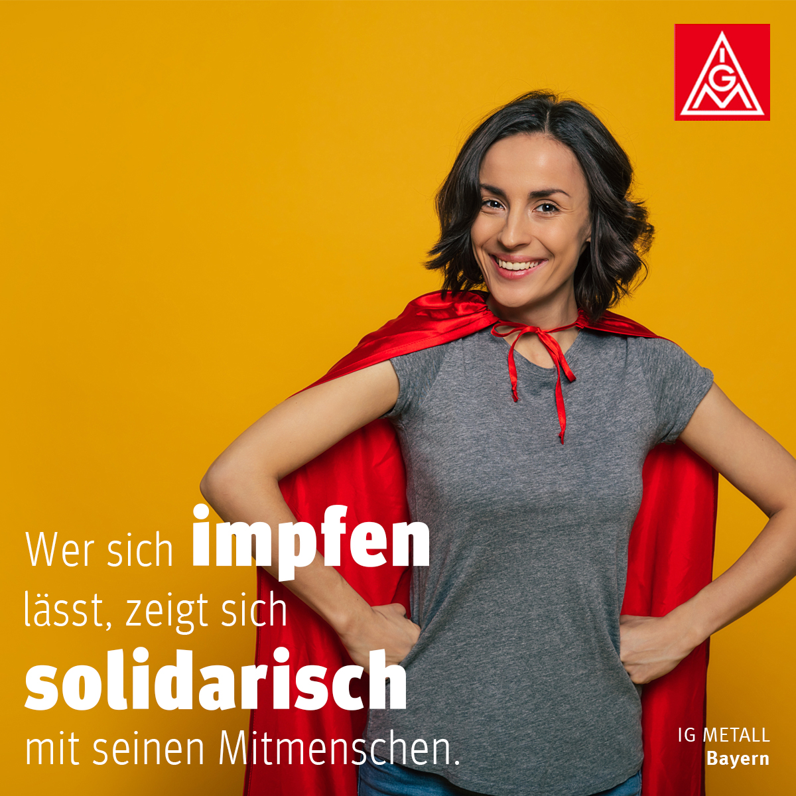
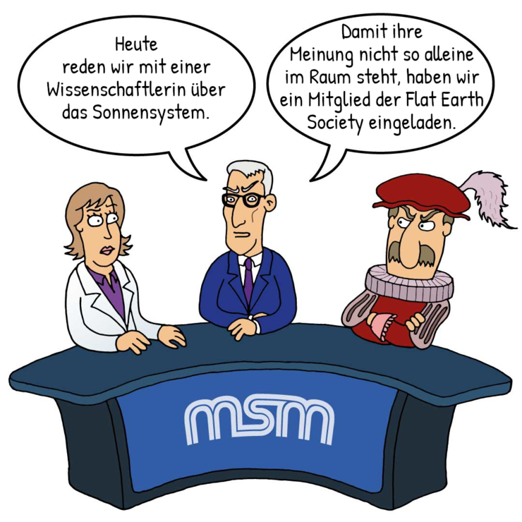
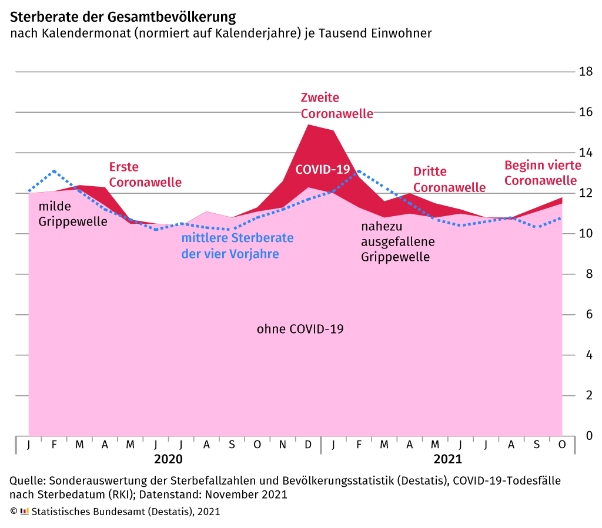
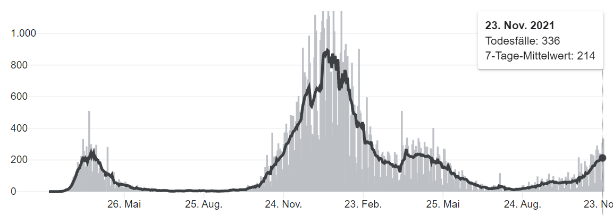
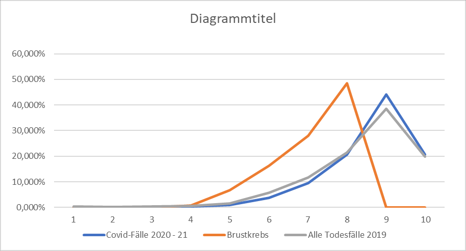
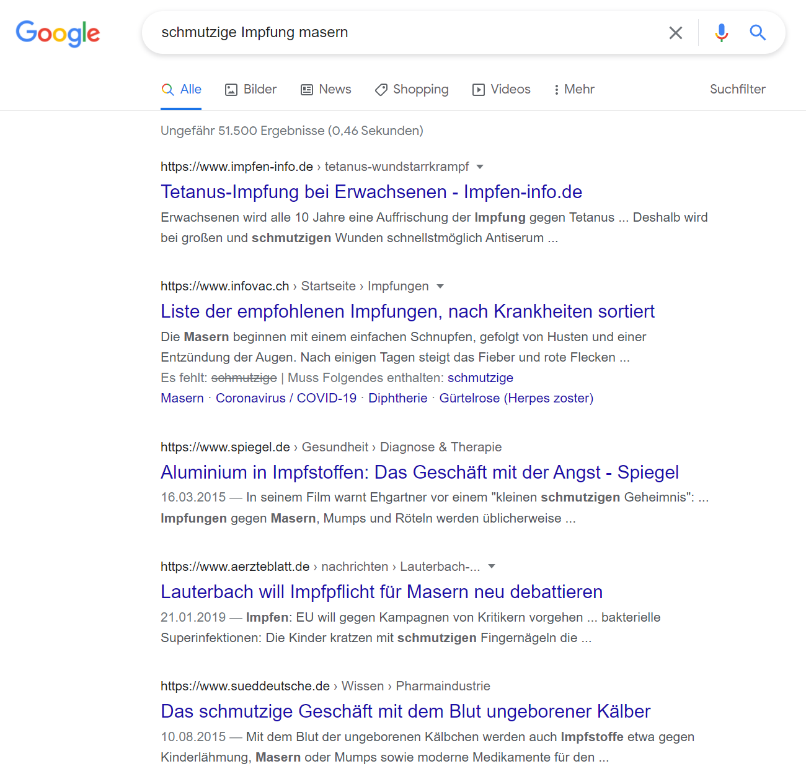
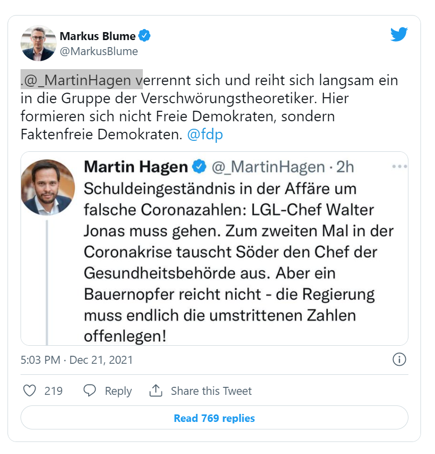
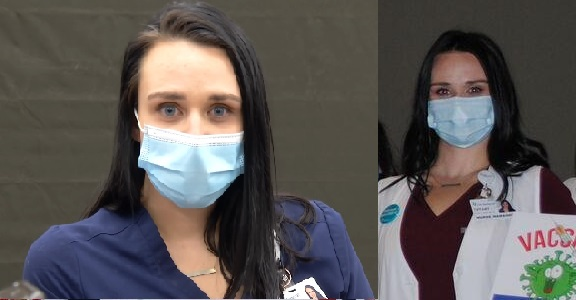
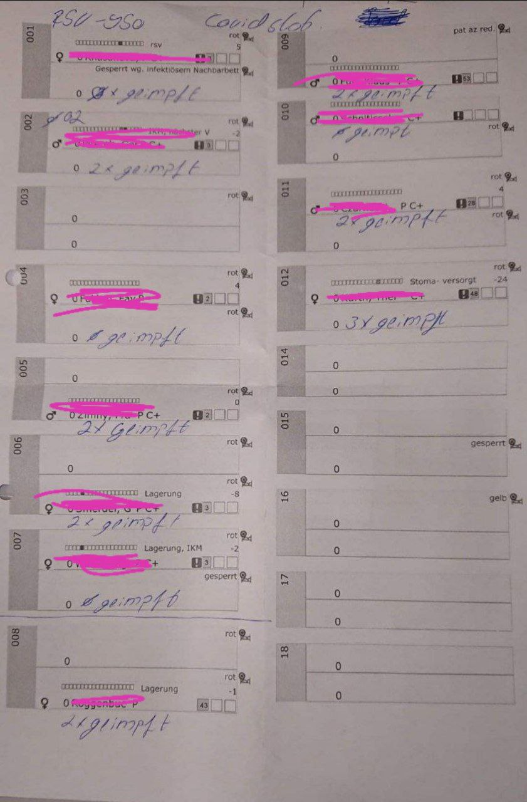
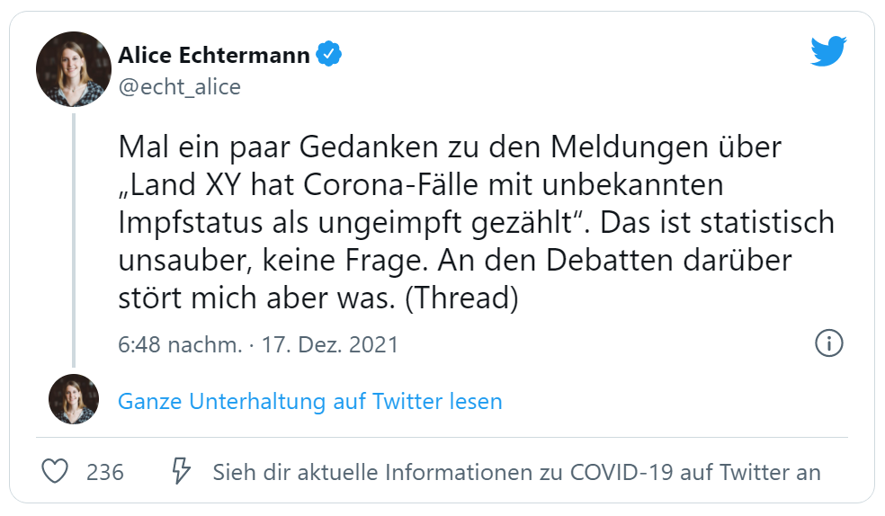

= Warum bin ich nicht gegen COVID geimpft?
:toc: left
:sectnums:
:xrefstyle: short
:attribute-missing: warn

[quote, Helmut Schmidt]

Eine Demokratie, in der nicht gestritten wird, ist keine

Angesichts der zunehmenden Polarisierung der Gesellschaft, die durch immer schärfere Vorwürfe gegen Ungeimpftefootnoteref:[aggitation,"Ich habe mir mal erlaubt, eine kleine "Wall-of-Shame" zusammenzustellen. Was früher als Entgleisung gegolten hätte, ist heute normal. Los geht es: Impfverweigerer sollten den Anstand haben, sich aus der Gemeinschaft zu entfernen ... Wie sie an Nahrungsmittel kommen, ist ihr Problem." https://thecord.ca/noam-chomsky-makes-comments-about-people-who-refuse-to-be-vaccinated-against-covid-19/[Noam Chomsky, Linker Intelektueller], deutsche Übersetzung https://reitschuster.de/post/wie-das-impf-narrativ-kollabiert/[reitschuster.de] / Die "Pandemie der Ungeimpften" https://www1.wdr.de/daserste/monitor/sendungen/pandemie-der-ungeimpften-100.html[wurde mindestens von Jens Spahn, Markus Söder und Bodo Ramelow] ausgerufen - wie wir heute wissen https://www.nordbayern.de/region/inzidenz-der-ungeimpften-soder-nutzte-falsche-zahlen-1.11601322[auf der Basis falscher Zahlen] - schon damals widersprochen von https://www.berliner-zeitung.de/news/drosten-wir-haben-keine-pandemie-der-ungeimpften-li.194322[Christian Drosten] / Frank Ulrich Montgomery, Verbandsfunktionär und Talkshow-Dauer-Gast sieht eine "Tyrannei der Ungeimpften",  kritisiert https://www.faz.net/aktuell/wirtschaft/montgomery-kritisiert-richter-fuer-aufhebung-von-corona-massnahmen-17702693.html["kleine Richterlein"] für ihre 2G-Urteile und fabuliert von COVID-Varianten, die https://www.zeit.de/news/2021-11/27/montgomery-warnt-virusvariante-so-gefaehrlich-wie-ebola["so gefährlich, wie Ebola"] seien / für Joachim Gauck sind Ungeimpfte https://www.faz.net/aktuell/politik/inland/joachim-gauck-greift-impfgegner-als-bekloppte-an-17532805.html["Bekloppte"] /  https://www1.wdr.de/nachrichten/themen/coronavirus/corona-regeln-weihnachten-ungeimpfte-100.html[WDR] empfiehlt "Familienmitgliedern, die sich aus Überzeugung nicht impfen (...)  klare Kante (zu) zeigen und ohne diese Personen (zu) feiern" / Daniel Günther, MP von Schleswig-Holstein bekennt: "Mein Geduldsfaden mit Leuten, die sich gegen eine Impfung entscheiden ist gerissen" und spricht Andersdenkende an wie ungezogene Kinder / Steuerbetrüger Uli Hoeneß fordert "Man muss diese Leute konsequent ausgrenzen" und droht "Ich kann ziemlich militant werden, wenn jemand sich nicht impfen lässt" / Daran, das Humor in Deutschland mit Agitation gegen Anderdenkende verwecheselt wird, erinnert eine https://twitter.com/sarahbosetti/status/1466829037645582341[unlustige Komikerin im Staatsfunk]: "Wäre die Spaltung der Gesellschaft wirklich etwas so Schlimmes? Sie würde ja nicht in der Mitte auseinanderbrechen, sondern ziemlich weit rechts unten. Und so ein Blinddarm ist ja nicht im strengeren Sinne essentiell für das Überleben des Gesamtkomplexes." und auch sie sieht sich als Opfer eines https://www.youtube.com/watch?v=d4QIFFS53Rc[Shitstorns von rechten Hetzern und Absichtlich-Falschverstehern] /  https://www.tichyseinblick.de/daili-es-sentials/macron-sorgt-mit-drastischer-kampfansage-an-ungeimpfte-fuer-empoerung/[Emmanuel Macron] beweist, dass irre Rethorik kein rein deutsches Phänomen ist: "Les non-vaccinés, j’ai très envie de les emmerder." Es läst sich wohl festhalten, dass die Beschimpfung unflätig ist - der genauen Bedeutung wird  https://www.spiegel.de/kultur/emmanuel-macron-zu-ungeimpften-in-frankreich-ein-exquisites-aroma-der-provokation-a-e6c2fb60-49e3-4402-9f74-4cb88f9195ac[hier nachgespürt] / Tobias Hans (CDU) formuliert überhaupt nicht spalterinsch  "Ihr seid jetzt raus aus dem gesellschaftlichen Leben" / Malu Dreyer, MP Reinl.-Pfalz findet „Ungeimpfte sollen gar nicht feiern“ / Sarah Frühauf, MDR kommentiert in den Tagesthemen: "Na herzlichen Dank! An alle #Ungeimpften. Dank euch droht der nächste Winter im #Lockdown" (https://twitter.com/tagesthemen/status/1461795932391960578[Twitter] bzw. https://www.tagesschau.de/multimedia/video/video-949037.html[Video]) / Klaus Holetschek, bayrischer Gesundheitsminister schlägt Malus-Regelungen für Ungeimpfte bei der Krankenversicherung vor / Thüringens MP Bodo Ramelow weist darauf hin, dass ein Platz für Ungeimpfte in Thüringer Kliniken nicht garantiert sei. / Stuttgarts OB Boris Plalmer schlägt vor, https://www.stuttgarter-zeitung.de/inhalt.tuebinger-ob-zu-omikron-palmer-fordert-impfpflicht-ab-mitte-januar.ce206824-29b5-4709-bd85-71d1360f0fd4.html[Ungeimpften  Lohn- bzw. Rentenzahlugnen zu sperren] oder fordert https://www.welt.de/politik/deutschland/article235810706/Boris-Palmer-will-Beugehaft-fuer-Impfverweigerer.html[Beugehaft] / der für seine geschliffene Rethorik als "Pöbel-Ralle" bekannte SPD-Bonze Steegner hat nicht nur Impfgegner, sondern gleich auch noch Atomkraftbefürworter https://www.focus.de/politik/deutschland/unverstaendnis-und-kritik-im-netz-wirbel-um-spd-politiker-ralf-stegner-vergleicht-atomfans-mit-rechtsradikalen_id_34281209.html[in die Nähe von Rechtsradikalen gerückt], eine Gleichsetzung, die angesichts der zum Jahreswechsel anschwellenden "Montagsspaziergänge" https://www.sueddeutsche.de/muenchen/freising/freising-corona-spaziergaenge-rathaus-au-nandlstadt-protest-kerzen-1.5493901[omnipräsent ist] und für die https://www.mdr.de/nachrichten/sachsen-anhalt/update-am-morgen-corona-proteste-innenministerin-rechte-abgrenzung100.html[Delegimierung von Demonstrationen] genutzt wird. Da beruhigt es doch, dass https://www.nzz.ch/international/spaltung-gibts-nicht-die-neujahransprache-von-olaf-scholz-wirft-fragen-auf-ld.1662711[Olaf Scholz keine Spaltung sieht], spricht aber von einer "Minderheit von Extremisten" spricht, die "uns ihren Willen aufzwingen will". Für mich klingt das ja schon etwas nach Spaltung, aber vielleicht liegt es an mir.] footnote:saskiawillpruegeln[BT Abgeordnete Saksia Weishaupt (Grüne) fordert die Polizei auf: "Pfefferspray und Schlagstöcke ein(zu)setzen" Kritik an dieser Aussage wird https://www.news.de/politik/856051355/saskia-weishaupt-fordert-schlagstoecke-gegen-querdenker-gruenen-politikerin-erntet-rechten-shitstorm-unter-schlagstocksaskia/1/[zum "Rechten Shitstorn"]] fröhlich vorangetrieben wird und dem Eindruck, dass in der öffentlichen Debatte die Beweggründe der Impfkritiker nicht hinreichend erklärt werden, möchte ich hier als Betroffener meine Haltung begründen und so einen Beitrag für gegenseitiges Verständnis leisten.

Ich kann gut nachempfinden, welches Unverständnis meine Haltung zu dem Thema auslöst, denn mir geht es nicht anders: Ich verstehe nicht, wie die Mehrheit zu ihrer Bewertung der Pandemie, der Maßnahmen und insbesondere der Impfung gelangt. Ich wünsche mir einen Diskurs, der uns allen hilft, zumidest nachzuvollziehen, wie die jeweils andersdenkenden zu ihrer Meinung kommen - dabei geht es nicht notwendigerweise um Zustimmung.

Ich werbe dafür, die Freiwilligkeit der Impfentscheidung beizubehalten, die Diskriminierung Ungemimpfter durch 2G-Regeln und ähnliches zu beenden und die Grundrechte (insbesondere Meinungs- und Demonstrationsfreiheit) wieder herzustellen. Mein wichtigstes Anliegen jedoch ist, die Impfung Minderjähriger zu beenden, für die von der Krankheit keine Gefahr ausgeht und die dennoch die mitunter tödlichen Risiken der Impfung tragen.

Leider stelle ich fest, dass die Darstellung von Überzeugungen, die sich während 2 Jahren Pandemie gebildet haben, ein langwieriges Unterfangen ist. Ich habe den Text in Abschnitte gegliedert, die auch einzeln gelesen werden können:

. *Sollten Sie mit dem weiterlesen zögern, wo doch allenthalben davon abgeraten wird, mit Querdenkern zu reden, so empfehle ich Ihnen diesen Abschnitt.* Ich stelle dar, wie der Diskurs gezielt vergiftet wird und warum dies unsere Demokratie beschädigt. Ich halte es angesichts der Diskussion um eine Impfpflicht für undemokratisch, dass die Position der Betroffenen tabuisiert und aus dem Diskurs gedrängt wird.

. *Wer sich fragt, warum ich die Nutzen-Risiko-Abwägung des individuellen Patienten höher gewichte als Mahnungen zum https://www.bundesgesundheitsministerium.de/presse/interviews/interviews/swp-220620.html[Corona-Patriotismus], sollte diesen Abschnitt lesen.* Ich stelle die für mich ausschlaggebenden Kriterien dar und arguementiere, warum die Fragen der persönlichen Betroffenheit im Zentrum stehen müssen.

. *Hier stelle ich konkret meine Sicht auf die COVID-Epidemie, die mRNA-Impfungen und dem Zustand unserer Gesellschaft nach 2 Jahren Ausnahmezustand dar.* Dazu formuliere ich  Hypothesen und beleuchte diese mit Pro-und-Contra-Argumenten. Ich bin bemüht, mich auf objektive Messgrößen oder Beobachtungen zu beziehen, aber letztlich ist es meine subjektive Sicht, die hier dargestellt wird.

. Hier leite ich meine ablehnende Impf-Entscheidung ab.

Weitere Abschnitte sind angedacht, Fragen und Hinweise gerne via mail an: quo_vadis_germany@gmx.de

*Hinweise*

* Zahlen und Statistiken beziehen sich auf Deutschland, soweit nicht anders gesagt.

* Der Verständlichkeit halber werde ich in diesem Text die Gen-Therapiefootnoteref:[abc,Als Laie war ich lange vorsichtig, die Behauptung, es handele sich bei der sog. Impfung um eine Gen-Therapie weiterzutragen, aber dieser Hinweis scheint sich zu bewahrheiten. So wird https://www.bayer.com/de/interview-de-backer[hier] die mRNA-Technologie als Plattformtechnologie für innovative Behandlungen, wie die Behebung von Gen-Defekten oder die Behandlung von Krebs bezeichnet. Zumindest dürfte klar sein, dass die Technologie innovativ und Teil der Gentechnologie ist - daher kritisiere ich, dass fortwährend so getan wird, als handele es sich um eine hergebrachte Impfung.] als Impfung bezeichnen und somit auch von Impf-Kritikern sprechen. Ich bin weder generell Impf-kritisch noch lehne ich grundsätzlich Gen-Technologie ab. Ich kritisiere aber, dass im öffentlichen Diskurs mit dem Begriff "Impfung" verschleiert wird, dass es sich um eine innvoative Technologie mit entsprechendem Risikoprofil handelt. Mitunter wird diese Vermischung https://www.businessinsider.de/wissenschaft/gesundheit/impfskepsis-warum-impfungen-politisch-sind-und-uraengste-wecken-a/[direkt] genutzt indem man die Covid-Impfverweigerer mit traditionellen Impfskeptikern in einen Topf wirft - unterschwellig, schwingt diese Vermischung aber jedesmal mit, wenn von Impf-Kritikern die Rede ist.

* Da jeder Impf-Kritiker schnell zum "Querdenker" erklärt wird, verwendet ich diesen Begriff ebenfalls synonym und nicht im engeren Sinne für ein Mitglied der "Querdenker-Bewegung" - ich nehme für mich in Anspruch, dass mein Denken nicht stromlinienförmig ist, möchte aber darauf hinweisen, dass ich über Bodo Schiffmann nicht viel weiss und kein Anhänger bin.

* Je nach Kontext werden die Begriffe Corona und COVID verwendet, zur genauen Abgrenzung siehe https://coronatest.eurofins.de/corona-wissen/unterschied-corona-sars-cov-2-und-covid-19[hier].

== Setzen wir uns über Denkverbote hinweg und hören einander zu

_Ich versuche, meine Familie und mich zu schützen und lehne die COVID-mRNA-Impfung ab, weil ich die Risiken höher als den Nutzen einschätze und stehe damit im Widerspruch zur Einschätzung der Mehrheit. Meine naive Erwartung wäre, das nun Argumente ausgetauscht werden, doch zu meiner Verwunderung passiert das weder im privaten, noch im öffentlichen Diskurs._

=== Vergiftung des Diskurses und Spaltung der Gesellschaft sind gezielte Strategien aus dem "Teile und Herrsche"-Werkzeugkasten

*Den Impfskeptikern wird Rationalität abgesprochen, und mit dieser Begründung wird die Argumentation von der Inhaltsebene auf emotional-moralische Apelle umgelenkt*

Durch die Behauptung, Impfkritiker seien ohnehin irrational, vermeiden Politik und Medien den Austausch von Sachargumenten und lenken die Debatte auf simple Schlagwortefootnote:stefangosepathdeutschlandfunk[Der Philosoph Stefan Gosepath etwa formuliert im Gespräch mit dem https://www.deutschlandfunkkultur.de/impfzwang-und-solidaritaet-wer-sich-nicht-impfen-laesst-100.html[Deutschlandfunk]: "Freiheit besteht (nicht) darin, allen Irrationalismen zu folgen, die man sich irgendwie aus dem Netz gesaugt hat." und "Diejenigen, die sich nicht impfen lassen, sind im Moment nicht solidarisch." und bildet damit genau das Argumentationsmuster ab, das einen rationalen Diskurs verweigert und statdessen mit moralischem Druck daherkommt.] footnote:einfacheegomanen[Unter dem Titel https://www.deutschlandfunkkultur.de/buch-ueber-die-querdenker-die-einfachen-antworten-der-100.html[Die einfachen Antworten der Egomanen] stellt der Deutschlandfunk ein Buch über die Radikalisierung im Querdenker-Milieu vor und zitiert den Autor mit den Sätzen "Mit Fakten erreicht man die Menschen kaum noch" und "Mit einem Teil der Bewegung könne man dennoch ins Gespräch kommen – über die emotionale Schiene."]. Dies entspricht auch der Kommunikationsstrategie wie sie in dem Begriff "Solidarität" sichtbar wird, um den sich die Werbekampagnen für die Impfung ranken (vgl. <<infantilewerbung>>).

.Anstatt Informationen zu liefern, locken die Werbekampagnen zur Impfungen durch das Zusprechen eines hohen Selbstwertes (Superheld) und dem omnipräsenten Schlagwort der Solidarität - Die Abwertung von Menschen, die sich anders entscheiden ist implizit  Teil der Botschaft.
[#infantilewerbung,reftext='{figure-caption} {counter:refnum}']

Es ist einer der vielen Widersprüche der ganzen Corona-Debatte, dass die wissenschaftsfeindlichen und emotionsgesteuerten Querdenker Fakten recherchieren und Studien lesen, während die wohlinformierten Impflinge sich offenkundig durch eine in meinen Augen infantile Werbung angesprochen fühlen.

Jetzt mag man meine Kritik zurückweisen mit dem Hinweis, es ginge nun einmal um Werbung und die sei per definitonem eher emotional aufgeladen. Darauf möchte ich mit einem Gedanken-Experiment antworten: Man stelle sich vor in einer anderen großen gesellschaftlichen Debatte der Vergangenheit hätte man diesen Ton angeschagen, etwa: "Wer für Atom-Energie ist, ist ein Superheld!". Wäre das ein Niveau, das dem Thema angemessen ist? Kann ich eine Impfkampagne vermarkten, als ginge es um Tütensuppe?footnote:werbung[Und wenn es um Werbung geht - wo ist der Hinweis auf "Risiken und Nebenwirkungen", der sonst bei keinem Hustensaft fehlen darf?] Die Frage ist rethorisch und die Antwort lautet: Nein! Wo politische Kommunikation sich die Beeinflussung durch Methoden der Werbung beschränkt, wird sie zu Propaganda.

*Medien fordern auf: "Sprich nicht mit den Schmuddelkindern"*

Die Diskursverweigerung erstereckt sich auch auf das private Gespräch. Ich werde recht häufig mit Unverständnis, einem moralischen Apell oder Vorwürfen "Du weißt schon, dass Du Leute gefährdest" konfrontiert, will ich aber Argumente bringen wird die Diskussion auf die ein oder andere Art beendet. Aus dem Kontakt mit Gleichgesinnnten über Social Media weiß ich, dass es sich um ein allgemeines Phänomen handelt.

Diese Haltung ist kein Zufall, sondern folgt öffentlichen Beispielen:

- Die Youtuberin MaiLab erklärte bereits im Mai 2021 gegenüber dem https://www.rnd.de/wissen/interview-warum-mai-thi-nguyen-kim-nicht-mehr-mit-verschwoerungsideologen-diskutiert-YVEWPE2UJFHNFAXF3MJ54JDOMM.html[RND], sie spreche nicht mehr mit Verschwörungstheoretikern. MaiLab hat mittlerweile eine Moderation in den öffentlich-rechtlichen übernommen, erhielt das Bundesverdienstkreuz, bekam in ihrer Sendung Besuch von Herrn Lauterbach und sie wurde von Frau Merkel zitiert. Kurzum, Sie hat Relevanz!footnote:maisprichtnicht[Die Einlassung von MaiLab stößt mir auch deshalb negativ auf, weil https://www.youtube.com/watch?v=KEggd1S9_9Y[sie sich im November 2021 für die Impfpflicht ausspricht] und dabei sinngemäß argumentiert man habe es ja lange im guten versucht. Dieses Argument erscheint etwas heuchlerisch, wenn bereits früh in der Impfkampagne signalisiert wurde, dass es Sach-Einwände nicht wert sind, inhaltlich beantwortetet zu werden. In Summe wird von der Gruppe der Skeptiker eher Unterwerfung gefordert, als dass man sie zu überzeugen sucht.]

- Die  https://www.sueddeutsche.de/panorama/verschwoerungserzaehlungen-beratungsstelle-corona-tobias-meilicke-veritas-berlin-1.5496235?[SZ sagt noch im Dezember '21] "Ich würde mich niemals auf eine Faktendiskussion einlassen".

- Die https://www.zeit.de/gesellschaft/zeitgeschehen/2021-12/querdenker-umgang-diskussionen-tipps[Zeit] rät am letzten Tag des Jahres 2021 zum "Umgang mit Querdenkern: Es ist okay, nicht mehr diskutieren zu wollen". Sie schreibt das "Querdenker (...) krude Geschichten und Lügen verbreiten, die sie im Internet aufgeschnappt haben". Für alle, die partout den Kontakt zu Covidioten nicht generell abgrechen wollen kommt noch die Mahnung " Wer hier nicht aufgeben will, sollte sich bewusst machen, dass Fakten laut Experten nicht das geeignete Mittel dafür sind." Wenige Tage zuvor bot das selbe Blatt einen waschechten Erfahrungsbericht https://www.zeit.de/gesellschaft/2021-12/impfgegner-familie-brief-schwester-bitte#comments[Meine "Schwester ist Impfgegnerin."] den ich leider nicht lesen kann, da er hinter der Paywall liegt.

*Mit dem falschen "False Balance"-Argument werden unbequeme Meinungen aus dem Diskurs verbannt*

Gerne wird das "False Balance"-Argument angebracht dem gemäß der Reflex, jeder These eine Antithese gegenüberzustellen um ausgeglichen (balanced) zu berichten, dazu führe, daß abseitige Theorien unberechtigter Weise als der Mainstream-Meinung gleichwertig dargestellt werden.

Dieses Argument wird genutzt, um misliebige Positionen vom Diskurs auszuschließen, z.B. https://www.focus.de/kultur/medien/attackiert-virologen-streeck-und-kekule-durchtraenkt-von-menschenfeindlichkeit-boehmermann-geht-lanz-wegen-gaeste-wahl-an_id_20920311.html[von Herrn Böhmermann] im Video https://www.youtube.com/watch?v=kArDFWTH2wE[hier]).

.Menschen, die in einem innovativen Medizinprodukt unter einer bedingten Zulassung Risiken sehen mit Flacherdlern gleichzusetzen ist in meinen Augen kein ernstzunehmender Standpunkt.
[#falsebalancecaricature,reftext='{figure-caption} {counter:refnum}']

Der https://de.wikipedia.org/wiki/Falsche_Ausgewogenheit#:~:text=Falsche%20Ausgewogenheit%2C%20gelegentlich%20auch%20als,viel%20Raum%20gegeben%20wird%2C%20sodass[Wikipedia] Artikel veranschaulicht das in Wort und in Bild mit dem Beispiel der "Flachen Erde" (vgl. <<falsebalancecaricature>>). Es ist aus mehreren Gründen absurd:

* Zunächst zeugt das Beispiel von wissenschaftshistorischer Unkenntnis. Das Aussehen des Flat-Earthlers in der Karikatur verweist auf das Mittelalter, die Kugelgestalt der Erde war allerdings bereits in der Antike bekannt und es gibt keinen Beleg für das häufig geäußerte Vorurteil, dass diese im Mittelalter vergessen war. Es steht zu vermuten, dass der Kampf zwischen geozentrischem und heliozentrischem Weltbild und die Verfolgung von Nikolaus Kopernikus und Galileo Galilei gemeint ist.

* Es stellt sich die Frage, wer beurteilen darf, welche Theorien als abseitig vom Diskurs ausgeschlossen wird. Wissenschaftlicher Fortschritt war immer zunächst eine Minderheitenmeinung. Nikolaus Kopernikus und Galileo Galilei im obigen Beispiel standen mit ihrem heliozentrischem Weltbild gegen die Mehrheit, die das religiös begründete geozentrische Weltbild verteidigte. Die heutigen Vertreter des "False Balance"-Argumentes stehen somit in der Tradition Inquisition und nicht für wissenschafltichen Fortschritt.

* Wenn eine wissenschaftliche Theorie wirklich abseitig ist, besteht keine Notwenidgkeit zur Zensur, denn dann sollte es leicht seien, diese druch Argumente auszuräumen. Es gibt schlicht keine Notwendigkeit einer Beschränkung des Diskurses.

* Das False-Balance-Argument postuliert eine absolute Wahrheit, dies ist eine vor-moderne Vorstellung. Immanuel Kant verdanken wir die Erkenntnis, dass der Mensch die Welt durch Modelle wahrnimmt, die er selbst konstruiert. Diese Modelle werden nicht nach wahr und falsch kategorisiert, sondern danach inwieweit sie in der Lage sind, für ein konkretes Problem Prognosen abzugeben. Die Relativitätstheorie ist nicht "wahrer" als Newtons Bewegungsgleichungen, sondern behandelt einen anderen Problembereich.

*"Die Wissenschaft" wird zum Dogma*

Immer häufiger maßen sich Medien und Politik unter Berufung auf (ausgewählte) Wissenschaftler an, die Wahrheit zu definieren. Dies ist bemerkenswert:

* Wissenschaft ist keine diskursfreie Konsens-Veranstaltung, sondern lebt vom Streit.

* Der aktuelle Stand des Wissens steht immer unter dem Vorbehalt neuer Erkenntnisse. Wer sich dies nicht vergegenwärtigt, verdient nicht die Bezeichnung "Wissenschaftler".

* Natürlich ist es unethisch wissentlich Falschinformationen zu verbreiten. Aber wenn Meinungsfreiheit falsche Meinungen ausschließtfootnote:lisafitzzensiert[Lisa Fitz z.B. https://odysee.com/@gemeinschaften.ch:5/lisafitz:5[nannte in einer Stand-Up-Nummer für den SWR] die Zahl von 5.000 Impftoten, was in der Presse aufgegriffen und https://www.rnd.de/medien/lisa-fitz-verbreitet-in-swr-comedysendung-falsche-zahlen-ueber-impftote-Z75NRG7MGZAHDDOPX56TG6ZWBQ.html[skandalisiert] wurde. Diese Sendung wurde daraufhin zensiert. Frau Fitz nannte sogar  - für einen Commedy Auftritt ungewöhnlich - ihre Quelle, verfälscht aber in der Tat den Antrag einer einzelnen französischen Abgeordneten im Europäischen Parlament zur Aussage "das Europäische Parlament hat ... beantragt". Bei der Bewertung dieses unbestrittenen Fehlverhaltens muss man allerdings den Kontext in Betracht ziehen. In einer Commedy-Nummer erstaunte die Quellenangabe ohnehin und ich würde hier andere Standards anlegen, als an einen Kontext der "neutrale Information" verspricht wie eine Nachrichtensendung oder Reportage. Hier rächt sich, dass eine Diskussion über das "Eingemachte" nur noch mit Narrenkappe auf dem Kopf möglich ist. Bemerkenswert ist bei der https://www.rnd.de/medien/lisa-fitz-in-spaetschicht-swr-sieht-beitrag-nicht-mehr-von-meinungsfreiheit-gedeckt-5QK4ICYCBNDG7PK623KFYM6D5M.html[Beurteilung durch Peresse und Programmdirektion], dass die Aussage nicht durch die Meinungsfreiheit (immerhin ein Grundrecht) gedeckt sei und andererseits die Aussage von Clemens Bratzler, SWR Programmdirektor "Die Aussage von Lisa Fitz zur Anzahl der Impftoten ist nachweislich falsch". Diese Bewertung nennt keine Quelle und könnte sich selbst in der Zukunft als falsch herausstellen. Die EU hat rund eine halbe Milliarde Einwohner und 5.000 Impftote entsprächen einer Quote von 1 Impf-Toten auf 100.000 Einwohner - in Deutschland z.B. 800 Impftote. Die Zukunft wird weisen, wer hier Recht behält - ich sehe es als wahrscheinlich, dass am Ende der SWR als der Lügner dasteht.] wirft das Fragen auf: Wer definiert, was "falsch" und was "richtig" ist? Orwell's Ministerium für Wahrheit? Was passiert, wenn neue Erkenntnisse auftauchen? Müssen dann bislang zugelassene Äußerungen zurückgezogen und bislang verfehmte Meinungen zugelassen werden? Wer würde widersprechen, dass von Seiten der Regierung in der Corona-Krise vielfach Behauputungen aufgestellt wurden, die sich als falsch herausstellten - wer zensiert den Zensor?

* "Die Wissenschaft" ist häufig eine Untergruppe der Wissenschaftler, die eben deshalb ausgewählt wurde, weil sie das offizielle Narrativ bestätigt.

Wer sich dieser Wahrheit verweigert, wird zunächst mit geheucheltem Verständnis als "falsch informiert" bezeichnet, wenn er sich als renitent erweist wird er jedoch als Verschwörungstheoretiker lächerlich gemacht, ausgegrenzt und schließlich bekämpft. Exemplarisch führt https://odysee.com/@BehindTheMatrix:7/Sachsens-Ministerpr%C3%A4sident-Michael-Kretschmer-fordert-sch%C3%A4rfere-Ma%C3%9Fnahmen-gegen-Hetze-im-Netz.-(Telegram-12.12.2021):2[Michael Kretschmer] dieses Muster aus Zuckerbrot ("Brücke" für reuige Sünder) und Peitsche (Kriminalisierung anderer Meinung) vor.

*Sperren auf sozialen Medien*

https://www.achgut.com/artikel/impf_regime_in_israel_haben_die_leute_pfizer_satt[Berichte über Impfschäden] wurden auf den sozialen Medien genauso unterdrückt, wie https://www.achgut.com/artikel/ausgestossene_der_woche_die_pandemie_in_den_rohdaten[Analysen] und https://www.achgut.com/artikel/youtube_verliert_erneut_gegen_die_achse_des_guten[ganze Kanäle], die nicht ins offizielle Narrativ passen. Selbst Urteile deutscher Gerichte auf Wiederherstellung https://www.achgut.com/artikel/indubio_folge_197_lasst_die_pfoten_von_den_kindern[werden nicht umgesetzt], was möglich ist, da selbst große Tech-Konzerne wie Facebook in Deutschland keine ladungsfähige Adresse vorweisen müssen.

Natürlich begegnen einem Leute, die die Zensurwelle auf den sozialen Medien leugnen, oder damit argumentieren, dass es sich hier um private Unternehmen handele, denen es frei stehe, was veröffentlicht wird und was nicht.

Ich möchte die Diskussion hier nicht aufrollen - meinem Empfinden nach wird der Diskurs hier zuungunsten der Impf-Skeptiker eingeschränkt.

*Das Autoritätsargument*

Missliebige Meinungsäußerungen werden häufig pauschal als "Schwurbelei" abgetan, gerne mit dem Argument, der betreffende sei kein Arzt oder Epidemiologe. Stellvertretend sei die Definition des "Schwurblers" von ARD-Talker Plasberg genannt: https://www.focus.de/kultur/kino_tv/ard-talker-im-interview-plasberg-schwurbler-gelten-bei-impfung-als-kapitulierer-mit-gesichtsverlust_id_24512616.html["Jeder, der glaubt, auf YouTube eigene Quellen erschlossen zu haben, und ein Facebook-Studium absolviert hat, meint, auf Augenhöhe mit einem Arzt über medizinische Themen sprechen zu können."]

Hierzu erwiedere ich:

* Auch qualifizierte Personen werden als inkompetent dargestellt, bzw. als Schwurbler bezeichnet, wenn sie nicht das offizielle Narrativ bedienen. (z.B. wurde eine https://www.abendzeitung-muenchen.de/muenchen/nach-corona-wut-video-lmu-klinikum-schmeisst-pathologie-mitarbeiterin-raus-art-775230[Mitarbeiterin der Patologie der LMU zur Schwurblerin erklärt] - Einem Arzt, der die Impfung seiner Patienten verweigerte wurde die https://www.mdr.de/nachrichten/sachsen/leipzig/leipzig-leipzig-land/leipzig-hausarzt-impft-nicht-mehr-100.html[Lerherlaubnis an der Uni Leipzig entzogen]) - der Respekt vor den Experten ist also vorgeschoben, es geht um den Schutz des offiziellen Narrativs.

* Personen, die ohne medizinische Ausbildung eine medizinische Meinung kundtun werden dafür gelobt und gefeiert, solange sie dem offiziellen Narrativ folgen. Viele nutzen dafür die Talkshows von Herrn Plasberg und Kollegen als Bühne - eine Gruppe sticht dabei besonders hervor: Die Politiker

* Die medizinische Expertise der Protagonisten, z.B. unseres neuen Gesundheitsministers  (Kein Epidemiologe, sondern Gesundheitsökonom, https://www.tichyseinblick.de/meinungen/karl-lauterbach-der-panik-verbreiter-als-gesundheitsminister/["Lauterbach ist kein Arzt"]) oder die fragwürdigen Aspekte seiner https://www.spiegel.de/wissenschaft/der-einfluesterer-a-cac9b0b4-0002-0001-0000-000030346862[Vergangenheit] (Lipobay-Skandal, Treiber der Privatisierung des Gesundheitssektors, langjähriges Aufsichtsratsmitglied der Rhön-Klinikum AG) werden bei den ganzen Auftritten nie zum Thema gemacht.

* Selbstentlavend ist der Vorwurf an den "Schwurbler", doch tatsächlich auf Augenhöhe mit seinem Arzt sprechen zu wollen. Was ist das für eine Vorstellung vom Bürger als Untertan, in der der Dialog auf Augenhöhe zum Vorwurf gewandt wird?

* Ich möchte die Argumentation auf ein anderes Thema übertragen. Was hätten die gleichen Journalisten von dem Vorschlag gehalten im Jahr 2000 ein Gremium von Siemens-Kraftwerksingenieuren und Kernphysikern einzusetzen, um über die weitere Nutzung der Kernenergie zu befinden, während man die Demonstranten gegen Castor-Transporte ähnlich behandelt hätte, wie heutzutage die "Covidioten"? (Man muss hinzufügen, dass der Vergleich hinkt, denn Querdenker sind friedfertiger als die Kernkraftgegner es waren.)

Ich nehme mir die Frechheit heraus, meine Informationsquellen selbst zu wählen und mir meine eigenen Gedanken zu machen, ob das GEZ-Gefütterten Talkshowmillionären passt oder nicht! Es lebe das Selber-Denken, ob kreuz oder quer!

_Der Diskurs wurde von vergiftet und das war kein zufälliger Prozess, sondern entspricht der Strategie von Politik und Medien. Hätten diese die Argumente zur Hand, die ihr Narrativ stützen, hätten sie dieses Vorgehen nicht nötig._

=== Auch als Gruppe wird die der Maßnahmenkritiker z.B. auf Demos nach Kräften beschnitten

*Kriminialisierung von Anderdenkenden*

Im Sommer 2021 reichte EIN Mord, um alle Ungeimpften zu Mittätern zu machen.footnote:mord[https://www.amadeu-antonio-stiftung.de/internet-wie-reagieren-querdenken-szene-und-afd-auf-den-mord-von-idar-oberstein-75431/[Die Amadeu Antonio Stiftung] gibt den Ton vor: Wenn  AfD-Politiker Georg Pazderskiv sich gegen Schlagzeilen wie https://www.amadeu-antonio-stiftung.de/internet-wie-reagieren-querdenken-szene-und-afd-auf-den-mord-von-idar-oberstein-75431/["AfD mitschuldig an radikalen "Querdenkern" ]garniert mit dem Bild vom Tatort, beschwert, dann bestätigt er die Vorwürfe - "Die Aussage 'Regierung und Altparteien' ... würden eine 'Spaltung' vorantreiben." gilt als Relativierung der Tat.] Mit einigen Monaten Abstand betrachtet war die Tat eher als https://news-trier.de/region/birkenfeld/vater-des-taeters-von-idar-oberstein-schoss-2020-auf-seine-frau,50960.html[Familiendrama] einzuordnen. Das Narrativ von den gewalttätigen Querdenkern wird dennoch nach Kräften weiterbedient. Nach einer Demo in München wurde von mehreren Medien mit immer denselben Bildern und der Schlagzeile "Angriff (Singular) auf Polizisten" berichtet. Der Vorfall sieht dabei https://odysee.com/@Digitaler.Chronist:8/muc2912-die-rote-jacke-gestellte-szene:5[gestellt] aus, was ich natürlich nicht beweisen kann, aber auf jeden Fall wird ein Schubser gerne genommen, um mehrere Tausend Bürger zu diskreditieren, die auf Ihr Demonstrationsrecht nach Art. 8 GG nicht verzichten wollen. Das Attribut der "Gewaltbereitschaft" schwingt bei der Berichterstattung immer mit. Ich kann natürlich nicht ausschließen, dass es einzelne Vorfälle gibt (selbst die Medien bleiben da immer verdächtig )

Der Präsident des Bundesverfassungsschutzes Haldenwang gab im Interview https://www.morgenpost.de/politik/inland/article234321983/Haldenwang-Bei-Protesten-neue-Szene-von-Staatsfeinden.html[zu Protokoll]: Es gebe "eine neue Szene von Staatsfeinden", diese brauchten kein spezifisches Thema "Ob das jetzt Corona ist oder die Flüchtlingspolitik. Oder auch die Flutkatastrophe (...) die versuchten, den Eindruck zu vermitteln, der Staat versage und tue nichts für die Menschen". Das bedeutet: Wer das offensichtliche Staatsversagen in der Flutkatastrophe als solches benennt, wird zum Staatsfeind (!!!) erklärt. Die Aussage steht nicht allein. Häufig wird die Formulierung von der https://www.tagesschau.de/inland/haldenwang-corona-proteste-101.html["Verachtung des demokratischen Rechtsstaates und seiner Repräsentanten"] verwendet, die Kritik an einem Politiker zur Kritik am Rechtsstaat umdeutet, den sie repräsentieren. Was ist das für eine Demokratie, in der man die Politiker nicht kritisieren darf?

Die Maßnahmenkritiker  beziehen sich häufig auf Symbole des angeblich verachtete Staates. Das Grundgesetz wurde auf Demonstrationen mitgeführtfootnote:grundgesetzaufdemos[Das Fakten-Checker-Portal https://www.volksverpetzer.de/aktuelles/fake-afd-grundgesetz-demo/["Volksverpetzer"] meint, die AfD hier der Lüge zu überführen. Hintergrund ist, dass Demonstrationen gegen die Corona-Politik seit 2020 weitgehend mit dem Verweis auf den Infektionsschutz verboten werden und eine Versammlung daher sofort aufgelöst wird, wenn sie sich z.B. durch Rufe oder Transparente als derart motiviert zu erkennen gibt. Der Versuch, einfach mit dem Grundgesetz unter dem Arm und unter Vermeidung offenkundiger Corona-Bezüge zu demonstrieren wurde allerdings ebenso unterbunden, was offenkundig von der AfD mit den Worten beschrieben wurde, der Berliner "Senat hätte das Tragen vom Grundgesetz verboten". Jenseits des Kleinkriegs zwischen AfD und Berliner Senat - (sowie dem Volksverpetzer, der letzerem Beistand leistet) belegt diese Episode, dass sich in der Corona-Kritiker Szene auf Symbole des Staates bezogen wird, den sie angeblich verachtet. Die Verachtung gilt konkreten Politikern, nicht dem Staat.] auf grundgesetzlich verbriefte Rechte beziehen sich die Demonstranten auf Schritt und Tritt (insb. bürgerliche Freiheiten wie Versammlungsfreiheit, Meinungsfreiheit sowie das Recht auf körperliche Unversehrtheit). Natürlich wird dieser Bezug als Missbrauch dargestellt, z.B. durch den BR. https://www.br.de/nachrichten/deutschland-welt/was-querdenker-mit-freiheit-meinen-eine-analyse,SWQl1tR[in dessen Analyse] wird versucht, den Bezug auf "Freiheit" als illegetim darzustellenfootnote:brfreiheit[Eine Zeitung, die hier als "Theorieorgan der Szene" beschrieben wird (von der ich selbst aber bislang noch nie gehört habe) schreibt offenkundig den Satz "Freiheit bedeutet persönliche Autonomie und individuelle Selbstbestimmung" und das reicht, um in einem Musterbeispiel an Rabulistik der Bewegung Extremismus nachzuweisen, schließlich bestätige selbst die FDP, eine Partei, welche sich "nachdrücklich für die Wahrung der Freiheitsrechte" einsetze, es sei allees in Butter.].  Jeder kann sich selbst ein Bild machen, ob solche Beiträge eine ehrliche Analyse sind, oder der Versuch einer missliebigen Bewegung "etwas anzuhängen".

*Die Sache mit den Rechtsradikalen*

Immer wieder wird geschrieben, man dürfe sich an eisnchlägigen Demonstrationen beteiligen, da dort Rechtsradikale mitlaufen. Dabei wird wirklich oft die Vokabel "mitlaufen" verwendet, nie habe ich gelesen dass dort entsprechende Symbole gezeigt wurden oder irgendwelche einschlägige Agitation stattfand. Häufig liest man von Leuten vom "3. Weg". Ich kenne diese Kleinpartei überhaupt nicht (habe nur die vage Vorstellung, dass die programatisch so ähnlich wie die NPD zu verorten ist) und kenne keinen einzigen Vertreter. Die Veranstalter der Demos in München grenzen sich klar vom 3. Weg ab (was natürlich nie in der Zeitung steht) - jetzt soll ich also darauf verzichten, meine Meinung kund zu tun, weil unter tausenden Leuten 3 Menschen mitlaufen, die den Gesinnungs-TÜV nicht betehen?

Um das klar zu sagen: Eine Veranstaltung, bei der der 3. Weg z.B. als Veranstalter auftritt würde ich nicht besuchen. Ich würde mir eine ähliche Abgrenzung auch im linken Spektrum wünschen,, z.B. vom https://www.rf-news.de/2021/kw18/siegen-auf-dgb-kundgebung-vor-allem-redner-aus-den-betrieben[DGB gegenüber der MLPD].

*Demoverbote*

Seit Beginn der Krise 2020 wurde das Argument des Gesundheitschutzes missbraucht, um das Demonstrations- bzw. Versammlungsrecht einzuschränken. Gerade, die sich am Jahreswechsel 2021/22 sich häufenden "Spaziergänge" werden mitunter seitens mit einer Energie unterbunden, die einen wurdert.

Wie so oft fallen hier die doppelten Standards auf. Eine Polizei, die bei 1.Mai Krawallen über jahrzehnte im Namen der Deeskalation brennende Barrikaden und geplünderte Supermärkte akzeptiert hat tritt gegenüber Rentnern und Kindern plötzlich martialisch auf. Unrühmlich ist der 31.8.2020 in Berlin in Erinnerung.

Linke Politiker, die letztes Jahr im Rahmen der (politisch gewünschten, also auch gemäß Infektionsschutz unbedenklichen) BLM Proteste vermutlich noch die Abschaffung der Polizei gefordert haben, fordern nun den Einsatz von Schlagstock und Pfeffersprayfootnote:saskiawillpruegeln[].

Die NZZ titelt ironisch https://www.nzz.ch/meinung/jeden-tag-verliebt-sich-in-deutschland-ein-linker-in-den-starken-staat-ld.1663277[Jeden Tag verliebt sich in Deutschland ein Linker in den starken Staat] und weist damit auf einen Umstand hin, der seit langem zu beobachten ist: Linken bewerten einen Vorgang nicht nach der Sache, sondern aus ihrer Parteilichkeit heraus. Demokratische Institutionen, die weltanschaulich neutral seien sollten, werden scih untertan gemacht und agieren fortan parteilich. Das ist eine Gefahr für den Rechtsstaat, die vom Verfassungsschutz sicher nicht aufgegriffen werden wird.

Nur für den Fall, dass jemand den vorgeschobenen Grund des Gesundheitsschutzes glaubt: im Jarh 2020 - also vor der Impfung wurden Massenveranstaltungen ohne Impfungen tolleriert (CSD, BLM-Demos), wenn sie politisch gewünscht waren - jedoch unterdrückt, wenn sie aus der falschen Ecke kamen. Masken wurden dort auch nicht getragen (zumindest nicht nachdem die Pressefotos gemacht waren) wie vielfach dokumentiert. Ich zumindest glaube sowenig an die behauptete Montivation wie an den Weihnachtsmann.

=== Demokratie vor Populismus durch Beschneidung von Grundrechten zu schützen, setzt Transparenz und Fairness voraus, sonst besteht die Gefahr der Ausbildung einer Diktatur.

Ich höre das Argument, wenn Querdenker vor einer Diktatur warnen, so weise das nach, dass sie Extemisten seien. Dies halte ich nicht für gerechtfertigt.

In meiner Schulzeit wurde aufgrund der Erfahrung des 3. Reichs argumentiert, die Deutschen sei nicht reif eine direkte Demokratie (z.B. Volksabstimmungen auf Bundesebene wie in der Schweiz). Diese Vorstellung eines Volkes, das in einer Bewährungs-Situation noch unter Vormundschaft steht, kommt auch in der Warnung vor Populismus zum Ausdruck. Vertreter dieser Position wollen Volkes Wille nur gefiltert und moderiert in den Entscheidungsprozess einfließen lassen. Zwangsläufig ergibt sich die Möglichkeit zum Machtmissbrauch durch die Elite der "Medien und Politiker", die daher daher Transparenz, Fairness und  Rechenschaft schulden. Werden berechtigte Sorgen als Extremismus tabuisiert, besteht in der Tat die Gefahr, dass unsere Gesellschaft sich von einem freiheitlichen zu einem repressiven System entwickelt.

Die Mehrheiten werden heute durch mediales Trommelfeuer gebildet, nicht durch einen Diskurs im Volk. Noch im Sommer 2021 hatte die Idee einer Impfpflicht keine Mehrheit, mittlerweile hat sich das Blatt jedoch gewendet.

In der Corona-Kriese lassen sich diese Mechanismen in vielfältiger Weise beobachten. Der folgende Abschnitt stellt dar, wie Corona-Maßnahmen auch gegen den Merhheitswillen durchgesetzt werden.

*Astroturfing*

*Nudging*

Die Meinungsbildung findet von Oben nach Unten statt. Die für diese Beeinflussung verwendeten Methoden sind auch bekannt und beschrieben (Astroturfing, Nudgingfootnote:nudgingimfpen[Durch Strafen und Belohnungen Verhaltensänderungen beim Bürger zu verursachen ist eine Technik, die man gemeinhin mit dem berüchtigtem https://de.wikipedia.org/wiki/Sozialkredit-System[chinesischen Sozialpunktesystem] in Verbindung bringt. Im Zuge der Corona-Maßnahmen findet diese Idee auch im Westen anklang. Gerade bei den diversen G-Regeln, aber auch beim Thema https://www.handelsblatt.com/meinung/gastbeitraege/expertenrat/schreiber/gastkommentar-eine-triage-zum-nachteil-der-ungeimpften-schuetzt-am-ende-ungeimpfte/27834550.html[Triage] ist es ein offen ausgesprochenes Geheimnis, dass nicht die medizinische Wirkung der Maßnahme, sondern ihr erzieherisches Potential die eigentliche Motivation ist. Mit dem Verständnis einer freiheitlichen Demokratie, in der ein mündiger Bürger der Souverän ist, sind diese Ideen freilich schwer in Einklang zu bringen.]) und entsprechen nicht der Idee eines demorkatischen Prozesses.

*Verschiebung des Overtone-Fensters*

*Wahrheitssysteme*

Das ist natürlich eine "Rechte Verschwörungstheorie", oder? Naja: Die Linke Ikone Noam Chomsky hat diesen Prozess bereits vor 35 Jahren in seinem Buch https://de.wikipedia.org/wiki/Manufacturing_Consent:_The_Political_Economy_of_the_Mass_Media[Manufacturing Consent (1988)] beschrieben - heute teilt er gegen Ungeimpfte aus.footnote:aggitation[] Damals sah sich die Linke noch als Opfer dieser Mechanismen - Eine Generation später stecken eben jene Linke jeden, der heute auf ebenjene Mechanismen hinweist in die Ecke der "Rechten Verschwörungstheoretiker". Tempora mutantur!

Auf dem Höhepunkt der Ukraine-Kriese hielt Barack Obama eine Rede in West Point und https://kyleorton.co.uk/2014/05/28/obama-doubles-down-on-his-foreign-policy-at-west-point/[sagte]: “Our ability to shape world opinion helped isolate Russia right away” Hier spricht er aus, was meist als Verschwörungstheorie gilt: Mächtige Menschen manipulieren die öffentliche Meinung und orientieren sich dabei weniger an Wahrhaftigkeit, denn an ihrem eigenen Vorteil.

*Die Besetzung von Gremien*

Die Beratergremien schlossen bislang kritische Stimmen aus (Anmerkung: im Dezember '21 beruft Olaf Scholz Hendrik Streeck in seinen "Expertenrat"). Dies ist ein weiterer Punkt, der die Demokratie in Frage stellt. Politik wird nämlich nicht nur von gewählten Volksvertretern vorgegeben, in zunehmenden Maße wird diese Aufgabe an "Expertengremien" ausgelagert. Bei der Besetzung dieser Gremien wurden durch

https://www.t-online.de/nachrichten/deutschland/id_90762290/virologe-drosten-soll-hendrik-streeck-mit-querdenkern-verglichen-haben.html

sondern auch von der Führungsschicht der Bundesbehörden,

_Helmut Schmidt sagte "Eine Demokratie, in der nicht gestritten wird, ist keine". Wen eine Seite aus dem Diskurs gedrängt wird, bei der Besetzung von Beratergremien unberücksichtigt bleibt, auf der Straße mundtod gemacht wird, bleibt Demokratie auf der Strecke. Wer immer die Macht dazu hat, und die geht in unserer Gesellschaft von den Massenmedien aus, kann "Consent" organisieren und damit die Politik, die ja von Zustimmung abhängt, vor sich hertreiben._

=== Die Einführung einer Impfpflicht ist zu den oben beschriebenen Bedingungen unmoralisch

*Gesetze*

Es ist normal, dass die Merheit durch Gesetze der Minderheit ihren Willen auferlegt - doch in einer Demokratie gehört dazu der freie Austausch von Argumenten im Rahmen der Meinungsfindung - wird hingegen die Minderheit mit den oben beschriebenen Techniken aus dem Diskurs herausgehalten und nicht gehört, so sehe ich gesetzlichen Zwang als Unrecht an.

In der aktuellen Debatte hat sich die BILD Zeitung zeitweise als der Querdenkerversteher unter den Massenmedien hervorgetan - meines Erachtens eher heuchlerisch, denn zur Bundestagswahl hat man Anhänger der einzigen Partei, die sich im Bundestag der Corona-Politik entgegenstellt zum https://www.bild.de/video/clip/bild-tv/claus-strunz-wer-afd-waehlt-waehlt-rot-rot-gruen-77756694.bild.html[Verzicht auf die Teilnahme] aufgefordert - aber selbst die BILD Journalisten haben vor jedem Gespräch betont, sie selbst seien ja 2-fach geimpft.

Die Ungeimpften sind ja keine kleine Minderheit (vgl. <<ungeimpftespdwaehler>>), dennoch sind sie in Talkshows, Politischen Diskussionsrunden, Presseartikeln bestenfalls Objekt der Betrachtung, jedoch nicht Subjekt.

.Meme welches das Reden von der Kleinen Minderheit der Ungeimpften hinterfragt
[#ungeimpftespdwaehler,reftext='{figure-caption} {counter:refnum}']

=== Es ist moralisch geboten, unbequeme Fragen zu stellen

Eine rethorische Figur zum Diskussions-Abbruch mit der ich konfrontiert bin, ist das "getriggert" seien. Manche Zeitgenossen ertragen meine Meinung nicht. Nun kann ich sogar nachvollziehen, dass es für einen Betroffenen schwer seien kann, wenn seine Beschwerden verharmlost werden.

* Ich habe Respekt davor, dass die Menschen Angst vor Corona entwickelt haben - angesichts der medialen Panikmache werfe ich das niemandem vor. Ich habe diesen Menschen immer signalisiert, dass ich sie ernst nehme. Im Gegenzug fordere ich aber, dass auch meine Ängste vor der Impfung ernstgenommen und respektiert werden.

* Ich bekomme häufig zu hören: "Du mit Deinen Zahlen"

Wenn ich die Krankheit Corona relativiere

- wenn man sich aber um diese Abwägung "drückt" riskiert man, dass unkontrolliert an anderer Stelle Schaden entsteht.
Auch Opfer von Impfschäden haben Anspruch auf Verständnis, und auch Mitmenschen, die "nur" durch Einschränkung ihrer Grundrechte betroffen sind haben einen Anspruch darauf, dass die Maßnahmen auf Verhältnismäßigkeit geprüft werden.

Von Beginn der Pandemie an ist die offenkundige notwendige Güterabwägung zwischen Nutzen und Schaden von Maßnahmen nie thematisiert worden. Die alarmierende Aussage "es sterben Menschen" hat jede Diskussion erstickt. Um Verhälnismäßigkeit zu bewerten muss man insbesondere auch die Wirksamkeit der Maßnahmen kennen. Hier vermisse ich, dass wenigstens nachträglich untersucht wird, was Lockdowns, Maskenmandate und Kontaktbeschränkungen genau gebracht haben.

Die Abwägung zwischen dem einen oder anderem Schaden ist ein Thema der rationalen Ethik und insofern ein philosophisch anspruchsvolles Problem. Was ethisch geboten ist und was nicht, ist keineswegs so klar ist, wie es die Politiker darstellen.

*Die neuen Pharisäer*

Viele Handlungen, die man heute beobachtet scheinen eher die eigene Tugendhaftigkeit zur Schau zu stellen, als dass sie einem nachvollziehbaren Zweck dienen - sie wirken auf mich wie die demonstrative Frömmigkeit, die zu anderen Zeiten eher zur eigenen Glorifizierung, als zu derer Gottes zur Schau gestellt wurde. Vielleicht tue ich meinen Zeitgenossen unrecht, aber warum sitzt man mit Maske auf dem Fahrrad? Warum begrüßt man sich mit dem "Faust"-Gruß? Warum betont man so gerne, wieviel Rücksicht man auf "vulnerable Gruppen" legt, um dann https://www.youtube.com/watch?v=X8ceDQs2drg&t=63s[MS-Patienten, die Angst haben, die Impfung könne einen Schub auslösen] von der gesellschaftlichen Teilhabe auszuschließen, oder bevor man Krebs-Patienten, die früher keine Grippe-Impfung bekommen hätten zu versichern, die Impfung sei sicher? Wie kann man sich als https://www.youtube.com/watch?v=Efw7PAiNxIw&t=34s[linker Bürgerrechtler] sehen, wenn man begrüßt, dass die Obrigkeit repressiv gegen andere Bürger vorgeht.

*Ein Hoch dem Schwurbeln - Für einen Dialog auf Augenhöhe*

*Ich könnte mich ja irren*

== Welche Fragestellungen sind relevant für die Impfentscheidung?

Ich möchte hier dem Vorwurf begegnen, ich würde die Impfung aus irgendwelchen politischen Gründen verweigern und gegen besseres Wissen "Propaganda" betreiben. Ich wäre ja schön blöd, mich wider besseres Wissen nicht impfen zu lassen - es ist meine Gesundheit, die auf dem Spiel steht. Gerade aus meiner Außenseiterposition überprüfe ich die eigene Entscheidung regelmäßig und ich bin nach wie vor überzeugt von meiner Sicht der Dinge. Gleichwohl muss ich eingestehen, dass ich mich irren kann. Insbesondere bei Auftreten neuer Fakten oder besserer Belege für von mir verworfene Behauptungen werde ich meine Position revidieren. Dieses selbstverständliche Eingeständnis nehme ich allerdings bei dien Impf-Befürwortern nicht wahr. Mit der Bestätigung durch die gesellschaftliche Mehrheit und dem Narrativ der Medien im Rücken herrscht hier eine zu große Gewissheit bzgl. der eigenen Position.

Für mich sind 3 Gruppen von Fragen relevant bei der Frage, ob ich mich impfen lasse:

=== Fragen der persönlichen Betroffenheit

Die wichtigsten Fragen betreffen den Einfluss von COVID und Impfung auf die eigene Person bzw. die eigene Familie. Es wird durch Mahnung an die gesellschaftliche Verantwortung (Solidarität) sozialer Druck aufgebaut, doch sollte man sich vorrangig mit diesen Fragen beschäftigen:

* Wie gefährlich ist COVID für mich und meine Familie?

* Wie wirksam schützt die Impfung vor diesen Gefahren?

* Gibt es Alternativen zur Impfung?

* Welche Gefahr geht von der Impfung aus?

Es gilt hier also, eine Nutzen-Risiko-Abwägung zu treffen. Hierzu das folgende:

* Wer von mir eine Rechtfertigung fordert, warum ich nicht geimpft bin (gemeint ist nicht der Leser dieser Zeilen, den hoffentlich wohlwollende Neugier antreibt, sondern so mancher Zeitgenosse, der diese Rechtfertigung fordert, dann aber nicht anhören möchte), stellt die Beweislast auf den Kopf. Ich sehe Staat und Pharma-Konzerne in der Pflicht, dem skeptischen Bürger die Sicherheit des Impfstoffes zu beweisen, nicht umgekehrt.

* Wir operieren mit unsicheren Zahlen - es ist nicht einmal klar, wie hoch der Anteil der Ungeimpften bei den COVID-Intensivpatienten ist (siehe https://www.youtube.com/watch?v=m2lBN2PKw2w[hier]). In dieser Situation erwarte ich für eine Impf-Entscheidung keinen marginalen Grenz-Nutzen, ich erwarte, dass nicht einmal berechtigte Zweifel an der Sicherheit des Impfstoffes bestehen. Wir werden sehen, dass das in meine Augen nicht erfüllt ist.

* Teil des hippokratischen Eides und somit traditionell verwurzelter Grundsatz der medizinishen Ethik ist ein antikes Zitat, das in seiner Gänze lautet "https://de.wikipedia.org/wiki/Primum_non_nocere[primum non nocere], secundum cavere, tertium sanare” (deutsch: „erstens nicht schaden, zweitens vorsichtig sein, drittens heilen“). Hier wird der Vermeidung von Schaden Vorang vor der Heilung gegeben - mit anderen Worten wird der Arzt ermahnt, nicht in übergroßem Zutrauen auf den Nutzen einer Behandlung Schaden zu akzeptieren. Nebenwirkungen von Arzneimitteln werden daher nur akzeptiert, wenn sie sehr selten auftreten, auch ein vermeindlicher Nutzen rechtfertigt einen absehbaren Schaden nicht. In Fällen, in denen von diesem Grundsatz abgewichen wird, z.B. bei der Behandlung schwerer Krebserkrankungen.

* Im zugegebenermaßen laienhaften Gespräch begegnet mir eine Einstellung, die 10.000 Herzinfakttote durch "Rettung" von 100.000 Corona-Toten rechtfertigt. Ich finde diese Haltung moralisch bedenklich und möchte darauf verweisen, dass beim https://de.wikipedia.org/wiki/Contergan-Skandal[Contergan-Skandal], einem der größten Medizin-Skandale die Opferzahl "nur" 4.000 beträgt. Zu den moralischen Schwierigkeiten bei der Abwägung gibt es eine tolle https://www.youtube.com/watch?v=kBdfcR-8hEY[Videoserie] der Universität Harvard.

Um einen Richtwert für die Sicherheit heutiger Impfstoffe zu setzen habe ich ein Verhältnis von einem tödlichen Impfstoff zu mehreren Millionen Impfungen recherchiert. Das bedeutet, selbst ein Verhältnis 1:100.000 würde eine Not-Situation erfordern, ließe sich also nicht mit einer Krankheit rechtfertigen, deren Gefährlichkeit die einer Grippe nicht um Größenordnungen übersteigt.

*Diese Überlegungen sind theoretischer Natur, ich werde quantitativ zeigen, dass die Impfung mir absolut mehr schadet als nutzt.*

=== Fragen nach der gesellschaftlichen Verantwortung

Obgleich stark beworben (#Solidarität), sind diese Fragen nachrangig. Erst, wenn die erste Fragegruppe zu keinem schlüssigen Ergebnis kommt, würden diese Fragen greifen. Wenn die erste Fragegruppe aufzeigt, dass dem Individuum die Impfung eher schadet als nutzt, wäre es nach meinem Empfinden verfehlt, es zu dieser drängen.

* Ist das Impfen wirklich ein Beitrag für die Rückkehr zur gesellschaftlichen Normalität?

* Sehe ich vielleicht auch nachteilige Auswirkungen auf die Gesellschaft, die von der Impfkampagne ausgehen? (Stichwort: Schaffung eines Präzedenzfalls für angeordnete medizinische Maßnahmen / Zwangsimpfung für Kinder)

=== Vertrauen und Weltbild

Hier handelt es sich um Meta-Fragen, die implizit bei der Beantwortung aller anderen Fragen mitschwingen. Da wir vielfach keine gesicherten Informationen haben, muss ich die Vertrauenswürdigkeit derjenigen bewerten, die mich zu etwas drängen wollen.

* Wie vertrauenswürdig sind Politiker, Medien und Pharma-Konzerne - Raten sie mir um meiner selbst willen zur Impfung? Bin ich für sie Mittel zum Zweck?

* Folge ich dem "Narrativ" der einen- oder der anderen Seite?

* Wie sind meine Grundwerte und in welcher Wechselwirkung stehen sie zur Pandemiebekämpfung?

Verfassungsrechtler Boehme-Neßler: "Die Verfassung ist freiheitlich orientiert." https://www.youtube.com/watch?v=2wUF3qzcfaY[Minute 0:35]

== Hypothesen und Begründungen

Ich werde hier eine Reihe von Hypothesen aufstellen, also Aussagen die wahr oder falsch sein können.
Zu jeder Hypothese führe ich die Begründungen an, die mich zu der Annahme bringen, dass sie richtig ist.
Diese Hypothesen bilden dann die Basis für die Beantwortung der oben genannten Fragen.

Nochmal: Die hier getroffenen Aussagen stellen kein absolutes Wissen dar, sondern sind Glaubenssätze (in der Philosophie auch Doxa genannt) - diese stehen zur Disposition, wenn bessere Argumente kommen.
Diese Offenheit würde ich mir natürlich idealerweise auch von meinem Opponenten in einem Streit wünschen.
So könnte man gemäß der Aristotelischen Formel "These und Antithese bilden die Synthese" gemeinsam zu einem inhaltlichen Fortschritt gelangen.

=== Hypothese: COVID ungefähr so gefährlich wie eine schwere Influenza-Welle

Diese Aussage ruft oft eine sehr emotionale Abwehrreaktion hervor.
Ich möchte nicht leugnen, dass Menschen leiden und keine Opfer verhöhen. Es bedeutet keinen Mangel an Mitgefühl mit diese Kranken, wenn ich im Rahmen einer Nutzen-Risiko-Abschätzung für meine Person das Leid dieser Menschen ins Verhältnis setzte - denn nichts anderes heißt das böse Wort "Relativierung". Mir wurde schon vorgeworfen, ich wolle noch mehr Tote sehen, ich sei "unerträglich" - all das weise ich zurück.

Allerdings ist dieser Vergleich nötig, um die abstrakten Zahlen von einordnen zu können.

*Corona-Leugner oder nicht?*

Es gibt ja die Hypothese, dass es COVID gar nicht gibt und dass es sich um die Grippewelle 2020 handele. Ich kann die Überlegungen verstehen, gerade wenn man sich vor Augen führt, dass https://www.achgut.com/artikel/indubio_folge_186_08_12_2021_ein_test_als_fetish[man die Krankheitsbilder klinisch kaum voneinander abgrenzen kann], wobei es ja auch Aussagen gibt, dass COVID auch ganz andere Symptome bildet, als eine Influenza (Geruchsverlust, Organversagen, ...). Eie besondere Rolle spielt be dieser Diskussion auch der PCR-Test, der ja das wesentliche diagnostische Instrumnet bei der Abgrenzung der Krankheitsbilder ist. Da mir hier Informationen und Sachkenntnis fehlen, enthalte ich mich. *Mich interessiert lediglich die Gefährlichkeit der Epidemie - ob der Erreger neu oder alt ist, spielt eine nachrangige Rolle.*

Wenn ich die Gefährlichkeit der Epidemie in Frage stelle bestreite ich natürlich nicht, dass Menschen krank, unter Umstädnen sehr krank sind.

==== Argument: Die Pandemie hat sich 2020 nicht in der Übersterblichkeitsstatistik in Deutschland gezeigt - sehr wohl gibt es aber seit der Impfkampagne eine Übersterblichkeit mit bislang ungeklärter Ursache

===== Es gab 2020 keine Übersterblichkeit

* Das Statistische Bundesamt stellt https://www.destatis.de/DE/Themen/Querschnitt/Corona/Gesellschaft/bevoelkerung-sterbefaelle.html[Daten zur Sterblichkeit bereit], entweder als Grafik aufbereitet, oder in Rohdaten.
Diese habe ich 2020 fortlaufend beobachtet und keine Übersterblichkeit festgestellt.

* Im November oder Dezember 2020 (ich habe das damals nicht dokumentiert) wurden rückwirkend die Zahlen ab September angehoben, sodass sich ab diesem Zeitpunkt eine Übersterblichkeit ergeben hat - allerdings nur bezogen auf den Herbst, nicht auf das Gesamtjahr.
Diese als Datenbereinigung begründete Korrektur passte seinerzeit in das Narrativ der Medien, die Angst vor der zweiten Welle schürten und einen Lockdown herbeischrieben, der ja dann in Form der Bundesnotbremse auch kam.
Natürlich ist es mir nicht möglich, die Berechtigung für diese Korrektur zu prüfen, aber mein Vertrauen in die Zahlen wurde dadurch erschüttert.

* Zwar ist die entsprechende Graphik für 2020 nicht mehr abrufbar, stattdessen kann ich auf das Video "https://www.youtube.com/watch?v=nEPiOEkkWzg&t=0s[Die Pandemie in Rohdaten]" verweisen, das in seiner Analyse wesentlich tiefer geht und zu der *Schlussfolgerung gelangt, es habe keine Übersterblichkeit gegeben.* Dieses Video wurde übrigens zunächst als Fehlinformation von YouTube gesperrt und wurde erst auf juristischen Druck wieder freigeschaltet.
Medienberichte und sogenannte Fakten-Checker haben das Video als unseriös dargestellt, ich empfehle jedem, sich ein eigenes Bild zu machen.

* Die Bundesregierung https://rumble.com/vnzfyv-regierung-zu-anstieg-der-bersterblichkeit-im-vorjahresvergleich-da-fehlen-d.html[verweigert eine Stellungnahme zu dem Thema unter Verweis auf "fehlende Vergleichsdaten"].

* Einige Wochen später wird diese Einschätzung auch durch den  https://www.mdr.de/wissen/in-deutschland-keine-uebersterblichkeit-durch-covid-100.html[mdr] geteilt und auch eine https://www.uni-due.de/2021-10-21-keine-uebersterblichkeit-durch-corona[entsprechende Studie der Universität Duisburg-Essen] kommt zu diesem Ergebnis.

===== 2021 beobachten wir eine deutliche Übersterblichkeit

* Die aktuelle Graphik ist unten dargestellt.
Man sieht, dass im Gegensatz zum Jahr mit Impfung der Verlauf der Sterblichkeit oberhalb derer der Vorjahre verläuft. Das diese Übersterblichkeit durch die gefährlichen Virus-Varianten Delta und Omicron induziert wird, kann man durch Betrachtung der COVID-Sterbezahlen, die ebenfalls eingezeichnet sind ausschließen.

* Es steht natürlich im Raum, das die  Übersterblichkeit durch die Impfkampagne verursacht wurde. Dr. Rolf Steyer und Dr. Gregor Kappler haben im Auftrag der thüringer Landtagsabgeordneten Dr. Ute Bergner deutsche Bundesländer verglichen und eine Korrelation zwischen hoher Impfquote und hoher Übersterblichkeit gefunden. Der Vollständigkeit halber sei erwähnt, dass dieser Analyse von den üblichen Faktencheckern widersprochen wird, z.B. https://correctiv.org/faktencheck/2021/12/07/im-thueringer-landtag-vorgestellte-analyse-zeigt-nicht-dass-eine-hohe-impfquote-zu-erhoehter-sterblichkeit-fuehrt/[Correctiv]. Weiter geht der
der Youtuber https://www.youtube.com/channel/UCRUDDX1GNzPlYG-WNVEV5VA["Der subjektive Student"], der Daten des RKI und des Bundesamt für Statistik betrachtet und auf einen zeitlichen Zusammenhang zwischen der Impfkampagne und Spitzen in der Sterblichkeit hinweist - https://www.youtube.com/watch?v=4EGk_-cV07o[Youtube] hat das Video zensiert - machen Sie sich auf https://odysee.com/@INFORMATION:9/SubjektiveStudent:9[Odysee] selbst ein Bild, ob das berechtigt war. Darüber https://www.youtube.com/watch?v=K8_oCgQec9o[zeigt er auf], dass die Presse anders über das Thema Übersterblichkeit berichtet als im Vorjahr - für mich ein Indiz für die Voreingenommenheit. Ich glaube nicht, dass der Zusammenhang zwischen Übersterblichkeit und Impfkampagne nach den vorliegenden Analysen bewiesen ist, aber ein beunruhigender Anfangsverdacht besteht. Der Staat, der hier in beispielloser Weise ein innovatives Arzneimittel unter Notzulassung mit https://de.nachrichten.yahoo.com/welt%C3%A4rztechef-ungeimpfte-brauchen-zuckerbrot-statt-091715983.html[Zuckerbrot und Peitsche] an den Mann gebracht hat, schuldet uns Aufklärung.

* Wenn man über die Übersterblichkeit nachdenkt, fällt mir ein, dass in 2021 der Topos https://report24.news/2021-das-jahr-der-ploetzlich-und-unerwartet-verstorbenen/["plötzlich und unerwartet verstorben"] durchs Netz ging. Natürlich stellen anekdotische Berichte über weniger prominente Todesfälle mit diesem Satz in der Traueranzeige keinen Beweis für den Zusammenhang zur Impfung, aber sie lösen auch in mir Ängste aus. Entsprechend kamen beim https://www.news.de/promis/856025624/mirco-nontschew-ist-tot-irre-spekulationen-um-todesursache-verschwoerungstheorie-nach-todesermittlungsverfahren-um-toten-comedian/1/[Tod von Mirko Nontschew Spekulationen über eine kürzliche Booster-Impfung auf, die als geschmacklos verurteilt wurden]. Natürlich ist es generell zu verurteilen, wissentlich Falschmeldungen zu verbreiten, aber angesichts der gerade laufenden Booster-Welle ist die Annahme eines zeitlichen Zusammenhangs naheliegend und keine "irre Theorie". Ich dieser Verurteilung entgegen, denn sie unterbindet eine Diskussion die hochgradig berechtigt ist  - umgekehrt sieht man keine Pietätsprobleme, wenn prominente https://www.mdr.de/nachrichten/deutschland/panorama/prominente-stars-gestorben-zweitausendeinundzwanzig100.html[Corona-Tote] genannt werden oder die https://www.faz.net/aktuell/gesellschaft/menschen/diese-prominenten-hatten-covid-19-16996028.html[Krankengeschichten von Stars berichtet werden] - schließlich dient das dem Narrativ von der gefährlichen Epidemie.

* Selbst der https://www.br.de/nachrichten/wissen/was-steckt-hinter-der-uebersterblichkeit-im-september,Sn7heCB[BR] tut sich schwer, einen Zusammenhang zwischen Impfung und Übersterblichkeit wegzuerklären, aber er bemüht sich redlich. Gerade dass aus jeder Zeile des Artikels das Bemühen spricht, Impfschäden als Ursache auszuschließen, ist eine Selbst-Entlarvung. Eine ergebnisoffene Analyse sieht anders aus.

* Zurück zur Übersterblichkeitsstatistik (vgl. <<uebersterblichkeit21>>) ist auch die grün eingekreiste Erhebung in den Sommermonaten.
Diese gibt die Übersterblichkeit im August an, denn Kanke oder Hochbetagte versterben verstärkt bei hohen sommerlichen Temperaturen.
Hier ist dann der Vergleich zur gepunkteten COVID-Linie interessant, denn die ebenfalls eingekreiste Erhebung Anfang des Jahres (also noch fast ohne Impfung) ist nur minimal höher.
Die 2. COVID-Welle im Winter 20/21, die gleichzeitig den bisherigen Höhepunkt der Pandemie bildete in etwa so ausgeprägt war, wie sommerliche "Hundstage".
Freilich dauerte sie 2 Monate und nicht 2 Wochen - insofern liegt auch die Opferzahl höher - aber ein Sterbegeschehen das krass ausserhalb des Üblichen lag, gab es in Deutschland selbst Anfang 2021 auf dem Höhepunkt der Pandemie nicht.

.Übersterblichkeitsstatistik des Statistischen Bundesamts abgerufen Mitte November 2021 - Meine Kommentierung in Grün
[#uebersterblichkeit21,reftext='{figure-caption} {counter:refnum}']
image::./images/Destatis-Übersterblichkeit-Highlighted.png[width=80%,align="center"]

*In Summe lässt sich festhalten, dass das Sterbegeschehen im Jahr mit Impfung höher war, als im Jahr Ohne Impfung und das COVID derzeit keinen deutlichen Einfluss mehr auf die Übersterblichkeit hat.*

//.Die Graphik der COVID-Toten in Deutschland zeigt den Gesamtverlauf über zwei Jahre. Man sieht das Maximum am Jahreswechsel und den Abfall mit der Schulter im Frühjahr - dies entspricht der Graphik in der Übersterblichketisstatistik.
//image::./images/corona-tote-deutschland.png[width=80%,align="center"]

https://www.destatis.de/DE/Themen/Querschnitt/Corona/Gesellschaft/bevoelkerung-sterbefaelle.html

===== 2021: Oops - I did it again

Ich hatte ja berichtet, dass 2020 im Dezember die Zahlen korrigiert wurden und bedauert, dass ich das nicht dokumentiert habe. Was soll ich sagen? Mit Datum 9.12.2021 kann das Bundesamt für Statistik sagen "Oops, I did it again". In einem Beitrag von diesem Datuim stellt man eine neue Graphik bereit, die irgendwie anders aufbereitet ist <<uebersterblichkeit21bearbeitet>>. Der begleitende Text bietet

Ich habe oben noch das im November abgerufene Diagramm <<uebersterblichkeit21>> gezeigt.

.bildtext
[#uebersterblichkeit21bearbeitet,reftext='{figure-caption} {counter:refnum}']

Das Diagram wirft eine Reihe von Fragen auf:

* Die Kurven sehen im Vergleich zu <<uebersterblichkeit21>> sehr grob und unbehauen aus / als habe man pro Monat nur einen Datenpunkt. Details wie der Spike in KW24 unt in KW35 in  <<uebersterblichkeit21>> verschwimmen hier. Ich kenne als Physiker die Möglichkeit, durch Anpassung des "binnings" Peaks entstehen und verschwinden lassen - da ich davon ausgehen muss, dass das Statistische Bundesamt genug Daten für eine genaue Darstellung hat, sehe ich das als Auffälligkeit.

* Legt man die Kurve aus <<uebersterblichkeit21>> in das Diagramm, so ergibt sich in dieser Darstellung eine Überzeichnung der Übersterblichkeit in der 2. Welle.

* Was in diesem Diagram (<<uebersterblichkeit21bearbeitet>>) als 3. Welle bezeichnet wird (KW 20 bis 25), ist die Schulter, die in der Statistik der Todesfälle bzw. in der normalen Übersterblichkeitsstatistik <<coronatotedeutschland>> bzw.  <<uebersterblichkeit21>> als Schulter sichtbar ist.

* In <<uebersterblichkeit21>> sieht man relativ genau, dass die 3. Welle in KW20 beendet ist und zu diesem Zeitpunkt die Impfkampage

* Interessant ist auch, dass das Diagramm Mitte Oktober abbricht. Die in den Herbst hinein

.bildueberschrift
[#coronatotedeutschland,reftext='{figure-caption} {counter:refnum}']

<<coronatotedeutschland>>

==== Argument: Aus der Altersstruktur der Todesfälle lässt sich ablesen, dass mittlere und junge Jahrgänge kaum betroffen sind.

Die absolute Mehrzahl der Opfer ist hochbetagt.
Dast Durschnittssterbealter in der 2. Welle betrug 84,5 Jahren - unten stehende Graphik zeigt, dass mehr als 85% über 70 Jahre alt sind.
Unter 60-jährige bilden weniger als 5% der Todesfälle.

.Todesfälle in Zusammenhang mit dem Coronavirus (COVID-19) in Deutschland nach Alter und Geschlecht (Quelle: de.statista.com)
[#coviddeathbyage,reftext='{figure-caption} {counter:refnum}']
image::./images/statista-altersstruktur-corona-tote.png[width=80%,align="center"]

<<coviddeathbyage>>

* Die als Corona-Opfer gezählten Toten gehören in der Mehrzahl Alterskohorten an, in denen eine hohe Sterblichkeit nichts auffälliges ist.

* Die Abwägung von Risiken und Nutzen der Impfung müsste nach Alterskohorten getroffen werden. Für die unter 30-jährigen - so wird hier deutlich - ist der potentielle Nutzen minimal. Eine Impfung für Kinder und vielleicht sogar eine Impfpflicht (Österreich macht da gerade vor, dass bei Kindern keine Ausnahme gemacht wird) sind meiner Einschätzung nach ein Skandal.

==== Argument: Der Vergleich der Altersstruktur der Corona-Toten mit der Struktur aller Todesfälle in 2019 lässt legt nahe, dass die Toten in der Mehrzahl MIT und nicht AN Coronoa gestorben sind.

Um die absoluten Zahl an Todesfällen betrachten kann, muss man abschätzen, bei wievielen der derzeit gut 100.000 "Corona-Toten" für die Jahre 2020-2021 footnote:warumkeinjahresbezug[Warum wird die Zahl der Corona-Toten immer weiter hochgezählt, wo Zahlen für alle anderen Todesursachen immer pro Jahr gemessen werden? Um zu höheren Absolut-Zahlen zu kommen?] COVID ursächlich für den Tod war. Leider wurde bei der Zählung nie ein Unterschied zwischen Patienten gemacht, die AN Corona gestorben sind und Patienten, die MIT Corona gestorben sind.footnote:abgrenzungnichtmoeglich[Während man 2020 immer argumentiert hat, eine Abgrenzung zwischen den "an" Corona gestorbenen von den "mit" Corona Verstorbenen sei nicht möglich, funktioniert das 2021 erstaunlicherweise. Bei geimpften Patienten, die COVID-Positiv wird nur dann von einem "Impfdurchbruch" gesprochen, wenn es sich um eine einschlägige Symptomatik handelt.]

Die Wissenschaft beziffert das Verhältnis zwischen https://www.welt.de/wissenschaft/article214363586/COVID-19-Tote-in-Deutschland-86-sterben-nicht-mit-sondern-an-Corona.html[85%] und https://www.welt.de/politik/deutschland/plus233426581/Seit-Juli-2021-Corona-bei-80-Prozent-der-offiziellen-COVID-Toten-wohl-nicht-Todesursache.html[20%], so dass hier eine große Unsicherheit verbleibt.

Ich habe in einer sehr einfachen Analyse mal die Alterstruktur der COVID-Toten (2020 und 2021) in blau mit der des "normalen" Sterbegeschehens (2019) in grau verglichen (<<sterbealter>>): Falls COVID wirklich bei einem hohen Anteil der 100.000 Patienten der eigentliche Sterbegrund war, würde ich erwarten, dass die Verteilung sich deutlich von der normalen Sterbeverteilung unterscheidet. Wenn hingegen bei den meisten Patienten der postiive COVID-Test nur zufällig einen ohnehin im Sterben liegenden Menschen zum COVID-Opfer machte, dann würde ich eine Verteilung erwarten, die fast deckungsgleich mit der Verteilung des "normalen" Sterbegeschehens ist. Als Prüfung für diese Annahme habe ich die Sterbeverteilung für Brustkrebs mit eingezeichnet.

Ergebnis:

* Eine eine geringe Abweichung zwischen dem COVID-Sterbegesehen erklärt sich dadurch, dass Unfalltode nicht im Kontext eines Krankenhaus mit seinen Tests stattfinden und somit nicht "mitgezählt werden"
* Abgesehen von diesem Effekt ist die Verteilung der COVID-Tode in erstaunlicherweise deckungsgleich zu der Verteilung des "normalen" Sterbegeschehens
* Die Brustkrebs-Verteilung ist deutlich unterschiedlich.

*Fazit:* Gerade unter Berücksichtigung der Tatsache, dass im Jahr 2020 keine Übersterblichkeit herrschte, muss ich davon ausgehen, dass die Todesursache in den meisten Fällen NICHT Corona war. Wie wäre es sonst zu erklären, dass die Sterblichkeit dieser neuen Krankheit zufällig die Altersstruktur der normalen Sterblichkeit abbildet?

*PS:* Es wird interessant sein, die Sterbefälle 2021 nach Alter in die Graphik einzutragen. Wenn sich hier - wie ich vermute - eine Verschiebung hin zu jüngeren Jahrgängen ergibt, ist dies ein Hinweis auf eine, von der normalen Situation abweichenden Sterbeursache - mutmaßlich induziert durch die Impfung.

.Die Alterstruktur der COVID-Fälle in den Jahren 2020 bis 2021 gegenüber dem normalen Sterbegeschehen 2019 (Quelle für beides: de.statista.com: https://de.statista.com/statistik/daten/studie/1013307/umfrage/sterbefaelle-in-deutschland-nach-alter/[Alle Todesfälle] und https://de.statista.com/statistik/daten/studie/1104173/umfrage/todesfaelle-aufgrund-des-coronavirus-in-deutschland-nach-geschlecht/[COVID-Todesfälle]) und der Altersverteilung der https://www.radiologie-westmuensterland.de/mammographie-screening/fakten-zum-brustkrebs[Brustkrebs-Toten 2004] (Jahrgang und Erkrankungsart wurden nicht "cherry"-gepickt, ich habe sonst keine nach Alter aufgeschlüsselten Statistiken für eine Todesursache gefunden. - Selbstverständlich eine andere Atemwegserkrankung besser).
[#sterbealter,reftext='{figure-caption} {counter:refnum}']

*Anmerkung:* Meine Analyse hat natürlich Schwächen. So verändert sich durch die Alterung der Gesellschaft Jahr für Jahr die Altersstruktur, das könnte man herausrechnen indem man nicht die Zahl der Verstorbenen, sondern die Sterbewahrscheinlichkeit eines Jahrgangs betrachtet. Auch könnte man versuchen genauere Daten als die Aggregation nach Dekaden zu verwenden - für die Versicherungswirtschaft sollten solche Daten eigentlich zur Verfügung stehen. Der Vergleichsjahrgang 2019 war übrigens ein Jahr ohne schwere Grippewelle - es ist sicher sinnvoll, hier unterschiedliche Sterbejahre zu vergleichen.

==== Argument: Andere Äußerungen zu COVID und Grippewelle

*Im Oktober hat RKI Chef Lothar Wieler Corona und Grippe verglichen*

Anstelle einer Diskussion verweise ich auf einen https://www.youtube.com/watch?v=bIK0VDzYXlg[Beitrag von BILD], der alles dazu sagt.

*https://www.rki.de/DE/Content/Infekt/EpidBull/Archiv/2020/Ausgaben/41_20.pdf?__blob=publicationFile[Das Epidemiologisches Bulletin 43 des RKI]*

Die Veröffentlichung vergleicht Grippe und COVID und sieht bei COVID Patienten einen schwereren Verlauf und ein höhere Mortalität als bei Grippe. Interessant ist die Aussage "Dabei ist bemerkenswert, dass es bei schwer erkrankten Fällen im Median nur einen geringen und bei verstorbenen Fällen keinen Altersunterschied gab zwischen SARI mit COVID-19 und SARI innerhalb der Grippewelle"

* Die Graphiken im Paper zeigen aber quantitativer Abweichungen eine
qualitative Übereinstimmung. Interessant wäre, verschiedene Grippewellen untereinander zu besprechen.
* Das Paper hat methodische Schwächen, so vermisse ich eine Fehlerbetrachtung oder Aussagen, was für einen Einfluss die unterschiedliche Erfassung der Daten (Grippe über das Sentinel-System) auf die Ergebnisse hat.
* Das Paper stammt aus dem August 2020, hat also als Datengrundlage die 1. Welle. Hier liegt nahe, dass die hohe Mortalität keine intrinsische Eigenschaft der Krankheit ist, sondern wohlmöglich durch Behandlungsfehler induziert wurde, die aufgrund der Neuartigkeit der Krankheit unvermeidbar waren (insbesondere die frühe Beatmung von COVID-Patienten, von der man mittlerweile wieder abgekommen ist.)
* Die Schlussfolgerung des Papiers ist die Forderung nach einem Ausbau der Beatmungs-Kapazitäten. Diese Forderung ist nicht zeitgemäß und stellt die Frage, ob die Aussagen des Papers nicht einen mittlerweile veralteten Wissens-Stand aus dem Sommer 2020 wiederspiegeln.

Der Möglichkeit, dass COVID und Grippe sich graduell unterscheiden, trage ich mit dem Wort "ungefähr" in der Hypothese Rechnung. Bestätigt fühle ich mich in dem Paper darin, dass die Krankheiten nah beieinander liegen. *Die für mich entscheidende Aussage ist, dass die Maßnahmen in der COVID-Epidemie, Lockdowns, Ausg  Maskenmandate, 3G-2G-2GPlus, bis hin zur Impfpflicht und dem https://www.youtube.com/watch?v=UU2I9ZixJxo[Einkassieren von Grundrechten] nicht angemessen waren.*

==== Argument: Die absoluten Todesfallzahlen für COVID liegen maximal im Bereich einer durchschnittlichen Grippewelle

Ich möchte ausdrücklich betonen, dass ich die Zahl von 10.000 Toten pro Jahr nur im Rahmen dieser Argeumentation verwende und sie eine Maximal-Abschätzung darstellt - in der Tat glaube ich, dass es in 2020 kein ausergewöhnliches Sterbegeschehen gab.

Um einen Vergleichspunkt zu haben, betrachten wir zunächst die Jährlichen Grippe-Toten.
Wir sehen, dass nur alle paar Jahre eine wirkliche Grippe-Welle auftritt, diese dann aber zwischen 10 und 25 Taunsend Menschenleben kostet. die 25.000 wurde 2018 erneut erreicht (nicht im Scope dieses alten Diagramms). Wir stellen fest, dass im Betrachtungszeitraum seit 1990 (also in 30 Jahren)

* 2x über 25.000 Tote
* 2x über 20.000 Tote
* 2x über 15.000 Tote
* 2x über 10.000 Tote

In Summe gibt es also alle 3 bis 4 Jahre eine Grippewelle mit mehr als 10.000 Toten.

.Die Alle paar Jahre auftretenden Grippewellen können in Deutschland zwischen 10-25 Tausend Tote kosten. Nicht im Scope dieser Darstellung ist die Saison 2018/19 mit ca. 25.000 Toten. Es handelt sich um Schätzzahlen des RKI, die durch Testungen bestätigten Fallzahlen bilden nur einen Bruchteil ab.
[#grippetoteprojahr,reftext='{figure-caption} {counter:refnum}']
image::./images/grippe-tote-pro-jahr-historie.png[width=80%,align="center"]

Es stellt sich nun also die Frage, ob die mehr als 20% der 50.000 Corona-Toten, die derzeit pro Jahr gemessen werden an COVID gestorben sind.

Ich betrachte die Altersverteilung der Todesfälle (die wie wir in <<_argument_der_vergleich_der_altersstruktur_der_corona_toten_mit_der_struktur_aller_todesfälle_in_2019_lässt_legt_nahe_dass_die_toten_in_der_mehrzahl_mit_und_nicht_an_coronoa_gestorben_sind>> gesehen haben) als eine Art Fingerabdruck der Krankheit. Die Indizienkette schließt sich durch das Fehlen einer Übersterblichkeit in 2020. Daher gehe ich davon aus, dass COVID nicht schlimmer ist, als eine übliche Grippewelle.

*Kritik der Mainstream Medien*

Indirekt bestätigt wird diese Rechnung von Mainstream-Medien, die diese Rechnung relativeren, z.B. https://www.aerzteblatt.de/blog/112935/Sterben-mehr-Menschen-an-COVID-19-als-an-der-saisonalen-Grippe[hier].
Dabei wird auf den Umstand hingewiesen, dass wir hier Schätzungen (Grippe) mit Testdaten (Corona) vergleichen.
Bei der Grippe betragen die Schätzzahlen in der Tat das Vielfache der Testzahlen - diese Argumentation ist jedoch wenig stichhaltig, weil in 2021/22 eine praktisch 100%ige Corona-Testabdeckung bei Personen angenommen werden kann, die im Krankenhaus verstarben. Es gibt aber keine Dunkelziffer von nicht gezählten Corona-Toten. Im Gegenteil gibt es eine Über-Zählung wie ich dargestellt habe.

==== Argument: Studien zur Mortalität von COVID spannen einen großen Bereich von 0 bis 1,5 % ab. Grippe hat eine Mortalität von 0,37%

Eine weitere Messgröße ist die Mortalität, also der Prozentsatz der Infizierten, der schließlich an der Kranheit verstirbt.
Im Frühjahr 2020 wurde die COVID-19 Case-Cluster-Study (aka Heinsberg-Studie) präsentiert, die von Forschern rund um Professor Hendrik Streeck von der Universität Bonn durchgeführt wurde.
Es wurde durch Untersuchung eines frühen Corona-Hotspots eine Mortalität von 0,37 ausgewiesen - ein Wert, wie er für eine Influenza erwartet wird.

Wie üblich wurde diese Studie https://www.tagesschau.de/investigativ/swr/heinsberg-studie-103.html[angegriffen]. Das in Deutschland Maßgebliche RKI nennt 1,5 % in den Medien wurde mit Verweis auf New York (mehr zu den regionalen Hotspots unten) häufig 1,8 % genannt.

Eine Übersichts-Studie aus dem Oktober 2020 kommt nach der Auswertung von 61 Studien zu einem Spektrum zwischen 0 und 1,54% Mortalität. Und man kann beobachten, wie die Politik sich die passenden Zahlen aus dem Spektrum herauspickt und dann jeden Widerspruch als "unwissenschaftlich" abwehrt. Das trifft auch andere Wissenschaftler. John Ioannidis, ein namhafter Epidemiologe von der University of Stanford, der selbst in einer https://www.n-tv.de/wissen/COVID-19-weniger-toedlich-als-vermutet-article22104272.html[Studie] eine Mortalität von 0,15% ausweist, wird umgehend vom Mainstream angegriffen, z.B. bezeichnet ihn die https://www.faz.net/aktuell/wissen/forscher-john-ioannidis-verharmlost-corona-und-provoziert-17290403.html[FAZ als "Verharmloser"]. Lauterbach bezeichent Ioannidis, der zu den https://www.einsteinfoundation.de/medien/fragebogen/john-ioannidis/[meistzitiertesten Wissenschaftlern der Welt] gehört auf Twitter als "Außenseiter"

.Lauterbach über John Ioannidis auf Twitter
[#lauterbachtwitterioannidis,reftext='{figure-caption} {counter:refnum}']
image::./images/lauterbach-twitter-ioannidis01.png[width=50%,align="center"]

//.John Ioannidis wird deutlich öfter zitiert, als Christian Drosten
//image::./images/citations-Ioannis.png[width=80%,align="center"]

Diese Vereinnahmung eines Teils der Wissenschaft für das eigene Narrativ bei gleichzeitiger Delegitimierung von Widerspruch der eigentlich das Wesen der Wissenschaft ausmacht hat https://www.tichyseinblick.de/daili-es-sentials/die-post-wissenschaftliche-gesellschaft/["Tichys Einblick" treffend als wissenschaftsfeindlich charaktersiert].

Zurück zur Frage der Mortalität: Die Mortalität der Grippe (0,37%) liegt im Spektrum der Studienergebnisse für die Mortalität für Corona. Auffällig ist die uneinheitliche Studienlage und das in der Öffentlichkeit verzerrte Bild, bei dem nur die dramatischsten Ergebnisse Eingang in den Diskurs finden.

==== Argument: Alternativen zur Impfung werden nicht mit der Energie untersucht, die man in einer verzweifelten Pandeminesituation unterstellen würde.

===== Medikamente

Die Mortalität einer Krankheit ist ja keine Naturkonstante, sondern hängt davon ab, wie man behandelt. Bei einer neuen Krankheit würde ich daher erwarten, dass die Mortalität gerade zu Beginn durch schnell sinkt.

Auffällig ist, dass die Behandlung von Corona im Mainstream nie groß thematisiert wurde. 2020 drang kurzzeitig durch, dass die anfangs zu bereitwillig vorgenommene künstliche Beatmung (die einen schweren Eingriff darstellt) möglicherweise für eine höhere Sterblichkeit verantwortlich sei - man muss sich vor Augen führen, dass die betroffenen zumeist hochbetagt und vorerkrankt sind. Diese Debatte ist aber schnell wieder verschwunden.

Sehr früh - schon während des ersten Lockdowns in Deutschland - hat sich die Politik festgelegt, dass allein die Impfung de Situation verbessern könne. Verbesserte Behandlungsmethoden waren kein Thema.

Zwei Medikamente sind in der zwischenzeit aufgetaucht, die einzelnen Berichten zu Folge gute Erfolge erzielen.

* Das Malaria-Mittel Hydroxychloroquine
* Das Parasiten-Mittel Ivermectin

Beide Mittel sind seit vielen Jahrzehnten beim Menschen eingesetzt und haben sehr geringe Nebenwirkungen.

**Hydroxychloroquine**

Hydroxychloroquine wurde sogar von Präsident Trump als Hoffnung in der Behandlung von Corona bezeichnet, wobei die Medien daraus die Empfehlung bastelten, Trump habe die Leute aufgefordert, https://www.achgut.com/artikel/ivory_will_es_wissen_wie_sichMedien_selbst_demontieren[Chlorbleiche zu saufen]. Ich kenne die Orginalzitate nicht und habe nur viel gelesen, was darüber berichtet wurde - ob hier Trumps große Schnauze oder die Missgunst der Medien die Schuld tragen möchte ich an dieser Stelle nicht erläutern - jedenfalls war Hydroxychloroquine damit ausserhalb von Trumps Anhängerschaft erfolgreich diskretitiert.

.https://today.yougov.com/topics/politics/articles-reports/2020/04/30/americans-reject-disinfectant[Umfragen] zeigen, dass Demokraten Hydroxychloroquine als gefährlich einschätzen
[#trumphydroxycholorquine,reftext='{figure-caption} {counter:refnum}']
image::./images/trump.png[width=50%,align="center"]

Offenbar gab es aufgrund von
https://www.achgut.com/artikel/indubio_folge_186_08_12_2021_ein_test_als_fetish[Überdosierung] Probleme mit dem Mittel - ich behaupte nicht, dass das Mittel die Lösung ist, ich schildere nur meinen Eindruck, dass es gar nicht in Betracht gezogen wird.

**Ivermectin**

Schon früh wurde in meiner Blase das Medikament Ivermectin als potentiell aussichtsreiches Mittel gegen Corona genannt. Der Mainstream hat diese Spekulationen von Anfang an als Blödsinn abgetan https://www.uni-wuerzburg.de/aktuelles/pressemitteilungen/single/news/kein-wundermittel-gegen-covid-19/[pressemitteilung uni würzburg], https://www.medizin-transparent.at/ivermectin-corona/[medizin-transparent]. Dabei wurde häufig süffisant darauf hingewiesen, dass es sich um ein Würmermittel handelt ( https://www.zdf.de/nachrichten/panorama/corona-medikament-wurmmittel-100.html[zdf] https://www.rnd.de/gesundheit/ivermectin-gegen-corona-wie-das-wuermermittel-gegen-covid-19-wirken-koennte-fachleute-warnen-MGIL5LD5NBGYHICHOYLL4OOXVU.html[rnd]) für mich der offenkundige Versuch, die Idee als absurd abzutun.

Wie plausibel ist das? Da ist man schier am Verzweifeln über die ganzen Toten, von Behandlungsmethoden will man aber nichts wissen...? Ich kann nicht beurteilen, ob diese Mittel wirklich eine Hoffnung darstellen, aber ich sehe in der Reaktion keinerlei Interesse an irgendeiner Alternative zur einzig seelig machenden Impfkampagne. Die Zukunft wird weisen, was an diesen Mitteln dran ist.

Eine immer wieder auftretende Stilblüte lässt sich an dieser Episode auch illustrieren: Das Muster "Es gibt keine Beweise" ( https://www.medizin-transparent.at/ivermectin-corona/[Ivermectin gegen Corona: möglicherweise wirkungslos], https://www.cochrane.de/de/news/ivermectin-keine-evidenz-f%C3%BCr-wirksamkeit-gegen-covid-19[Ivermectin: Keine Evidenz für Wirksamkeit gegen COVID-19]) Dabei werden häufig gerade von denjenigen, die das offizielle Narrativ hinterfragen immer Beweise gefordert, oft von den Leuten, die Transparenz entgegenarbeiten.

*Mein Eindruck ist, dass es eher um die Impfung geht, als um die Behandlung der Erkrankung.*

===== Manipulieren mit Neologismen

*Natürliche Immunität oder Schmuzige Impfungen*

Da die Omikron-Variante des Virus https://www.focus.de/gesundheit/coronavirus/grund-fuer-milderen-verlauf-neue-studie-macht-hoffnung-omikron-greift-die-lunge-seltener-an_id_33652948.html[weniger gefährlich] ist, sehen manche https://www.dailyadvent.com/de/news/01a908eb449e8e0bfe2822c448c4c021[eine Chance auf Herdenimmunität] ohne Impfung
("Das Omikron-Coronavirus breitet sich rasend schnell aus. Damit wächst die Chance für eine baldige Immunisierung der Bevölkerung."
https://www.welt.de/politik/deutschland/plus235976346/Omikron-Bedeutet-dass-das-Virus-keine-relevante-Bedrohung-mehr-fuer-das-Gesundheitssystem-darstellt.html[(WELT)]). Am 5.1.2022 tritt Lauterbach solchen Erwägungen entgegen und https://www.aerztezeitung.de/Politik/Lauterbach-gegen-schmutzige-Impfung-425805.html[spricht dabei von "schmutzigen Impfungen"] als sei dies ein fester Begriff. Da ich diesen Ausdruck nie gehört habe (aber ich bin ja auch kein Arzt) kam mir gleich der Verdacht, dass hier ein abwertender Neologismus geschaffen wird. Ich habe also nach der Begriffsverwendung gesucht.
Die Abfrage des Begriffs "schmutzige Impfung" führen ausschließlich auf das frische Zitat von Lauterbach. Auch wenn man den Begriff "Masern" ergänzt, kommt man nicht zu den berüchtigten
https://de.wikipedia.org/wiki/Masernparty[Masernparties], sondern wie der Screen-Shot (vgl <<schmuzigeimpfungen>>) zeigt ausschließlich zu Stellen, bei denen der Begriff Schmutzig irgendwie in der Nähe des Begriffs Impfung steht (auffällig oft und gewissermaßen plausibel im Kontext zu Tetanus-Impfungen, die ja durch Verunreinigungen von Verletzungen verursacht werden). *Auch wenn ich sicher bin, dass viele auf die etablierte Wortschöpfung aufspringen werden und sich diese Suchergebnisse in einigen Monaten nicht reproduzieren lassen schließe ich, dass hier eine neue Wortschöpfung Alternativen Abwertet mit dem Ziel die Impfung zu promoten.*

[#schmuzigeimpfungen,reftext='{figure-caption} {counter:refnum}']
.Google Abfrage zum Begriff "schmutzige Impfung Masern" zeigt keinen Hinweis auf einen gebrauch dieses Begriffes für mutwillige Ansteckung mit einer Infektionskrankheit.

==== Argument: Die regionalen Hot-Spots zeigen nicht die Gefährlichkeit

Ein wesentlicher Treiber für die Panik in 2020 war die Situation in einigen regionalen Hotspots (Wuhan, Lombadei, New York, Wisconsin). Hier stellt sich natürlich die Frage, warum ich dennoch zu meiner "entwarnenden" Bewertung gelange. Hierzu als erstes eineige generelle Überlegungen:

* In Deutschland und in gewissem Maße in den USA habe ich die Möglichkeit, Meldungen zu plausibilisieren und einzuordnen. In anderen Ländern fällt mir das schwer da ich die lokalen Medien nicht verfolge, das behördliche System nicht kenne und trotz allen Möglichkeiten (Google translate) eine Sprachbarriere besteht. Wir haben bereits bei der Betrachtung der Todeszahlen in Deutschland gesehen wie kontrovers die Zahlen interpretiert werden.

* Wenn man feststellt, dass die Krise sich an manchen Orten stärker auswirkt, stellt sich  die Frage, was an den Hotspots anders ist. Liegt es an Besonderheiten in der Bevölkerungsstruktur, werden andere Behandlungsmethoden eingesetzt... Diese Fragen wurden aber meines Wissens in unseren Medien nicht gestellt. Vielmehr wurden die Bilder von Särgen und Massenbegräbnissen zur Panikmache genutzt. Um die Gefährlichkeit der Krankheit einzuschätzen würde ich mich ausdrücklich nicht an regionalen Hotspots orientieren.

* Zumindest im Fall von New York ist mir eine dreiste Manipulation ins Auge gesprungen - meiner Erinnerung nach in der "Welt" - ggf. auch in anderen Massenmedien. Es wurde davon berichtet, dass man der COVID-Toten nicht mehr Herr wurde und dass man daher dazu übergegangen sei, diese in Massengräbern auf "Heart-Island" zu verscharren. Eine Sichtung des Wikipedia-Artikels zu "Heart-Island" hat jedoch ergeben, dass hier seit Jahrzehnten Armenbegräbnisse stattfinden. Diese Manipulation hat es sogar in aktuelle Versionen dieses Eintrags geschafft. Man sieht, wie Sensationsgier (Am Ende geht es um Klick-Zahlen) dazu verleitet etwas dick aufzutragen und darf daher auch Beiträgen in den Mainstream-Medien nicht mit blindem Vertrauen rezipieren.

* Italien hat bekanntermaßen kein allzu gutes Gesundheitssystem, wie ich aus eigener Anschauung weiß. Bot die Pandemie möglicherweise eine bequeme Entschuldigung, Tote durch Krankenhauskeime oder Behandlungsfehler durch einen externen Faktor zu erklären? Es sei auch darauf hingewiesen, dass Italien als Netto-Empfängerland der EU zieht sicher auch einen Nutzen von den Corona-Fonds der EU.

* In den USA wurde COVID noch unter der Präsidentschaft von Donald Trump zum Politikum. Die Demokraten stellten die  dramatische Situation als Versagen der Regierung dar und beispielsweise das Tragen von Masken wurde von dieser Seite zum Symbol erhoben. In dieser Situation fällt auf, dass die Corona-Hotspots in demokratischen Staaten lagen. Hier unterstelle ich ebenfalls, dass ein politisches Interesse an einer möglichst dramatischen Darstellung der Situation vorlag.

* In den US-Bundesstaaten stehen den republikanisch regierten Staaten mit vergleichsweise geringen Maßnahmen die demokratisch regierten mit stärkeren Maßnahmen gegenüber. Hier böte sich die Möglichkeit, die Wirksamkeit der Maßnahmen ex-post zu überprüfen.

* In der Lombardei, aber auch in New York und Wisconsin habe ich Hinweise gefunden (Social Media und Lokalpresse), dass es gängige Praxis war, COVID-Patienten die Pflege aber keine Therapie benötigen aus Krankenhäusern in Altenheime zu verlegen. Im Fall des Wisconsin benachbarten und ebenfalls demokratisch geführten Staates Michigan https://www.bridgemi.com/michigan-government/feds-demand-answers-gov-whitmer-michigan-nursing-home-deaths[kam es zu einer formalen Untersuchung des Bundes gegen Gouvaneurin Gretchen Whitmer] die freilich unter Joe Biden https://www.bridgemi.com/michigan-health-watch/feds-wont-probe-michigan-nursing-home-covid-policy-despite-initial-query[wieder eingestellt wurde]. Hiervon habe ich in der deutschen Presse nichts erfahren.

* Wenn man über regionale Hotspots redet, muss man natürlich zuerst über Wuhan sprechen. Ich habe die Situation dort früh verfolgt und es zeichnete sich dort wirklich apokalyptisches Bild: Menschen, die auf offener Straße tot zusammenbrachen - der junge Arzt, der das Virus entdeckt habe und nach mehreren Wochens heroischen Kampfes selbst der Krankheit erlag - Kraftanstrengungen zur Errichtung ganzer Krankenhäuser binnen weniger Tage - Menschen, die aus dem Taxi geschmissen wurden, weil sie zugaben in Wuhan gewesen zu sein... Umso befremdlicher (natürlich auch erleichternder) war es, die vergleichsweise geringen Auswirkungen hierzulande zu sehen. Aber es stellte sich sofort die Frage, wie das zusammenpasse. Nun muss man sich bewust machen, dass Informationen aus China sicher nur nach Billigung durch die KP nach außen dringen und das China dem Westen ganz klar nicht wohlgesonnen ist. Hier sehe ich also keine vertrauenswürdige Quelle, daher würde ich die Erfahrungen aus Wuhan bei der Bewertung der Pandemie verwerfen.

* Schließlich gibt es sowohl positive wie auch negative Abweichungen von der Norm, https://www.youtube.com/watch?v=O1DgWYdukZU[Die Amish haben die Pandemie ohne sichtbaren Schaden überstanden], ohne dass sie irgendwelche Maßnahmen (natürlich auch keine Impfung) getroffen hätten. Schweden steht mit vergleichsweise milden Maßnahmen (und einer Impfquote wie in D) vergleichsweise gut dar. Trotz weniger Impfungen blieb die große Katastrophe aus. (https://www.spiegel.de/ausland/hohe-durchseuchung-und-niedrige-sterblichkeit-in-afrika-a-5b16ecd0-1803-4659-8405-3696c0ef55cb[Spiegel])

**In Summe bleibt hier festzustellen, dass ein geziehltes Cherry-Picking von Hot-Spots kein realistisches Bild zeichnet.**

==== Argument: "Long COVID" wird als Joker genutzt, mit dem man Patienten mit milden Krankheitsverlauf Angst vor Langzeitschäden machen kann. Ohne mehr Präzision und eine Bessere Datenlage ist diese Argumentationsstrategie abzulehnen.

Die erste Erwähnung von Long COVID derer ich mir bewust war, war im Mai 2020 zu einer Zeit, als allgemein beklagt wurde, junge Leute nähmen Corona nicht ernst genug. Da passte Long COVID gut als "Angstmacher" und seither wird es immer wieder für alarmierende Meldungen genutztfootnote:longcovidalarmierend[Die  https://www.pharmazeutische-zeitung.de/jeder-dritte-covid-patient-hat-langzeitschaeden-an-nerven-oder-psyche-124852/seite/2/["Pharamzeutische-Zeitung"] berichtet über Neurologische Langzeitschäden bei jedem 3. COVID-Patient, stellt aber im letzten Satz fest "Ob die (...) Folgen noch länger als sechs Monate anhalten, muss noch untersucht werden." / Das https://www.zusammengegencorona.de/informieren/koerperliche-gesundheit/long-covid-langzeitfolgen-einer-covid-19-erkrankung/[Bundesministerium für Gesundheit] behauptet auf einer Informationsplattform: "Long-COVID kann auch Patientinnen und Patienten mit leichten Verläufen betreffen". ] Dieser Alarmismus wird auch als Begründung für die Impfung von Kindern genutzt.footnote:longcoviddaherkinderimpfung[https://www.br.de/nachrichten/bayern/long-covid-bei-kindern-und-jugendlichen-atemlos-mit-14,SquCKB3[BR]: "Long-COVID bei Kindern und Jugendlichen: Atemlos mit 14"]. Dem stehen entwarnende Studien entgegenfootnote:longcovidkinderentwarnung[Das https://www.rki.de/SharedDocs/FAQ/COVID-Impfen/FAQ_Liste_Impfung_Kinder_Jugendliche.html[RKI] sagt: "Unsicher bleibt, ob und wie häufig Long-COVID nach SARS-CoV-2-Infektion bei Kindern und Jugendlichen auftritt" und "Die Häufigkeit von Long-COVID kann derzeit bei Kindern noch nicht verlässlich erfasst werden" (Stand 30.11.) / https://www.aerzteblatt.de/nachrichten/126121/Studie-Long-COVID-bei-Kindern-und-Jugendlichen-eher-selten[Das Ärzteblatt] zitiert eine Studie: "Long COVID bei Kindern und Jugendlichen eher selten"]

*Long Coivid ist der Joker in der Debatte um die Abwägung von Maßnahmen, denn damit kann so auch vor einer leichten Erkrankung Angst schüren.*

Ein Problem ist die schwammige Beschreibung der Symptomatik. Ist Long COVID ein Erschöpfungszustand, der nach der Krankheit noch einige Monate anhalten kann - wir kennen das als "Fatige" auch nach Influenza Erkrankungen. Dieser Zustand mag nicht angenehm sein, aber er ist gut therapierbar und nicht lebensbedrohlich. Andererseits gibt es wieder Berichte von drastischen Spätfolgen https://www.rnd.de/gesundheit/ulmer-forschungsprojekt-zu-long-covid-jeder-fuenfte-mit-organschaeden-DYIH7VPKL4FZP5XJUDXPOEIXZM.html[(z.B. Organschäden)] die eher nach einer langfristigen Einschränkung für die betroffenen klingen.

*Heutzutage wird auch in anderen Themen oft mit schwammig definierten Begriffen gearbeitet. Ich wünsche mir hier mehr Präzision und klarere Daten.*

Es sei auch darauf verwiesen, dass in Zweifel gezogen wird, https://www.rnd.de/gesundheit/corona-langzeitfolgen-long-covid-aehnliche-symptome-treten-auch-nach-grippe-auf-YQPDVJU4DJDUBEE7F5GYJPUYSA.html[ob Long COVID wirklich etwas anderes ist, als die Fatigue nach einer Grippe]

*Mir ist das Thema zu schwamig und mit zu vielen Unsicherheiten belegt, um hieraus eine Begründung abzuleiten, mich impfen zu lassen. Bei dieser Beurteilung spielt auch eine Rolle, dass mein Vertrauen in z.B. das RKI angesichts anderer Prognosen, die sich nicht halten liessen, nicht sehr ausgeprägt ist.*

Ähnliches gilt übrigens auch für das Kinder-spezifische PIMS. Dieses Syndrom wurde gerade im Sommer, als die Impfung ab 12 freigegeben wurde gelegentlich als Argument verwendet - danach wurde es aber wieder still um das Thema. Mehr Daten und transparente Informationen sind auch hier mein Wunsch.

=== Hypothese: Die COVID-Impfstoffe haben nur eine sehr begrenzte Wirksamkeit

Mein Haupt-Problem mit dem Impfstoff ist **nicht** seine begrenzte Wirksamkeit, sondern seine Gefährlichkeit. Dennoch ist dieser Punkt natürlich wichtig.

Die Frage nach der Wirksamkeit der Impfstoffe ist die Geschichte eines Rückzuggefechtes. Noch im April https://investors.biontech.de/de/news-releases/news-release-details/pfizer-und-biontech-veroeffentlichen-weitere-daten-aus-phase-3[behaupteten die Hersteller] eine nahezu 100%ige Wirksamkeit. Eine Aussage, die nach und nach preisgegeben wurde.

Hat man ein halbes Jahr später bessere Informationen als damals? Wieso wurde dann so oft behauptet, die Imfpung sei trotz der schnellen Entwicklung gut erforscht, wenn man ein halbes Jahr nach Beginn der breiten Impfkampagne noch so im Dunkeln tappte? Wieso wussten viele "Querdenker" schon früh, was der Mainstream erst unter dem Druck der Fakten zugeben musste. Und: *Wenn die Hersteller so daneben lagen, was die Wirksamkeit angeht, wieso sollte ich ihnen in der ungleich wichtigern Frage nach den Nebenwirkungen vertrauen?*

==== Argument: Die Impfung schützt nur teilweise vor schwerer Erkrankung bzw. Tod (ca. 30%-80%, vermutlich abhängig von Alter, Zeit nach der Imfpung, Variante des Virus)

Weil Israel früher als Deutschland eine hohe Impfquote erreicht hat, aber auch früher in die Delta-Variante gelaufen ist, die dort Ende August / Anfang September ihren Höchststand erreicht hat, bot das Land einen interessanten Blick in die Zukunft.

Es lies sich im Sommer beobachten, dass der Anteil der Geimpften unter den hospitalisierten COVID-Fällen https://www.beckershospitalreview.com/public-health/nearly-60-of-hospitalized-covid-19-patients-in-israel-fully-vaccinated-study-finds.html[ungefähr dem Impfgrad] der Bevölkerung entspricht. Ganz klar darf man daraus nicht schließen, dass die Impfung wirkungslos sei. Die Impfquote variiert sicher stark mit dem Alter, so dass in den Risikogruppen (und auf die kommt es ja an) - der Anteil von vielleicht 10% Ungeimpften immerhin 40% der Hospitalisierung ausmacht. *Die Impfung scheint das Risiko damit um einen Faktor 4 zu senken* Natürlich handelt es sich hier um eine Daumen-Schätzuung, dieser Faktor könnte bei 3, aber auch bei 6 liegen. Der Schutz ist aber sicher nicht 100%ig, wie noch kurz zuvor behauptet.

[#israelcovid,reftext='{figure-caption} {counter:refnum}']
.COVID metrics for israel
image::./images/israel.png[width=80%,align="center"]

Es war verwunderlich, als das RKI Anfang September verkündete, dass in Deutschland der Anteil der Ungeimpften nicht 40% wie in Israel, sondern sage und schreibe 94% beträgt.

Über Monate klärte sich langsam auf, wie dieses Ergebnis zustande kam. Der erste, der hier Hinweise lieferte war der Youtuber https://www.youtube.com/channel/UCRUDDX1GNzPlYG-WNVEV5VA["Der subjektive Student"], den wir schon mit seinen Analysen zur Übersterblichkeit 2021 kennengelernt haben. Seine Argumente gegen dieses Narrativ stellt er https://www.youtube.com/watch?v=lkST9sJL5Lc[hier] dar. Die Argumente sind (Details im Video):

* Eine verzerrte Statistik in der einschlägigen Tabelle 3 im Wochenbericht dadurch, weil die Kriterien um in diese Tabelle aufgenommen werden, sich unterscheiden zwischen Ungeimpften und Geimpften.

* Möglicherweise gilt ein Patient der nicht wegen Corona behandelt wird bei positivem Test als COVID-Fall, aufgrund der fehlenden Systematik aber nicht als Impfdurchbruch. Dies würde zur Fehlinterpretation der Tabelle 3 führen.

* Der Impfsatus von COVID-Patinenten wird bei einem erstaunlich hohen Anteil der Patienten als "unbekannt" gemeldet. Bis zum 30.09. wurden diese Fälle den Ungeimpften zugeschlagen. Der Impfstatus "unbekannt" wächst ausserdem im Lauf der Zeit immer mehr an - von 38{nbsp}% in KW{nbsp}35 auf 59{nbsp}% in KW{nbsp}46. Angesichts dessen, dass ich im Alltag permanent meinen Imfpstatus nachweisen muss ist es absurd, dass im Krankenhaus bei der Mehrzahl der Patienten der Impfstatus unbekannt ist. Kann es sein, dass man geimpfte geziehlt aus der Statistik nimmt, indem man den Status als "unbekannt" meldet?

Der subjektive Student ist sehr gewissenhaft bei der Nennung seiner Quellen, und zurückhaltend, was Bwertungen anbelant. Der freien Journalisten https://reitschuster.de/[Boris Reitschuster] geht diesen Hinweisen ebenfalls nach, er hat sich den ganzen Herbst durchgegenüber der Bundesregierung und dem RKI um Aufklärung über die Zählweisen bemüht. Ich habe Stunden seiner Berichterstattung aus der Bundespressekonferenz gesehen und immer weider beobachtet, wie sich die Verantwortlichen um eine Antwort gewunden haben. Stellvertretend für viele Stunden Bundespressekonferenz, die ich zu dem Thema gesehen habe, sei dieses kurze https://www.youtube.com/watch?v=YoycxmZ3ji0[Video] genannt. Boris Reitschuster schildert eingangs des https://www.youtube.com/watch?v=PvecN5YLhqA[Videos] die anhalten Inkonsistenzen in den RKI Berichten.

Am 15.11. wurde Prof. Marx von der DIVI, welche das Intensivbettenregister führt im Bundestag vom Abgeordneten Martin Sichert befragt: wie viele der 1662 (in der letzten Woche mit COVID aufgenommenen) Patienten geimpft bzw. ungeimpft waren?
Antwort: Diese Frage kann ich leider nicht beantworten, weil wir bisher noch nicht erfasst haben, welche Patienten auf den Intensivstationen geimpft und welche nicht geimpft sind.  https://www.bundestag.de/resource/blob/869052/8ad3e08fc55c91e8f87812e64d74f691/protokoll-data.pdf[Protokoll Seite 28] *Wie kann es sein, dass wir zu dieser wichtigen Frage keine Daten haben und wie kann es sein, dass Politiker und Medien hier Permanent Behauptungen aufstellen, die offenkudig nicht durch die Datenlage gedeckt sind*. Dieses Unwissen hält Prof. Marx natürlich nicht ab, schon am Folgetag in den https://www.rbb24.de/panorama/thema/corona/beitraege/2021/11/interview-divi-geimpfte-ungeimpfte-unterschiede.html[Medien] weiter Behauptungen aufzustellen, die ja offenkundig ungedeckt sind. Diese Widersprüche hat Boris Reitschuster in einem https://www.youtube.com/watch?v=m2lBN2PKw2w[kurzen Video] zusammengestellt.

Um das Bild vom "Tarnen und Täuschen" abzurunden fallen einschlägige Politiker (insbesondere Markus Söder) immer wieder mit der Aussage auf "90{nbsp}% der COVID- Intensivpatienten sind ungeimpft" Diese Aussage wäre selbst dann Absurd, wenn man den offiziellen RKI Zahlen folgt. Den Auszug aus dem aktuellen Wochenbericht stelle ich hier dar, es sind danach knapp die Hälfte der Intensivpatienten mit COVID geimpft, das selbe gilt für die Todesfälle. Mutmaßlich (siehe oben) liegt diese Zahl höher. Andreas Scheuer hat im Interview mit BILD das Klinikum Passau erwähnt, wo 10 von 11 Patienten ungeimpft seien - hat er sich hier bewust einen nicht repräsentativen Fall herausgepickt, damit er nicht lügen muss? Diese spezifische Angabe hat bei mir den Eindruck hinterlassen.

Wenn man das https://www.youtube.com/watch?v=LLpC7DOUH5w&t=39s[ursprüngliche Video] aus dem August anschaut, mit dem der subjektive Student die 94% Aussage als Betrug entlarvt hat, bleibt festzuhalten, dass die Zeit ihm Recht gegeben hat. Zu dieser Zeit hat der Mainstream noch am Narrativ der "Pandemie der Ungeimpften" festgehalten - der Youtuber hingegen hat die Effektivität der Impfung in Zweifel gezogen - berechtigt, wie sich nach 3 Monaten herausgestellt hat. Was sagt mir das bezüglich der Frage, welcher Seite ich heute vertrauen soll?

Noch eine Frage: Warum boostern wir denn bitteschön fleissig, wenn der Impfstoff so wirksam ist, dass die Zahl der Geimpften auf den Intensivstationen unter 10{nbsp}% liegt? Da kommen dann so gestelzte Formulierungen heraus wie diese: https://www.n-tv.de/panorama/Lauterbach-Brauchen-drei-Impfungen-wegen-Omikron-article22987003.html[Mit großer Wahrscheinlichkeit werden zwei Impfungen die Krankheit aber bereits abmildern]footnote:catchmeifyoucan[Übrigens steht jeder Lügner vor dem https://www.imdb.com/title/tt0264464/[Problem, die innere Konsistenz seines Lügengebäudes zu wahren]. Da muss zunächst die https://www.tagesschau.de/inland/kritik-wieler-101.html[Impfquote gedrückt] werden, um Druck auf die Ungeimpften aufzubauen werden kann, dadurch macht man es sich natürlich noch schwerer, die vielen Geimpften auf der Intensiv-Station zu erklären. Kaum hat man die entsprechenden Statistiken zurechtgebogen, läuft man in den Widerspruch, warum bei einem solch wirksamen Impfstoff die Booster-Impfungen nötig werden.]

Auch andere Quellen aus der Gegenöffentlichkeit, z.B. https://uncutnews.ch/studie-in-the-lancet-die-mehrheit-der-derzeit-infizierten-und-toten-in-deutschland-dem-vereinigten-koenigreich-israel-und-den-usa-ist-vollstaendig-geimpft/[uncutnews.ch] berichten von einer höheren Quote Geimpfter auf den Intensivstationen, nicht nur Reitschauaster und der Subjektive Student. Ich habe lediglich 2 Quellen herausgegriffen. Ebenso habe ich schon einige Videos auf Social Media gesehen, auf denen Krankenhaus-Mitarbeiter den offiziellen Darstellungen widersprechen. Ich kann diese Aussagen natürlich jeweils nicht überprüfen, aber wenn sich gleich mehrere Leute mit ihrem Gesicht als Whistle-Blower an die Öffentlichkeit wenden tue ich mich schwer, das alles als Falschbehauptungen abzutun.

*Selbstverständlich ist die Frage, wieviele COVID-Patienten geimpft sind hochinteressant (am besten gestaffelt nach Alter und Schwere der Erkrankung), es liegt an den Verantwortlichen, hier qualitativ hochwertige Daten bereitzustellen anstatt Halbwahrheiten zu verbreiten!*

.Die einschlägige "Tablelle 3" aus dem RKI Wochenbericht (hier von Anfang Dezember) weist unter den Corona-Toten 48% geimpfte aus. Für die Fälle auf der Intensivstation und die hodpitalisierten Fälle ist die Quote ähnlich (die Altersgruppe unter 60 kann man aufgrund der geringen Fallzahl vernachlässigen.)
[#tabelle3,reftext='{figure-caption} {counter:refnum}']
image::images/rki-wobericht-tab3.png[align="center",width=80%]

Auf Social Media gibt es weitere Aussagen, die ich zum Teil nicht prüfen kann:

* Geimpfte Patienten, die zu wenige Antikörper haben, werden als ungeimpft gezählt.

* Patienten mit nur einer Impfung werden als ungeimpft gezählt. (bestätigt)

* Patienten bei denen die Zweit-Impfung weniger als 14 Tage zurückliegt werden als ungeimpft gezählt. (bestätigt)

* Patienten bei denen die Impfung mehr als 6 Monate zurückliegen, werden als ungeimpft gezählt.

* Patienten mit einer in der EU nicht zugelassenen Impfung (Sinovac, Sputnik), werden als ungeimpft gezählt.

* Sehr missverständliche Definitionen erwecken zumindest den Verdacht, dass man die Dehnbarkeit von Begriffen ausnutzt (Geimpfte sind asymptotische Personen mit Imfausweis vgl. https://www.gesetze-im-internet.de/schausnahmv/BJNR612800021.html[SchAusnahmV])

Natürlich springen correctiv und co. der Obrigkeit zur Seite (https://www.tagesschau.de/faktenfinder/ungeimpfte-covid-patienten-101.html[ARD], https://correctiv.org/faktencheck/2021/11/03/nein-geimpfte-zaehlen-nicht-als-ungeimpfte-sobald-sie-symptome-entwickeln/[Correctiv]) und kanzeln das als "unbewiesen" ab. Es bleibt feszuhalten, dass hier Aussage gegen Aussage steht. Entweder die https://uncutnews.ch/studie-in-the-lancet-die-mehrheit-der-derzeit-infizierten-und-toten-in-deutschland-dem-vereinigten-koenigreich-israel-und-den-usa-ist-vollstaendig-geimpft/[Mehrheit der Infizierten ist Geimpft] oder 90% der Patienten sind ungeimpft, wie Politiker und Medien nicht müde werden, zu behaupten.

*Lügen haben kurze Beine*

Mittlerweile hat es Kreise gezogen, dass die von Politikern vorgetragenen Zahlen (90% der Intensivpatienten sind ungeimpft) grob falsch sind. siehe https://www.welt.de/politik/deutschland/article235803198/Geimpfte-und-Ungeimpfte-Falsche-COVID-Zahlen-Amtspraesident-in-Bayern-wird-versetzt.html[hier]

* abc

.ddd
[#fdpschwurbler,reftext='{figure-caption} {counter:refnum}']

==== Argument: Kann der Geimpfte andere anstecken?

* Mittlerweile ist diese Frage auch durch das https://www.rki.de/SharedDocs/FAQ/COVID-Impfen/FAQ_Transmission.html[RKI bejaht]: "Es muss (...) davon ausgegangen werden, dass Menschen nach Kontakt mit SARS-CoV-2 trotz Impfung PCR-positiv werden und dabei auch Viren ausscheiden und infektiös sind." Allerdings sieht das RKI die Wahrscheinlichkeit hierfür "deutlich vermindert". Alle Aussagen beziehen sich ausdrücklich auf die Delta-Variante, nicht auf die Ende November aufgetretende Omnicron-Variante (Stand 2.12.). "Deutlich vermindert" kann dabei natürlich alles heißen - die Schwamigkeit der Formulierungen ("es muss davon ausgegangen werden") spricht Bände. Hier könnte Correctiv mal hinterherforschen, ob die Aussagen des RKI belegt sind, wo sie doch der Gegenöffentlichkeit so gerne einen Strick daraus drehen, keine Wasserdichten Beweise für Ihre Aussgen vorbringen zu können.

* Eine eine https://www.thelancet.com/journals/laninf/article/PIIS1473-3099%2821%2900648-4/fulltext#seccestitle150[Ende Oktober veröffentlichte Studie] sieht hingegen keinen Unterschied in der Ansteckungswahrscheinlichkeit. Die https://www.fr.de/wissen/coronavirus-corona-impfung-geimpfte-infektion-studie-forschung-alpha-delta-variante-ansteckend-news-91086265.html[FR berichtet]: "Ob die infizierte Person, die das Virus weitergegeben hat, bereits geimpft war oder nicht, spielte dabei keine große Rolle"

* Zähneknirschend erkennt inzwischen auch der Mainstream dieses an (https://www.rki.de/SharedDocs/FAQ/COVID-Impfen/FAQ_Transmission.html[FAZ FAQ Stand 29.11.]: "Darüber hinaus ist die Virusausscheidung bei Personen, die trotz Impfung eine SARS-CoV-2-Infektion haben, kürzer als bei ungeimpften Personen mit SARS-CoV-2-Infektion. In welchem Maß die Impfung die Übertragung des Virus reduziert, kann derzeit nicht genau quantifiziert werden (Eyre et al.).") Die zitierte Aussage bedeutet: Es gibt keinen Beleg für die Aussage, Geimpfte seien weniger ansteckend als Ungeimpfte - und glauben Sie mir: Es wurde eifrig nach einem solchen Beleg gesucht.

* Immer wieder wird sich im Mainstream in dieser Sache auf einen veralteten Wissensstand bezogen (z.B. https://www1.wdr.de/daserste/hartaberfair/faktencheck/faktencheck-510.html[hier])

* Der Bevölkerung wurde über Monate vermittelt, die Impfung bedeute die Rückkehr zur Normalität. Es ist daher offensichtlich, dass Geimpfte sich seltener Testen, weniger Vorsicht walten lassen (man denke an Bilder von ausgelassenen 2G Karnevall-Feiern) und auch Zugang zu Großveranstaltungen haben. Im Kontext der obigen Befunde bedeutet dies, dass von Geimpften ein **höheres Infektionsrisiko** ausgeht, als von Ungeimpften.

* Die Behauptung, Geimpfte seien weniger ansteckend als Ungeimpfte ist Argument für das Wort "Pandemie der Ungeimpften" und damit Grundlage für rationale Begründung der sog. 2G Regel. Nur sehr wiederwillig ist die Politik davon abgerückt, obwohl sich lange abzeichnete, dass die Position nicht haltbar ist. So hat Herr Lauterbach in der Talk-Show mit Frau Wagenknecht argumentiert "Geimpfte haben zwar die gleiche Virenlast, wie Ungeimpfte - seien aber weniger ansteckend, weil "ihre Viren weniger lebhaft" seien. Das RKI hat bereits im Oktober eine Passage, wonach die Ungeimpften Träger der Pandemie seien ohne Kommentar von seiner Homepage entfernt.

* Noch im April wurde https://investors.biontech.de/de/news-releases/news-release-details/pfizer-und-biontech-veroeffentlichen-weitere-daten-aus-phase-3[von einer eine fast 100%igen Schutzwirkung] ausgegagen.

* Das RKI hat die Einschätzung "Geimpfte haben keinen Anteil am Infektionsgeschehen" sang und klanglos von seiner Homepage entfernt.

_Im Frühsommer 2020 habe ich meiner Hausärztin gegenüber bei einer Konsultation angedeutet, dass ich die Maßnahmen für übertrieben und die Krankheit für weniger gefährlich als behauptet halte. Die Antwort war: "Sie müssen mal sehen, was Ihre Meinung für ein Leid auf den Intensivstationen anrichtet". Ich habe dann gefragt, wie wir als Gesellschaft wieder aus der Krise rauskommen sollen und darauf hingewiesen, dass auch eine Grippe-Impfung nur eine begrenzte Wirksamkeit hat und jedes Jahr an die aktuellen Virenstämme angepasst werden muss. Ihre Antwort ist mir noch im Ohr: "Da muss die Gesellschaft halt dauerhaft regelmäßig durchgeimpft werden" Wie kann es sein, dass wir in diesem kurzen Austausch vorweg genommen haben, was durch die Experten angeblich nicht vorherzusehen war?_

**Schlussfolgerungen**

* Das Anfang Dezember im Einzelhandel eine Flächendeckende 2G Regel eingeführt wird ist keine Medizinische Maßnahme, sondern nur durch den Druck auf Ungeimpfte motiviert. Dieser Umstand wird eigentlich auch nur pro-forma verschleiert und zwischen den Zeilen zugegeben.

* Gegen besseres Wissen lange darauf zu beharren, Geimpfte seien weniger ansteckend, war mit Sicherheit ein wichtiger Treiber für die 4. Welle und damit auch für die derzeitige Überlastung des Gesundheitssystems. Eben diejenigen, die dies zu verantworten haben, , teilen am eifrigsten gegen die Ungeimpften aus. Das ist eine klassische "Sündenbock" Strategie.

* Man kann beim Thema "Wirksamkeit der Impfung" die Unehrlichkeit in der Debatte nachvollziehen. Dies betrifft Aussagen zur Wirksamkeit an, die nie offiziell zurückgezogen, aber sang-und-klanglos korrigiert wurden.

* Die Verlautbarungen zur Pandemie von Politikern und Medienvertretern brandmarken ja immer jeden Zweifel oder jede abweichende Meinung als "unwissenschaftlich". Die Unfehlbarkeit, die damit in Anspruch genommen wird, ist besonders absurd, wenn man über die letzten Monate die Einchätzung zur Wirksamkeit der Impfstoffe revidieren musste. Wer sagt mir, dass nicht die Einschätzung zur Sicherheit der Impfstoffe ebenso vorläufig ist?

Politiker und Experten haben die Bevölkerung mit den optimistischen Behauptungen zum Impfschutz getäuscht, denn wäre gleich klar gewesen, dass der Impfschutz temporär und die Ipfung ein andauernder Prozess ist (wie meine Ärztin und ich das schon 2020 wusten), dann wäre die Akzetpanz sicher viel geringer augefallen. *Zudem war den Verantwortlichen vermutlich bewust, dass sie mit 2G die 4. Welle provozieren. Das ist für mich ein klarer Hinweis darauf, dass die Pandemie ein Wilkommener Anlass für die Selbst-Ermächtigung der Politik ist.*

Nachtrag vom 13.12.: Mittlerweile wiederholt sich das Spiel mit der Omikron-Variante. Zunächst hat man 2G+ eingeführt, weil ja Geimpfte das Virus auch weitergeben. Die Inzidenz ist nun seit 2 Wochen  am Fallen und nun kommen immer mehr Orte auf die Idee, Geboosterte von der Testpflicht zu befreien. *Nocheinmal: Das ist nicht fahrlässig, sondern mutwillig, man will die Inzidenzen wieder oben haben, denn die Politik möchte den Ausnahmezustand perpetuieren*

=== Hypothese: Die Impfstoffe sind gefährlicher als jeder andere Impfstoff, den wir kennen

==== Argument: Der politische Rahmen ist eine Steilvorlage für ein Desasater

**Richtige Angst bekomme ich, wenn Experten von 100%iger Sicherheit sprechen**

Hundertprozentige Sicherheit gibt es nicht. Nicht in der Kernkraft, nicht in der Raumfahrt. Es gibt immer ein Restrisiko - richtig gefährlich wird es, wenn dieses beharrlich geleugnet wird.

Legendär ist die die Falle einer zu großen Selbstsicherheit im Fall der Titanic geworden. Das "unsinkbare" Kreuzfahrtschiff ist eben deshalb gescheitert, weil das Gefühl der Unfehlbarkeit dazu führte, dass Risiken ausgeblendet wurden.

**Der Faktor Zeit**

Es wurde häufig bestritten, aber nach meiner Lebenserfahrung lassen sich Abläufe auch durch Erhöhung der verfügbaren Ressourcen nicht beliebig erhöhen. Ich bin in der Softwareentwicklung tätig und in der Tat kann man durch Erhöhung der Ressourcen die Entwicklungszeit verringern, aber wenn die Zeit zu knapp wird, steigt unweigerlich das Risiko von Fehlern. Wieso sollte das bei der Impfstoffentwicklung nicht gelten?

Für die Dauer einer Impfstoffentwicklung veranschlagt die WDR-Sendung "Quarks" 8 bis 17 Jahre - Wir sehen, dass die Entwicklung des COVID-Impfstoffes mindestens 10x so schnell war.

Wie kommt es, dass die Impfstoffhersteller ihre Einschätzung zur Wirksamkeit so sehr revidieren mussten, aber in Bezug auf die Impfsicherheit nicht in Frage gestellt werden?

.Eine Info-Graphik der Sendung "Quarks" gibt die Dauer der Impfstoffentwicklung mit 8 bis 17 Jahren an.
[#impfstoffentwicklung,reftext='{figure-caption} {counter:refnum}']
image::images/phasen-der-impfstoffentwicklung.png[width=59%, align="center"]

**Der Faktor Alternativlsoigkeit**

Schon früh (nämlich noch im ersten Lockdown 2020) hat sich die Politik festgelegt, dass nur die Impfung, die Cornona-Krise beenden könne. Alternativen wurden nie ernsthaft in Erwägung gezogen (vgl. <<_argument_alternativen_zur_impfung_werden_nicht_mit_der_energie_untersucht_die_man_in_einer_verzweifelten_pandeminesituation_unterstellen_würde>>). Das baut Druck auf, der das Risiko erhöht: Man stelle sich vor, ein Sachbearbeiter in irgendeiner Gesundheitsbehörde prüft die Zulassung uns stellt fest, dass ein Testergebnis unbefriedigend ist. Ordnet er weitere Tests an? Damit ist er derjenige, der die Rückkehr zur Normalität verhindert und sich rechtfertigen muss, wenn die Bedenken sich als unbegründet herausstellen. Dann prüft man lieber weniger gewissenhaft und winkt das Ergebnis durch - wenn das schief geht, ist man ein Rädchen im großen Getriebe, das sich in die Richtung gedreht hat, wie alle anderen.

Ich kenne mich nicht mit Arzneimittelfreigaben aus, aber genau diesen Effekt gibt es bei der Freigabe großer Softwareprojekte -  Eine typische Beobachtung ist, dass vom Vorstand gedeckte Großprojekte vom Risikomanagement durchgewunken werden, während Kleinstvorhaben nach allen Regeln der Kunst Kontroll-Prozesse durchlaufen müssen.

**Die Gesellschaft "durchimpfen"**

Ich habe in den letzten Jahren unter anderem Software für ein großes Rechenzentrum entwickelt. Diese Software wurde nicht allen Kunden gleichzeitig zur Verfügung gestellt, sondern in Wellen ausgerollt. So wird vermieden, dass bei einem Qualitätsproblem gleich alle Kunden betroffen sind.

Der Impfstoff kann der sicherste der Welt sein, es gibt immer ein Restrisiko - so klein es auch seien mag. Machen wir mal ein Gedankenexperiment, nach dem es ein Restrisiko von 1:10.000 gibt, dass 10% der Impflinge nach einigen Jahren zu Tode kommen.

Persönlich wäre es rational den Weg des geringsten Widerstands zu gehen. Ein Risiko von 1:100.000 geht man häufig ein, ohne darüber nachzudenken. Aber als Gesellschaft können wir uns das nicht leisten, denn wenn es doch eintritt, haben wir bei globalem Roll-Out Milliarden Menschen auf dem Gewissen. Etwas weniger anektotisch handelt es sich um ein Residualrisiko (Geringe Eintrittswahrscheinlichkeit aber katastrophale Folgen), dass es nach den Regeln des Risikomanagement eigentlich zu vermeiden gilt. In der Kernergie wurde dieses Restrisiko immer als Argument für den Ausstieg herangezogen - und es kam auch nicht darauf an, ob man es durch Sicherheitstechnik noch eine Größenordnung herunterdrückte - der potentielle Schaden war so groß, dass die Eintrittswahrscheinlichkeit gar nicht klein genug sein konnte.

_Gerade die Neuartigkeit der mRNA Impfstoffe gebietet es, die Impfung auf die vulnerablen Gruppen zu beschränken, es aber auf jeden Fall bei Freiwilligkeit zu belassen_

**https://religion.orf.at/stories/3203682/[Der Vatikan gestattet die Verwendung abgetriebener Föten]**

Ich bin kein Gentechnik-Feind. Aber ich sehe das Heil nicht in Schwarz oder Weiss, sondern in den Graubereichen. Das bedeutet, dass ich dein Einsatz von Gentechnologie befürworte, hierbei aber ein umsichtiges und verantwortungsbewustes Vorgehen wünsche.

Das bedeutet, dass auch Kritiker dieser von mir befürworteten Technologie ihre Rolle haben - nämlich die Befürworter zu hinterfragen und einem übergroßen Optimismus gegenüber Skepsis und Wachsamkeit in die Diskussion einbringen.

In Deutschland ist traditionell ein großer Protest losgebrandet, sobald jemand eine genmanipulierte Rübe auf einen deutschen Acker ausbringen wollte. Stammzellenforschung ist in Deutschland https://www.stammzellen.nrw.de/informieren/ethik-und-recht/rechtslage[gesetzlich stark reglementiert].

Selbstverständlich basieren die neueratigen Impfstoffe auf enbrionalen Stammzellen - die Widerlegung durch Faktenfinder (https://www.br.de/nachrichten/wissen/enthalten-corona-impfstoffe-zellen-von-abgetriebenen-foeten,SabJ7Nq[BR], https://correctiv.org/faktencheck/medizin-und-gesundheit/2019/12/13/nein-zellen-von-menschlichen-foeten-und-affen-oder-glyphosat-sind-keine-inhaltsstoffe-von-impfungen/[correctiv] "Anders als ... behauptet, sind Zellen von abgetriebenen Föten ... nicht Inhaltsstoffe von Impfungen. Es ist richtig, dass Spuren ... darin vorkommen können") Widerlegt eher dass diese Faktenfinder neutral an ihr Handwerk herangehen.

Mich irritiert, mit welcher Geräuschlosigkeit diese traditionell hochtehaltenen Grundsätze gekippt wurden. Wenn die traditionellen Wahrer der einen Extrem-Position die ersten sind, die auf die Gegenseite überlaufen, ist eben nicht mehr sichergestellt, dass die getroffenen Maßnahmen unter Rechtfertigungsdruck stehen und so ein verantwortungsbewusstes Vorgehen gewährleistet wird.

Ähnlich irritiert bin ich über die stillschweigende Wende der "Grünen" in Sachen Gentechnik.

==== Argument: Anstatt Hinweisen auf Nebenwirkungen nachzugehen und Transparenz einzufordern, stellen sich die Massen-Medien schützend vor das Narrativ der Pharmaindustrie

*Der Fall Tiffany Dover*

Am Anfang der Imfkamapgne steht die Geschichte von Tiffany Dover, einer  Medizin-Influencerin und Intensivkrankenschwester, die am 18.12.2020 zu den Ersten gehörte, die sich vor laufender Kamera mit dem neuartigen Impfstoff haben immunisieren lassen.

Einige Minuten nach der Impfung https://www.youtube.com/watch?v=p9agUz5cQCk[brach Tiffany vor laufender Kamera] ohnmächtig zusammen, was natürlich ein PR-Desaster ersten Ranges war. Noch am selben Tag trat sie mit einem https://www.youtube.com/watch?v=tOH7XLHl2mo&t=30s[kurzen Interview] wieder vor die Öffentlichkeit und erklärte die Situation mit einer Vorerkrankung (medical condition), die dazu führe, dass sie beim kleinsten Schmerz in Ohnmacht falle (Sie nannte einen eingerissenen Nagel oder einen angestoßenen Zeh als Beispiele, die das auslösen können.)

Natürlich mangelt es der Erklärung an Glaubwürdigkeit. Ich bezweifele, dass sie als Intensivkrankenschwester arbeiten könnte, wenn das wirklich so wäre - darüberhinaus wäre es extrem naiv anzunehmen, dass man sie mit einer solchen Krankengeschichte für die Show-Impfung in Betracht gezogen hätte. Darüberhinaus fällt auf, dass sie desorientiert wirkt. Die Frage nach Ihrem Namen beantwortet sie z.B. damit, dass Sie ihren Namen buchstabiert. Auf mich wirkt sie, wie jemand nach einem traumatischen Schock-Erlebnis.

Einige Tage danach berichteten verschiedenen Youtuber ihren Tod, wobei Ihr Name offenkundig im Internet auf irgendwelchen Seiten behördlichen Listen Verstorbener aufgetaucht ist (ich kenne mich in den USA nicht gut genug aus, um die Authentizität dieser Meldung einzuschätzen), ein YouTuber hat ihren Heimatort besucht und sogar einen Aushang an der örtlichen Kirche für einen Gedenkgottesdienst gefilmt (erneut ist die Authenzität für mich nicht verrifizierbar). Auch Tiffany Dovers Online-Präsenz auf Social Media wurde angeblich kurzerhand gelöscht.

Das Krankenhaus in dem Tiffany arbeitete, hat danach ein Bild veröffentlicht, was Tiffany im Kreise ihrer Kollegen zeigte. Es handelte sich um ein Gruppenbild mit ca. 20 Personen und offenkundig auch um https://www.youtube.com/watch?v=ylhq-fnMV00[Videomaterial], die alle in medizinischer Schutzkleidung und Gesichtsmaske auftraten. Für mich sah die angebliche Tiffany der Person am Impftag nicht sehr ähnlich, aber da kann sich jeder selbst ein Bild von machen. Mit dem Bild wurde die Nachricht verbreitet, Tiffany wolle nicht mehr in der Öffentlichkeit stehen und es wurde aufgefordert, ihre Privatsphäre zu respektieren.

.Das linke Bild zeigt Tiffany Dover während der Impf-Aktion, das rechte zeigt sie angeblich genesen. Ich fordere jeden an, sich das verfügbare Film-Material anzuschauen und sich ein eigenes Bild zu machen.
[#tiffanydoveramongstcolleagues,reftext='{figure-caption} {counter:refnum}']

Da die kritischen Berichte nicht nachließen traten nun die Faktenchecker (https://www.politifact.com/factchecks/2021/oct/20/instagram-posts/theres-still-no-evidence-tennessee-nurse-who-faint/[politifact]) auf den Plan, die auch in Deutschland entsprechende Recherchen verurteilten.  (https://correctiv.org/faktencheck/2021/02/12/nein-eine-krankenschwester-die-im-tv-geimpft-und-ohnmaechtig-wurde-ist-nicht-gestorben/[Correctiv] verweist dabei auf Bildmaterial, das auch verlinkt ist und wirklich mehr als unschlüssig ist). Dabei werden entsprechende Nachforschungen moralisch als https://www.thedailybeast.com/anti-vaxxers-wont-stop-harassing-tiffany-dover-nurse-theyre-convinced-is-dead-after-covid-shot["Harrasment" verurteilt]

Seit Ende Januar 2021 ist das Thema verschwunden und von Tiffany Dover hat man nie wieder etwas gehört. Das oben erwähnte Material ist nach wie vor verfügbar und jeder kann sich selbst ein Bild machen.

Für mich ist klar, dass Tiffany Dover tot ist. Wäre sie in der Lage, ein Interview zu geben, wäre das ein gefundenes Fressen für jeden Journalisten der darauf aus ist, Impfkritiker als blöde Verschwörungstheoretiker hinzustellen - Ich kann mir vorstellen, dass die Phramakonzerne ihr ein hohes Honorar für ein Interview gezahlt hätten, als die Story noch "heiss" war. Hingegen haben diejenigen, die sehr früh ihren Tod behauptet nicht wissen können, dass Tiffany von der Bildfläche verschwindet, die einzige Erklärung für dieses Vorwissen ist, dass ihre Quellen eben doch valide waren.

Die zum Beweis ihres Überlebens vom Krankenhaus und von Correkiv angeführten Bilder und Videos sind deutlich kein Beweis. Man sieht jeweils maskierte junge Damen mit einer ähnlichen Frisur auf verwackelten Handy-Bildern - die Art des Materials belegt eher eine plumpen Manipulationsversuch als dass sie die Behauptung stärkt. Gleiches gilt für die "Belege", die das Krankenhaus vorgebracht hatte.

Ohne Obduktion und angesichts der Möglichkeit einer nicht erkannten Vorerkrankung lässt sich keine Aussage zur Gefährlichkeit der Impfstoffe ableiten. (Besonders ermutigend wirkt das aber auch nicht) Allerdings wird klar, wie eifrig die Medien bemüht sind, jeden Verdacht von den Impfstoffen abzulenken und gegen jene zu hetzen, die einem berechtigten Informationsinteresse nachgehend recherchieren. Es ist eben kein Einbruch in die Privatsphäre, dieser Geschichte nachzugehen.Tiffany Dover hat sich vor laufender Kamera impfen lassen und uns alle damit aufgefordert, ihr zu folgen. Da haben wir verdammt nochmal ein berechtigtes Interesse daran, zu erfahren, was mit ihr passiert ist.

Es wäre Aufgabe der Presse gewesen, diesem Informationsbedürfnis nachzugehen, anstatt sich daran zu beteiligen, die Affäre "unter den Teppich zu kehren".

_Nach dieser Episode gebe ich nicht mehr viel auf Presseartikel, die die Sicherheit der Impfungen bestätigen. Für mich hat die Mainstream-Presse hier ihre Glaubwürdigkeit verspielt._

*Spätfolgen gibt es nicht*

Häufig begegnet man der Behauptung: Spätfolgen gibt es gar nicht - Nebenwirkungen treten immer direkt nach der Impfung oder überhaupt nicht auf.  Wer einen Eindruck bekommen will, kann einfach "Corona Impfung Langzeitfolgen" googeln und findet seitenweise entsprechende Beiträge von etablierten Medien.

Ich bin kein Mediziner, aber mich verwundert das sehr. Jeder kennt z.B. die langfristige Wirkung krebseregender Stoffe - auch eine nicht entdeckte Herzmuskelentzündung (eine dokumentierte Nebenwirkung der Impfungen) kann, so würde ich vermuten auch nach Jahren einen Herzinfakt nach sich ziehen, also eine "späte" Folge haben.

Auf mich wirkt das nicht seriös. Wenn man Bedenken hat, möchte man das Gefühl haben, dass jemand die eigene Position versteht und ernst nimmt. Erst auf dieser Grundlage lässt man sich überzuegen, wenn aber das eigene Argument gar nicht gelten gelassen wird, kommt man sich abgefertigt vor. So geht es mir.

Übrigens https://www.youtube.com/watch?v=vG4dRx3fSIQ[bezeichnet die Bundesregierung Langzeitfolgen der Impfung als "unwahrscheinlich"] -  wie beruhigend

Wenn diese Beiträge andere Leute beruhigen freut es mich für sie. Dieser Text soll ja darstellen, warum *ich* noch nicht geimpft bin, und ich vertraue diesen Aussagen schlicht nicht. Bin ich dafür zu verurteilen?

*Die ungefährlichen Herzmuskelentzündungen*

Die Herzmuskelentzündung ist eine anerkannte Nebenwirkung der Impfungen, selbst der
https://www1.wdr.de/nachrichten/themen/coronavirus/corona-kimmich-impfung-bedenken-100.html[WDR spricht von 1 Betroffenen unter 3.000 bis 6.000 Geimpften in der Gruppe der jungen Männer]. Frauen und andere Altersgruppen scheinen seltener betroffen, eine gut entwickelte Muskulatur (Sportler) scheint dagegen das Risiko zu erhöhen. In der Kritiker-Blase wird ein Zusammenhang mit Sportlern, die tot zusammenbrechen gezogen - für mich plausibel, wenn auch nicht bewiesen. Im privaten Gespräch hat man mir gesagt "das gab es schon immer".

Ähnlich wie mit den "unmöglichen Langzeitfolgen" verhält es sich mit der Verharmlosung der Herzmuskelentzündung. Diese ist eine alte Begleiterscheinung grippaler Infektionen und ich bin in meinem Leben 2 Leuten begegnet, die nach einem Infekt darunter litten und mir jeweils vermittelt haben, sie seien durch das Glück der frühzeitigen Entdeckung ihres Leidens "dem Tod von der Schippe gesprungen".

Ich habe aber gelernt, dass es sich um eine leichte Erkrankung handelt: https://www.aerzteblatt.de/nachrichten/126305/Teenager-erholen-sich-rasch-von-einer-Myokarditis-nach-Impfung-oder-COVID-19[Teenager erholen sich rasch von einer Myokarditis] / Der Faktencheck von Hart aber fair weis, dass der Verlauf nach einer Impfung https://www1.wdr.de/daserste/hartaberfair/faktencheck/faktencheck-510.html[überwiegend mild sei] / Auch das https://www.aerzteblatt.de/nachrichten/127936/Coronaimpfung-Myokarditis-Risiko-bei-juengeren-Maennern-nach-der-2-Dosis-erhoeht[Ärzteblatt] berichtet bei einer Studie von Patienten, die sich "relativ rasch und ohne Folgen von der Myokarditis erholen."

https://www.kardiologie.org/myokarditis/covid-19/spaetfolgen-einer-virus-myokarditis--viele-sterben-binnen-10-jah/18282172

https://www.zdf.de/nachrichten/panorama/corona-impfung-herzmuskelentzuendung-experte-100.html

Mir fällt auf, dass dieselben Medien, die 2020 die Corona-Welle in den düstersten Farben schilderten und sich jede Relativierung verbaten ("Es sterben Menschen") nun das Bild von Nebenwirkungen in den sanftesten Pastell-Tönen zeichnen. Den Impfungen wird das maximale Vertrauen entgegenbringen. Den Aussagen von Pharmaindustrie und Politik wird bis zum Beweis des Gegenteils (und darüber hinaus) geglaubt, Querdenkern und Schwurlbern wird mit maximaler Skepsis begegnet und alles wass sie nicht hart beweisen können gilt als falsch. Zur Krönung werden einer wirklichen Aufklärung dann noch Steine in den Weg gelegt - man denke z.B. an die Moralische Verurteilung der Recherchen im Fall "Tiffany Dover"

==== Argument: Dr Sucharit Bhakdi prognostiziert und die Pathologen um Professor Arne Burkhardt bestätigen im Nachgang die Prognose.

Die Wirkung der Impfstoffe wurde schon früh in einem Video von https://www.youtube.com/watch?v=4KD_3igxz0k[Sucharit Bhakdi erklärt]. Ich meine, das Video ist älter als es hier scheint, denn es wurde zunächst von Youtube gelöscht und auf juristischen Druck wieder zugelassen. Herr Bhakdi schildert hier einen Mechanismus, der zur Zellschädigung führen kann. Er prognostizierte bestimmte Schäden bei Geimpften.

Anfang Oktober fand dann die sogenannte https://odysee.com/@ovalmedia:d/Pathologie_Konferenz_Reutlingen_Teil_1_fixed:c[Pathologie Konferenz] in Reutlingen statt. Diese Veranstaltung wurde von einigen Aktivisten aus der Querdenkerbewegung (insb. die sog. "Stiftung Corona Ausschuss") durchgeführt und bot zwei Pathologen Gelegenheit, ihre Erkenntnisse zu präsentieren. (Mittlerweile gab es eine https://odysee.com/@coronaausschuss:5/pathologie-konferenz2:8[2. Konferenz], auch hier sehr eindrucksvolle Pathologie bei kurz nach der Impfung verstrobenen aus allen Altersgruppen.)

Mich haben die beiden Videos footnote:[Es sei darauf hingewiesen, dass die Veranstaltung und die Schlussfolgerungen im Mainstream als https://www.tagblatt.de/Nachrichten/Befunde-ohne-Belege-518601.html[unseriös] dargestellt wurden. Ich maße mir nicht ein, das fachlich zu beurteilen - aber für meine subjektive Impf-Entscheidung hat das Eindruck gemacht. Ich empfehle jeden, sich selbst ein Bild zu machen.] beeindruckt, denn das Bildmaterial, das die Pathologen zeigen, passt sichtbar zu den Prognosen von Herrn Bhakdi. Der vielfache Hinweis auf den unseriösen Charakter der Veranstaltung greift bei mir nicht, denn ich bewerte den Inhalt und stelle fest, dass Prognosen getroffen wurden, die offenbar eingetreten sind. Da hält mich die Diffamierung der Protagonisten nicht davon ab, zuzuhören.

Ebenfalls sehr beeindruckt hat mich dieses
https://odysee.com/@ReelNews:8/Spike-protein-is-very-dangerous-it's-cytotoxic-Robert-Malone-Steve-Kirsch-Bret-Weinstein:4[Gespräch über die Wirkung der Spike Proteine] Der Gastgeber https://odysee.com/@BretWeinstein:f[Bret Weinstein] hat auch einen sehr interessanten Podcast auf https://odysee.com/[Odysee]

==== Argument: Eine beeindruckende Liste an potenziell tödlichen Impfnebenwirkungen ist Aktenkundig, häufig wurden sie zuerst auf "unseriösen" Social Media Kanälen sichtbar.

====== Guillain-Barré Syndrom

Die Berichte über Impfschäden auf Social Media gingen bereits im Januar los. Sehr häufig waren Menschen mit seltsam zuckenden Gliedmaßen, die ersten habe ich bereits Mitte Januar in meiner Telegram-Timeline. Inzwischen wissen wir, dass es sich um das Guillain-Barré Syndrom handelt, eine anerkannte Nebenwirkung der Impfung. Das Paul Ehrlich Institut sprach im Sommer von 169 Fällen, einige Monate später war die Zahl rückwirkend auf 64 Fälle in Deutschland korrigiert.

====== Herzinfakte bei Sportlern

Nicht nur wurden Herzinfakte schon bei den theoretischen Ausführungen (vgl. Oben) als Nebenwirkung prognostiziert, es machten auch Listen mit Sportlern die Runde, die mit Herzproblemen auf dem Spiefeld zusammenbrachen und das häufig nicht überlebten. Genauso häufig wie die zusammenbrechenden Sportler sind die Beiträge im Mainstream, die das als haltlose Verschwörungstheorie darstellen.

Inzwischen ist ja klar, dass ich dem Mainstream gegenüber ein massives Vertrauensproblem ausgebildet habe - und wissend, dass ich hier voreingenommen bin, klicke ich mal einen der Links an. https://www.politifact.com/factchecks/2021/dec/01/blog-posting/theres-no-proof-covid-19-vaccines-are-causing-heal/[politifact weiss, dass das alles gar nichts mit den Impfungen zu tun hat]. Erstmal admoninem - irgendein Video wurde bereits bei Facebook als Falschinfo gesperrt, bekannte Antivax Verschwörungstheretiker... Dann fällt mir das Zitat einer Sport-Kardiologin ins Auge: "To date, I am not aware of a single COVID vaccine-related cardiac complication in the professional sports," said Matthew Martinez.

Herzmuskelenzündungen sind eine mittlerweile anerkannte Nebenwirkung der Impfung (und ganz ungefährlich, wie wir dieses Jahr gelernt haben) und können meinem Verständnis nach selbstverständlich einen Herzinfakt auslösen.

Im Rahmen eines Interviews auf einer https://www.merkur.de/lokales/garmisch-partenkirchen/murnau-ort29105/impfkritik-bayern-eklat-corona-ukm-ungeimpft-intensivstation-klinik-murnau-impfung-news-aktuell-91166961.html[Corona-Demo sagte der Leiter der Intensivstation des Klinikum Murnau], dass die Notfälle mit Kardiologischen oder Neurologischen Problemen seit der Impfkampagne um ca. 25% zugenommen hätten.  Er weist übrigens selbst darauf hin, dass dies keinen kausalen Zusammenhang beweise, begründet aber seine eigenen Ängste damit.

Ich finde die Verharmlosungen einer schweren Erkrankung unglaubwürdig und wer mich zu einer medizinischen Behandlung nötigen möchte, sollte etwas mehr Ehrlichkeit ausstrahlen, um glaubwürdig zu sein.

==== Argument: Wenn z.B. gezielt Impfkritische Informationen unterdrückt werden (Was ich beobachte), ist bei der Meldung der Impfnebenwirkugnen mit einer hohen Dunkelziffer zu rechnen.

Die Klinik Murnau sieht in dem Interview, das der ungeimpfte Leiter der Intensivstation gegeben hat (siehe vorhergehender Abschnitt <<_herzinfakte_bei_sportlern>>) ein Fehlverhalten: "Dabei hat er seine Funktion missbraucht, um seine privaten Ansichten öffentlich und unautorisiert im Klinikkontext zu verbreiten" und Konsequenzen werden angekündigt.

Ähnlich geht es einer https://www.tonight.de/aktuelles/nach-wut-video-erklaert-ehemalige-lmu-mitarbeiterin-corona-ist-echt_154877.html[Mitarbeiterin der LMU], deren Wut-REde viral ging und die nun https://www.spiegel.de/panorama/coronavirus-pathologie-mitarbeiterin-aeussert-sich-nach-tirade-in-instagram-video-das-ist-alles-ein-bisschen-aus-dem-ruder-gelaufen-a-190e36c8-9c89-4a8d-8d5d-2c45be6f8d4d[zu Kreuze kriecht] um ihren https://www.tonight.de/aktuelles/nach-wut-video-erklaert-ehemalige-lmu-mitarbeiterin-corona-ist-echt_154877.html[Job zu retten].

Schon länger wird in meiner Filterblase berichtet, die Kliiniken hätten Mitarbeiter in Änderungen zum Arbeitsvertrag verpflichtet, keine internen Informationen nach draußen zu geben, insbesondere keine Hinweise auf die Quote der Geimpften auf Intensivstationen. Diese Meldungen, denen ich zunächst mit Skepsis begegnet bin, erhalten durch die Reaktion der Kliniken auf die geschilderten Fälle Glaubhaftigkeit.

Ich habe öfter das Argument gehört, innerhalb von Kliniken gelte Filmverbot und es sei  normal, dass ein Mitarbeiter nicht einfach Interna seines Arbeitgebers nach außen geben dürfe. Freilich ist es OK, wenn https://www.youtube.com/watch?v=UBXkj2BJJes[Klinikpersonal sich für das offizielle Narrativ einspannen lässt] oder https://www.youtube.com/watch?v=be7wxojWtOk[sich systemkonform äußert]. Ich widerspreche dieser Argumentation. Was auf den Intensivstationen (angeblich) passiert, wird täglich genutzt, um uns zu erpressen. Es ist nicht "interne Information" der Kliniken, wieviele Geimpfte bzw. Ungeimpfte auf Intensivstation sind - das ist in dieser Situation von absolutem Öffentlichen Interesse und die Unterdrückung von Berichten, die dem offiziellen Narrativ widersrpechen ist eine Sauerei! Auf keinen Fall kann man das mit einem BMW-Mitarbeiter vergleichen, der irgendwelche Betriebsgeheimnisse ausplaudert.

.Grund eines Rausschmisses
[#tiffanydoveramongstcolleagues,reftext='{figure-caption} {counter:refnum}']

https://www.tichyseinblick.de/daili-es-sentials/die-universitaet-halle-schasst-ihren-star-virologen-alexander-kekule/

====== Probleme bei Schwangerschaft und Kinderwunsch

Fehlgeburten gehören früh zu den häufiger berichteten Problemen. Mehrfach habe ich Audio-Files mit vorgeblichen Stellungnahmen von Kinderwunsch-Medizinern gehört, die von einer drastisch reduzierten Erfolgsrate bei der IVF berichteten. Eine https://investors.biontech.de/de/news-releases/news-release-details/pfizer-und-biontech-veroeffentlichen-weitere-daten-aus-phase-3[Mitteilung von Pfizer/Biontech aus dem April] enthält den Hineweis: "Die bisher verfügbaren Daten zum Pfizer-BioNTech COVID-19-Impfstoff sind unzureichend, um eine Aussage zu den Risiken bei Schwangeren zu machen." Im Dezember 2021 wurde mir ein kurzes Video zugesand, in dem https://www.theglobeandmail.com/canada/article-ontario-mpp-rick-nicholls-out-as-deputy-speaker-at-legislature-after/[Rick Nicholls], ein Impf-kritischer Abgeordneter im Parlament der kanadischen Provinz Ontario von einer dramatischen Häufung von Todgeburten (angeblich 86 von Januar bis Juli statt üblicherweise 4) berichtet.

Anlässlich einiger Schwangerschaften in meinem Umfeld habe ich im Sommer recherchiert und keinen Hinweis darauf gefunden, dass Schwangere nicht geimpft würden. Im Gegenteil wird ausdrücklich https://www.muenchen-klinik.de/covid-19/corona-impfung-kinderwunsch-schwangerschaft/[dauzu geraten]. Auch im persönlichen Gespräch berichtete ein Bekannter von gleich 4 Schwangeren, die an COVID gestorben seien (Sein Wissen war mittelbar über seinen Arzt).

Erneut haben wir so ein Thema, in dem Aussage gegen Aussage steht. Ich kann weder die Aussagen der einen, noch der anderen Seite überprüfen. Es bleibt Abzuwarten, wie die Situation sich auf mittlere Sicht entwickelt.

==== Argument: Es gibt zahlreiche Meldungen über unbekannte Fremdkörper im Impfstoff

Ich kann diese Meldungen nicht bewerten. Manche wirken seriöser als andere, aber es bleibt festzuhalten, dass diese Behauptung immer wieder auftaucht.

* https://www.youtube.com/watch?v=oEY-yJApYck&t=1205s[Holger Reißner in "Wa(h)re Gesundheit"] (Graphen)
* https://odysee.com/@ovalmedia:d/Pathologie_Konferenz_Reutlingen_Teil_2:1[Pathologenkonferenz Reutlingen] aus dem Umfeld "Corona Ausschuss"
* https://odysee.com/@Docuteca:5/AndreasNoack:2[Andreas Noack] (Graphen)
* https://www.youtube.com/watch?v=jKHjUcGOaWc[Japan hat in Moderna Impfstoffen metallische Partikel gefunden], diese Meldung ist auch in den https://www.reuters.com/business/healthcare-pharmaceuticals/japan-finds-stainless-steel-particles-suspended-doses-moderna-vaccine-2021-09-01/[Mainsteam-Medien gekommen]
* Verunreinigungen der Impfstoffe durch https://odysee.com/@eingeSCHENKt:0/blutbild-der-geimpften:3[Wurmeier]

*Einer Bewertung enthalte ich mich zum gegenwärtigen Zeitpunkt*

==== Argument: Die Massenwanwendung stellt nicht wirklich eine

Olaf Scholz hat ja etwas augenzwinkernd von den Geimpften als "Versuchskaninchen" gesprochen, deren derzeitiges Wohlergehen doch die Ungeimpften überzeugen sollten, ihnen zu folgen. Ähnlich argumentiert maiLab in ihrem https://www.youtube.com/watch?v=KEggd1S9_9Y[Impfpflicht OK] Video.

Hierzu das folgende:

* Wir wissen ja inzwischen, dass die Impfung kein 1 oder 2x Ereignis ist, sondern eine fortan alle 6 (oder 5, 4, 3 ?) Monate durchzuführende Routineübung. Die Kaninchen sind also noch nicht durch mit dem Experiment, ich warte bis ans Ende.

* Die flapsige Bemerkung ist natürlich halb witzig gemeint, ist aber skandalös. Das würde bedeuten, dass man Milliarden Menschen ohne ihr Wissen an einem medizinsichen Experiment hat teilnehmen lassen - ein klarer Verstoß gegen den Nürnberger Kodex.

* Das Experiment ist nicht viel wert, wenn man die Augen vor den Ergebnissen verschließt. ich habe schon häufig geschildert, wie eifrig die Presse jede negative Auswirkungen der Imfpung wegzudiskutieren bemüht ist. So sieht seriöse Forschung nicht aus.

* Die Zahl "94{nbsp}% der Corona-Patienten auf der Intensiv-Station sind ungeimpft" ist ein Beispiel dafür, dass auf die falschen Dinge geschaut wird. Diese Zahl würde nicht ausschließen, dass die dreifache Menge an Patienten mit einem Herzinfakt nebenan liegt (aber nicht mit Corona). Ich möchte über *alle* Hospitalisierten, Intensivpatienten und Gestorbenen wissen wer geimpft war und wer nicht.

==== Argument: Notfallzulassung und Betrügereien bei den Studien

Es spielt in der Diskussion kaum noch eine Rolle, dass die Impfstoffe unter einer Notfallzulassung verwendet werden. Dies müsste bedeuten, dass die Imfpung nur an Risikogruppen abgegeben wird, denn z.B. bei Kindern oder gesunden jungen Erwachsenen besteht kein Notfall.

Im Spätsommer wurden Betrügereien bei einer der Zulassungsstudien bekannt. Die Mainstream-Medien sind sofort zur Rettung geeilt. https://www.tagesschau.de/faktenfinder/pfizer-impfung-test-usa-101.html[Die ARD-Tagesschau zitiert einen Fachmann (Peter Kremsner, Direktor des Instituts für Tropenmedizin an der Universität Tübingen), der die Enthüllungen zwar "unschön" findet, aber voller Verständnis für Big-Pharma ist: "falls Fehler gemacht worden seien, könne der große Erfolgs- und Zeitdruck in der Pandemie eine Rolle gespielt haben." Solche in Verständnis wünscht man sich doch.]

=== Schlussfolgerung: Die Risiko-Abwägung fällt für junge und mittlere Jahrgänge klar gegen den Impfstoff aus.

Das oben erwähnte Interview mit Herrn Popp vom Klinikum Murnau berichtet von einem 25%igen Anstieg der kardiologischen Notfälle. Ich bin Ende 40, in dieser Altersdekade sterben jährlich knapp 800 Männer an einem Herzinfakt. Wenn man annimmt, dass diese Zahl proportional zu den Notfällen steigt, hätten wir also 200 Tote durch Herzinfakte, die mutmaßlich durch die Impfung induziert sind auf der einen Seite. In 2 Jahren hatten wir 600 Corona-Patienten, pro Jahr also 300. Wenn wir mit einer Wirksamkeit der Impfung von 2/3 rechnen, würde man erwarten, dass diese Zahl sich um ca. 200 Fälle reduziert.

*Bei dieser ganz groben Abschätzung wird also der Nutzen der Impfung durch den Schaden bereits kompensiert - die Rechnung verschlechtert sich allerdings noch durch folgende Betrachtungen*

* Die Rechnung ist natürlich mit erheblichen Unschärfen versehen. Eine Entscheidung für eine Impfung würde voraussetzen, dass ich sicher bin, mir nicht zu schaden - ich bräuchte da  mindestens eine Reduktion der Todesfälle um den Faktor 10 um sicherzugehen.

* Wir haben hier außer Acht gelassen, dass 2020 alle Toten mit positivem PCR-Test unabhängig von der Todesursache als COVID-Tote gezählt wurden - Ich habe sogar Aussagen von Betroffenen gehört, dass angeblich Tote mit mehrfach negativem PCR-Test aufgrund einer COVID-Typischen Symptomatik dennoch als Corona-Tote gezählt wurden. *Wir müssen also den Nutzen um 20% bis 80% nach unten korrigieren*

* Wir haben neben Herzinfakten noch viele andere Nebenwirkungsbilder. Neurologische Erkrankungen wie das Guillain-Barré Syndrom sind anerkannte Nebenwirkungen, ebenso Schlaganfälle und andere thrombotische Erkrankungen. *Wir müssen also den Schaden um einen unbekannten Faktor korrigieren, da wir nur ein Krankheitsbild herausgegriffen haben.*

* Das angeblich nicht existierende Risiko von bislang nicht entdeckten Langzeitfolgen, wie hoch man immer es veranschlagen möchte ist nicht abgedeckt.

.In meiner Altersdekade (40 bis 50) sterben pro Jahr immerhin 780 Männer an Herzinfakt. Wir haben weiter oben gesehen, dass in dieser Gruppe ca. 600 Corona-Tote zu beklagen sind - nach 2 Jahren. Bei den 50 bis 60-jährigen stehen 3000 Herzinfakte pro Jahr 2.400 Corona-Toten in 2 Jahren gegenüber. Nicht berücksichtigt ist der Unterschied "An Corona-Mit Corona" gestorben.
[#herzinfaktnachalter,reftext='{figure-caption} {counter:refnum}']
image::images/herzinfaktnachalter.png[align=center, width=80%]

In Summe fällt die Nutzen-Risiko Abwägung deutlich zu ungunsten des Impfstoffes aus. Nun kann man mir vorwerfen mit unsoliden Zahlen zu argumentieren. Aber es gibt keiene entsprechede Rechnung, die von den Proponenten der Rechnung aufgemacht wird. Hier heißt es immer nur: "Die Impfung ist sicher" Das ist unglaubwürdig. Ich sehe den Mangel an verlässlichen Zahlen zwar, die Verantwortung liegt aber bei eben den Politikern, die mich seit Monaten zur Impfung drängen wollen.

Bei jüngeren Jahrgängen lässt sich eine solche Rechnung aufgrund des geringen Risikos an Herzinfakten und der gleichsam geringen Zahl an Corona-Toten nicht aufmachen. Bei älteren Jahrgängen nehmen die Corona-Toten stärker zu als die Herzinfakte, hier möchte ich keine Aussage treffen.

=== Hypothese:  Die Ungeimpften tragen keine Verantwortung für eine etwaige Überlastung der Intensivstationen

Im fortgeschrittenen Herbst 2021 liess sich nicht mehr leugnen, dass die Impfstoffe nicht vor Weitergabe des Virus und Erkrankung schützen.
Das Narrativ schwenkte daher um von "Die Impfung schützt vor Erkrankung mit dem Coronavirus und dessen Übertragung" auf "Die Impfung schützt vor einem schweren Verlauf". Die Ungeimpften, die nun nicht mehr für die Verbreitung der Krankheit verantwortlich gemacht werden konnten ("Pandemie der Ungeimpften"), wurden nun bezichtigt, verantwortlich für die Überlastung der Intensivstationen zu sein.

Dieses Narrativ hat gleich mehrere Schwächen:

* Durch winterliche Infektionskrankheiten überlastete Krankenhäuser sind weder Neu, noch Ungewöhnlich. Der Ertrag von wenigen Minuten "Googeln":
** *2013* https://www.welt.de/regionales/koeln/article113760346/Grippewelle-hat-Koeln-fest-im-Griff.html[Grippewelle hat Köln fest im Griff (Welt)]
** *2015* https://www.sueddeutsche.de/bayern/notfallmedizin-in-bayern-vor-dem-kollaps-1.2350251[Notfallmedizin in Bayern: Vor dem Kollaps (SZ)]
** *2016* https://www.nordbayern.de/region/nuernberg/kliniken-schlagen-alarm-notaufnahmen-sind-uberlastet-1.5036441[Kliniken schlagen Alarm: Notaufnahmen sind überlastet (NZZ)]
** *2017* https://www.welt.de/regionales/bayern/article161869919/Kliniken-schliessen-wegen-Ueberlastung-ihre-Notaufnahmen.html[Kliniken schließen wegen Überlastung ihre Notaufnahmen (Welt)]
//https://www.aerzteblatt.de/nachrichten/72938/Grippewelle-sorgt-fuer-ueberlastete-Kliniken[Grippewelle sorgt für überlastete Klinike (Deutsches Ärzteblatt)] / https://www.mz.de/lokal/halle-saale/grippe-in-halle-saale-an-der-uniklinik-geht-nichts-mehr-1276040[Grippe in Halle (Saale): An der Uniklinik geht nichts mehr (MZ)]
** *2018* https://www.merkur.de/bayern/wohin-mit-vielen-patienten-grippewelle-sorgt-fuer-ueberfuellte-krankenhaeuser-alarmstufe-not-zr-9678577.html[Grippe sorgt für überfüllte Kliniken - Unfallopfer konnten nicht aufgenommen werden (Merkur)]

* Just während der aktuellen Diskussion waren Kinderklinken durch das RS-Virus überlastet (https://www.hessenschau.de/gesellschaft/pflegenotstand-und-rs-virus-kinderkliniken-beklagen-hohe-belastung,kinderkliniken-rsv-100.html[Hessenschau], https://www.sueddeutsche.de/muenchen/muenchen-kinderklinik-rsv-notfall-1.5454637?reduced=true[SZ: "Schuld ist nicht COVID - sondern das RS-Virus."]) Wenn eine herbstliche Infektionswelle unser Gesundheitssystem überlastet - liegt die Schuld dann vielleicht doch nicht bei den Patienten, sondern bei den Gesundheitspolitikern?

* In der Tat wurde die Zahl der Krankenhausbetten wurde in den vergangenen 2 Jahrzehnten um Rund ein Drittel abgebaut. Maßgeblicher Treiber der Privatisierung war unser neuer Gesundheitsminister, der damals Berater von Ulla Schmidt (2003-09 Gesundheitsministerin im Kabinett Schröder) und im Nebenjob Aufsichtsratmitglied der Helios-Kliniken war. (Sehenswert hier ein Video von https://www.youtube.com/watch?v=hvQKE0bGq5U[Sahra Wagenknecht])

* Die Intensivbetten wurden während der Corona-Krise um 5.000 Betten reduziert, obwohl ein Füllhorn an Geld über dem Gesundheitssektor ausgekippt wurde. Dieses Geld floss offenkundig eher in https://www.marburger-bund.de/niedersachsen/pressemitteilung/helios-stellenabbau-trotz-rekord-dividende[Rekord Dividenden bei privaten Klinikbetreibern], als in einen Aufwuchs der Pflegekräfte (durch Prämien oder eine allgemein bessere Bezahlung)

* Am 9.9. weist die Bundesregierung Sorgen der AfD zurück, der Pflegesektor sei für die zu erwartende Auslastung zu Beginn des Winters nicht hinreichend aufgestellt. Ich zitiere aus der https://dserver.bundestag.de/btd/19/321/1932116.pdf[kleine Anfrage Drucksache 19/32116] *Frage (AfD):* _Welche Maßnahmen hat die Bundesregierung (...) ergriffen (...) um dem (Rückgang) der Intensivbettenkapazitäten in Vorbereitung auf den Herbst bzw. Winter 2021/2022 entgegenzuwirken?_ *Antwort (Bundesregierung):* _Im Hinblick auf die bestehenden Reservekapazitäten (...) sieht die Bundesregierung derzeit keinen Bedarf, den Ausbau weiterer intensivmedizinischer Behandlungskapazitäten zu fördern._

* Am 20.10. fragt Boris Reitschuster in der BPK nach - die Bundesregierung sieht keinen Personalmangel in der Pflege https://rumble.com/vnzfyv-regierung-zu-anstieg-der-bersterblichkeit-im-vorjahresvergleich-da-fehlen-d.html[Minute 2:30]

* Wir haben ja schon weiter oben (bei der Diskussion der Impfstoff-Wirksamkeit) die Frage besprochen, inwiefern der Anteil der Ungeimpften an den Intensivpatienten (offiziell ca. 50{nbsp}%) künstlich hochgerechnet wurde. Aber selbst, wenn man diesen Wert für den Moment akzeptiert, muss man beachten, dass nur ein kleiner Teil der Intensivbetten durch COVID-Patienten belegt ist. Laut Bundesregierung (Im Herbst 2021 auf der BPK geäußert) lag dieser Anteil nie über 25%, aktuell liegt der Anteil eher bei 15{nbsp}% (siehe <<intensivbetten>>). Das bedeutet, dass maximal ca. 10{nbsp}% der Intensivbettenkapazitäten durch ungeimpfte COVID-Patienten belegt sind, vermutlich deutlich weniger (denn wir haben bei beiden Faktoren die eingehen eine Maximal-Annahme getroffen). Wie können 10{nbsp}% der Betten für die Überbelegung verantwortlich zeichnen? https://www.youtube.com/watch?v=lkST9sJL5Lc&t=550s[siehe Minute 9:50]

* Interessant auch die Einlassungen eines https://www.youtube.com/watch?v=PjukhAkr8Ws[Pflegers auf der BPK] schon im April 2021

.Die Entwicklung der Intensivbettenkapazitäten zeigt, dass die Auslastung der belegten Betten recht konstant ist, der Mangel kommt durch Bettenabau zu Stande.
[#intensivbetten,reftext='{figure-caption} {counter:refnum}']
image::images/intensivbetten.png[align=center, width=70%]

Nachtrag:

* Auch im letzten Jahr mussten fragwürdige Intensivbettenzahlen als Argument für die Bundesnotebremse herhalten (siehe https://www.bitchute.com/video/oqUtg6oPJBU/[hier] und https://www.bitchute.com/video/QzLIUOl9Hq2j/[hier])

* Interessant wäre, nicht immer den Anteil der Ungeimfpten an den COVID-Patienten zu besprechen, sondern auch den Anteil der Geimpften an allen anderen Patienten. Hier könnte man ggf. ablesen, ob Impfnebenwirkungen auftreten (vergleiche dazu unsere Betrachtungen der Übersterblichkeit weiter oben).

*Ich schwanke in meiner Bewertung zwischen "Die Ungeimpften werden als Sündenbock für Politikversagen missbraucht" und "Der Notstand wurde mutwillig herbeigeführt, um ein Druckmittel gegen die Ungeimpften zu haben"*

=== Hypothese: Die Impf-Kampagne steht für eine Art von Gesellschaft, mit der ich nichts zu tun haben möchte

Als ich innerhalb der Familie inquisitorisch nach dem Grund für meine Impfverweigerung gefragt wurde, die als unsolidarisch interpretiert wurde und von der Unsinnigkeit der Kinderimpfung anfing wurde ich barsch zurechtgewiesen, es gehe um mich: "Warum bist Du nicht geimpft?"

Genauso wie *andere* sich aus "Solidarität" impfen lassen, bzw. ihre eigene Angepasstheit und Bequemlichkeit so verklären, verweigere ich die Impfung auch aus gesellschaftlichen Gründen (siehe <<Welche Fragestellungen sind relevant für die Impfentscheidung?>>)

==== Argument: Was tuen wir den Kindern an?

Vom Anbeginn der Pandemie waren die Maßnahmen gegenüber den Kindern in besonderem Maße übergriffig, unfair und unmenschlich.

* Im ersten Lockdown wurden die Spielplätze zum Tabu erklärt und zu allem Überfluss mit roten Bändern abgesperrt.

* Um Kinder gefügig gemacht, wurden Angst-Narrative vermittelt "Ihr bringt Eure Eltern und Großeltern um." - diese psychologische Manipulation wird uns eine traumatisierte Generation einbringen.

* Es gab ja die irrwitzige Idee, es sei ein Beitrag zum Gesundheitsschutz, zu Hause auf dem Sofa zu sitzen und Chips zu futtern - da gab es sogar Fernsehwerbung in der Richtung. Sportstätten wurden geschlossen und die Bewegung draußen durch Gängelung minimiert (Zwischenzeitlich war es polizeilich verboten, im Freien allein auf einer Bank zu sitzen). Dieser Blödsinn hat Kinder in besonderem Maße geschadet, die einen besonderen Bewegungsdrang haben und diesem auch nachkommen müssen.

* Die Schulschließungen waren ein Schlag gegen die Bildungschancen unserer Kinder

* Während Erwachsene Geimpfte auf 2G Veranstaltungen "Normalität" genießen, findet Schule im Ausnahmezustand statt:

** Dauerlüften

** Tests in der Gruppe

** Sozialer Druck zum Impfen

** Maskenpflicht im Unterricht

* Sie werden zu einer Impfung genötigt, von der sie keinen Nutzen, aber einen Schaden haben.

Die Zulassung der Impfung für Kinder wurde auf politischen Druck durchgewunken und sie wird auf immer jüngere Jahrgänge ausgedehnt, wie nicht anders zu erwarten folgen auf die Zulassung: Propaganda, Sanfter und Härterer Druck und schließlich die Impfpflicht.

Derzeit sind ältere Kinder (ab 12) bereits vom gesellschaftlichen Leben (z.B. Einkaufen 2G, Sportvereine) ausgeschlossen - Eine Impfpficht wird derzeit diskutiert. Für Kinder zwischen 5 und 11 gibt es derzeit nur eine Empfehlung der Stiko für Kinder mit Vorerkrankungen - das hält die Politik nicht davon ab, kräftig die Werbetrommel zu rühren. Die Impfung für Kinder ab 6 Monaten wird derzeit klinisch erprobt. Zur Risikoabwägung hört man hier wie überall nur das Mantra "Es gibt keine Risiken".

Wie schon öfter festgestellt, geht es nur noch um die Zahl der Impfungen. Weil auch geimpfte ansteckend <<_argument_kann_der_geimpfte_andere_anstecken>> sind, ist das momentan herschende Narrativ ja, dass die Ungeimpften die Intensivbetten füllen <<_hypothese_die_ungeimpften_tragen_keine_verantwortung_für_eine_etwaige_überlastung_der_intensivstationen>>. Kinder erkranken aber nicht in wesentlichen Zahlen <<_argument_aus_der_altersstruktur_der_todesfälle_lässt_sich_ablesen_dass_mittlere_und_junge_jahrgänge_kaum_betroffen_sind>>, daher macht die Kinderimpfung keinen Sinn.

*Hätte sich die Merhzahl der Erwachsenen der Impfung verweigert, so glaube ich - würden wir derzeit nicht von der Kinderimpfung sprechen. Wer wirklich eine andere Meinung zur Bewertung der Situation hat, oder wer vielleicht aus einer Vorerkrankung persönlich Angst vor Corona hat sollte sich natürlich impfen lassen. Aber diejenigen, die dem Druck nachgeben, sollten sich bewußt sein, dass sie mit ihrem "klein Beigeben" nicht mehr schützend vor Gruppen stehen, die sich weniger wehren können.*

==== Argument "Denkst Du gar nicht an die Unterpriveligierten?"

Ich habe dieses Argument als Vorwurf gehört. Ehrlich gesagt, wusste ich gar nicht, ob es da jetzt um Entwicklungsländer oder um Kranke und Behinderte (vulnerable Gruppen) geht?

* Epidimeologisch macht es ja keinen Sinn, die Impfquote in der ersten Welt über 90% zu heben und in immer kürzeren Abständen "durchzuboostern", während Afrike bei 10% verharrt. Entsprechend hat sich auch die WHO geäußert.

* Bezüglich der sogl. "vulnerablen Gruppen" muss ich sagen, dass ich sehr irritiert bin über den Umgang mit Vorerkrankten. Es passt ins Bild des Impf-Extremismus <<_der_herrschende_impf_extremismus_verhindert_rationalen_diskurs>>, dass hier eine gewisse Bedingungslosigkeit herrscht.

** Krebspatienten

==== Entgleisungen und Überschreitungen

==== Der herrschende "Impf-Extremismus" verhindert rationalen Diskurs

Ich beobachte seit Beginn der Pandemie ein Phänomen, das ich als "COVID- bzw. Impf-Extremismus" bezeichne. Das klingt zwar nach Augenzwinkern, ist aber ein ernstes Problem:

* Corona-Maßnahmen zu hinterfragen löst emotionale Reaktionen aus, dies betrifft nicht nur Kritik an der Impfung, sondern auch Masken-Mandate, Lockdowns etc. Ein typischer O-Ton ist z.B. "Sie müssten mal sehen, was Ihre Meinung für Leid auf den Intensivstationen verursacht". Eine derartige Prioritätensetzung lässt mich fassungslos zurück.

* Die Katastrophen-Hilfe nach der Flut im Ahrtal im August 2021 lief nur schleppend an (siehe https://www.focus.de/perspektiven/flutreporter/wiederaufbau-auf-dem-ruecken-von-freiwilligen-helfer-erhebt-schere-vorwuerfe-gegen-politik-fuer-versagen-im-flutgebiet_id_24402431.html[Focus] oder https://www.swr.de/swraktuell/rheinland-pfalz/baldauf-bildzeitung-kritik-dreyer-flutkatastrophe-ahrtal-100.html[SWR]), aber wenigstens schicket die Landesregierung einen Corona-Impfbus (Quelle: https://corona.rlp.de/de/aktuelles/detail/news/News/detail/ueber-4500-impfungen-durch-impfbus-an-der-ahr-stich-stuetze-der-pandemiebekaempfung-im-ahrtal-1/[Land Rheinland-Pfalz], https://www.swr.de/swraktuell/rheinland-pfalz/koblenz/booster-impfung-fuer-besucher-deressensausgabe-im-ahrtal-100.html[SWR]).

* Über Monate wurde nur noch von der Impfquote gesprochen. Es wurden Maßnahmen getroffen, die Impfquote zu erhöhen, bei denen stark in Frage steht ob sie dem Ziel der überhaupt die Pandemieeindämmung dienen - z.B. wurde die Impfung von Jugendlichen und jetzt auch Kindern durchgesetzt obgleich sie nicht durch die Krankheit betroffen sind (man betrachte den dramatischen Abfall der Todesfälle in den ) Für die immer wieder vorgebrachte Behauptung, Kinder agieren als Träger der Infektion ("Ihr tötet Eure Großeltern") sind mir keine empirischen Daten bekannt.

Man beobachtet an diesen Punkten, dass die Imfpung nicht als Mittel zum Zweck (Gesundheitsschutz) betrachtet wird, sondern zunehmend als Selbstzweck wahrgenommen wird, dem eine absolute Bedeutung zugesprochen wird und den zu hinterfragen starke Abwehrreaktionen hervorruft. Der von mir eingeforderte rationale
Diskurs über die  Risiko-Nutzen-Beurteilung lässt sich so nicht führen. Der Konflikt ist damit weniger die unterschiedliche Bewertung, sondern der Unwillen seitens der Impf-Befürworter, die eine solche

Nach dieser Analyse verwundert auch der Eindruck nicht mehr, den viele Impf-Verweigerer teilen, nämlich die seltsame Argumentlosigkeit, mit der man konfrontiert ist. Man würde ja denken, die Leute würden versuchen, einen zu überzeugen, aber er Debatte wird meiner Erfahrung nach aus dem Weg gegangen. Es bleibt bei der moralischen Verurteilung, ggf. mit dem pseudo-liberalen Bekenntnis verbunden, es könne ja jeder seine eigene Meinung dazu haben. (Wissend, dass die andere Meinung kurz davor steht, gesetzlich verboten zu werden - Stichwort: Impfpflicht - empfinde ich solche Kommentare als zynisches Achselzucken.)

=== Die Herstellerunternehmen sind nicht vertrauenswürdig

==== Argument: Johnson & Johnson

US-Pharmakonzern Johnson und Johnson (J&J) treibt derzeit einen 26 Milliarden Dollar Vergleich voran, mit dem die Opiat-Klagen abgewendet werden sollen. In den USA sind ca. 500.000 Amerikaner umgekommen - https://www.spiegel.de/wirtschaft/unternehmen/us-pharmafirmen-treiben-26-milliarden-dollar-vergleich-voran-a-156a2716-c4a2-4f37-87fd-55ced7456d96[J&J wird beschuldigt, die Vorteile von Opioiden überbewertet und die Risiken heruntergespielt zu haben.]

==== Argument: Pfizer

Viele der Angaben zu den Impfstoffen basieren auf Aussagen der Pharmaunternehmen die Milliardengewinne mit den Impfstoffen machen. Beispielsweise basieren die Zulassungen auf solchen, nicht auf Studien unabhängiger Dritter. Als Beispiel zeige ich im Bild, die Gesetzes-Verstöße von Pfizer jeweils mit den Strafen.

Wir sehen, dass Pfizer in den vergangenen 20 Jahren 4,6 Milliarden Dollar Strafe zahlen musste. darunter:

* Werbung für nicht zugelassene Produkte (2009), 2,3 Milliarden Dollar
* Falsche Angaben (2016), 784,6 Millionen Dollar
* Bestechung (2009) 331 Millionen Dollar
* Sicherheitsverstöße (2012) 55 Millionen Dollar
* Falsche Angaben (2019) 55 Millionen Dollar
* Bestechung (2012) 26 Millionen Dollar
* Falsche Angaben (2018), 23 Millionen Dollar
* Falsche Angaben (2002), 21 Millionen Dollar
* Falsche Angaben (2013), 18 Millionen Dollar

und so weiter und so weiter (Link in der Bildunterschrift)

*Die Hersteller sind bei diesem Milliardengeschäft nicht vertrauenswürdig, zu groß ist der potentielle Gewinn.*

.https://violationtracker.goodjobsfirst.org/parent/pfizer
[#pfizerviolationtracker,reftext='{figure-caption} {counter:refnum}']
image::./images/pfizer-violation-track.PNG[]

==== Argument: Berichte auf Social Media

Social Media schließt Messaging (Telegram) und Videoportale (z.B. Youtube, Rumble, Odyssee)

Generell stellt sich die Frage nach der Bewertung solcher Berichte, insbesondere wenn sie  anonym und ohne Quellen daherkommen.

Wenn Menschen ihr Gesicht in die Kamera halten, oder durch das Setting klar ist, dass sich die Szene nicht eben mal nachstellen lässt (z.B. ein Impfzentrum in vollem Betrieb) dann stärkt das die Glaubwürdigkeit der Berichte. Gestärkt wird das nochmal, wenn Menschen Ihren Namen nennen.

Vielfach bin ich eingesprochenen Tonbeiträgen begegenet, in denen z.B. Ärzte anonym aus ihrer Praxis berichten. Hier bewerte ich den Inhalt und die Form. Wird in ruhigem, sachlichem Ton berichtet, sind die geschilderten Sachverhalte für mich plausibel...

Besonders glaubwürdig sind natürlich Berichte von Symptomen, die später als Nebenwirkung anerkannt werden oder von Prognosen, die später eintreten.

Natürlich ist es angemessen, diesen Berichten mit gesundem Misstrauen zu begegnen und natürlich hat sich in mir mittlerweile eine Meinung verfestigt, die mich anfällig macht, hier zu vertrauensselig zu sein. Verfehlt halte ich es aber genauso, diese Berichte insgesamt zu verwerfen während man dem Narrativ von Leuten folgt, die in der Vergangenheit die Unwahrheit gesagt haben, nur weil sie in einer Takshow sitzen, oder von den Medien hoffiert werden.footnote:aufrichtigkeit[Zum Beispiel Herr Lauterbach hat schon vielfach Behauptungen aufgestellt, die sich später als unhaltbar erwiesen haben, dennoch war er Talkshow-Dauergast und wurde von den Medien zum Gesundheitsminister gemacht https://www.fr.de/panorama/karl-lauterbach-spd-corona-mutante-b1617-variante-indien-mutation-impfung-berlin-90466962.html[Es komme eine COVID-Katastrophe auf uns zu (April 2021)]  https://www.berliner-zeitung.de/news/mehr-junge-corona-intensivpatienten-fdp-politikerin-spricht-von-falschen-fakten-li.157998[Corona-Intensivpatienten werden immer jünger (Mai 2021)], https://www.rnd.de/politik/corona-infektionen-in-uk-steigen-lauterbach-kritisiert-johnson-fuer-oeffnungsplaene-M3QC636RGDMLBXKSAR72CKQTME.html[Warnung vor einer Welle nach der sommerlichen Liberalisierung der Regeln in UK] - weitere Beispiele wären die fragwürdigen und unbelegten Behauptungen z.B. vono Herrn Söder bzgl. der Impfquote von Intensivpatienten, die Liste ließe sich fortführen.]\

=== Die  Methode Prokrustes (was nicht passt, wird passend gemacht)

https://www.pi-news.net/2021/12/die-luege-des-dr-tschentscher-ist-ueberall/[90% lüge]

https://jungefreiheit.de/debatte/kommentar/2021/tschentscher-hauptsache-die-erzaehlung-stimmt/

https://jungefreiheit.de/politik/deutschland/2021/281031/

https://www.buergerschaft-hh.de/parldok/dokument/78197/gesonderte_erfassung_von_inzidenzen_in_hamburg_geimpft_ungeimpft_unbekannt.pdf

https://jungefreiheit.de/politik/deutschland/2021/hamburger-buergermeister-belegt-2g-vorteile-mit-falschen-zahlen/

==== Argument: Omicron und die Booster-Kampagne

Derzeit wird mächtig für die Booster-Impfung geworben. https://www.echo24.de/welt/biontech-impfstoff-impfschutz-studie-corona-israel-ansteckung-booster-geimpfte-mrna-forscher-91141559.html[Entsprechend oft wird eine Studie aus Israel genutzt, um den Leuten vor Augen zu führen, dass Ihr Impfschutz schon am Ablaufen ist]. Die gegenüber Impfunwilligen bis auf die Zähne verteidigte Wirksamkeit der Impfstoffe ist plötzlich doch nicht so hoch. https://twitter.com/karl_lauterbach/status/1451175675222712322[Nach der 3. Impfung bleibt nur ein minimales Risiko der Infektion übrig.] twittert Lauterbach im Oktober - Als frisch gebackener Gesundheitsmiinister legt er  https://www.tagesschau.de/inland/corona-omikron-booster-101.html[nach] "Die Impfung ist nur abgeschlossen, wenn man dreimal geimpft wurde" Wobei man wohl davon ausgehen kann, dass das Wort "abgeschlossen" vorläufiger Natur ist.

Hier lassen sich erneut typsiche Probleme veranschaulichen:

* Angesichts einer "neuen" Sachlange (Omicron) werden dem staunenden Publikum Erkenntnisse präsentiert, bei denen man sich fragt, wo sie herkommen. ,

* *Ausgangslage:* https://www.arte.tv/de/videos/106993-000-A/omicron-ansteckender-als-delta-aber-mildere-verlaeufe/[siehe Arte] Omicron wurde  erstmals am 24.11. in Südafrika nachgewiesen, ist ansteckender als Delta hat https://www.youtube.com/watch?v=C39RFlHaGHU[aber milde Verläufe]. Der Schutz durch die Impfung ist offenbar nicht gegeben ("etwas weniger wirksam").

* *Bewertung mit gesundem Menschenverstand:* Dass ein Virus in die Richtung "höhere Ansteckung" und "weniger schwerer Verlauf" mutiert entspricht Prognosen, die ich Anfang 2020 gehöhrt habe und die mit dem Evolutionsdruck argumentierten, der es für das Virus unattraktiv macht, seinen Wirt zu töten. Das der "milde Verlauf" immer mit der Einschränkung versehen wird, die Bewertung sei vorläufig ist in Ordnung - nur würde ich mir diesen Vorbehalt auch mal bei schlechten Nachrichten wünschen. Bei der Booster-Impfung erwarte ich einen positiven Effekt eher auf die Börsenkurse - Omicron hat deutlich mehr Mutationen, als Delta (vgl. <<deltaomicronmutation>>). Während die erneute Gabe des alten Impfstoffes möglicherweise einen nachlassenden Impfschutz auffrischt ist mir nicht plausibel, dass das alte Mittel jetzt plötzlich einen Impfschutz gegen einen veränderten Erreger aufbaut.

* Sofort springt Lauterbach auf den Zug auf und sieht hier eine Bestätigung für die Forderung nach einer Impfpflicht. Der Aspekt, des milden Verlaufs geht dabei genauso unter, wie die beschränkte Wirksamkeit der Impfung. Der Joker Long COVID wird wieder als https://www.politico.com/newsletters/politico-nightly/2021/12/14/mild-omicron-could-still-be-bad-495458[Angstmacher] gezogen - meinem Eindruck nach ohne hinreichende Evidenz (die Variante gibt es erst seit ein paar Wochen).

.Omicron [[abcde]] ist deutlich weiter mutiert, als Delta https://www.rainews.it/tgr/tagesschau/articoli/2021/11/tag-Omikron-Italien-draengt-zu-europaweiten-Beschraenkungen-a35338f1-9daf-4e98-b8ac-da1adb693534.html[Quelle].
[#deltaomicronmutation,reftext='{figure-caption} {counter:refnum}']

- und die Hersteller empfehlen den Booster.

=== Die Träger der öffentlichen Debatte (Politik und Medien) sind einseitig

Sahra Wagenknecht über Lauterbach https://www.youtube.com/watch?v=hvQKE0bGq5U
Lauterbach https://www.tichyseinblick.de/meinungen/karl-lauterbach-der-panik-verbreiter-als-gesundheitsminister/
https://www.achgut.com/artikel/bericht_zur_coronalage_16.6.2020der_seltsame_professor

Die gewünschte Schockwirkung erzielen“

https://www.gppi.net/2021/05/05/die-gew%C3%BCnschte-schockwirkung-erzielen

==== Argument: Die Berichterstattung über Querdenker-Demos ist nicht ansatzweise neutral

Gerne wir https://www.facebook.com/watch/?v=221584989907069[geleungent,]
https://twitter.com/extra3/status/1472501022102855681[dass das Land]
https://www.rnd.de/politik/olaf-scholz-die-gesellschaft-ist-nicht-gespalten-LKZMUDSNIBCC7LVK5ZHUQKDYPA.html[gespalten] ist. Hierzu kann man sich mal zwei Berichte über eine Querdenker-Demo in Berlin anschauen. Die https://www.youtube.com/watch?v=NkRK9HCPiSs&t=1s[Welt schlägt sich einseitig auf Seite der Polizei]. Wären die Querdenker mal zu Hause geblieben, was fällt denen ein, auf eine Demo zu gehen, wo die doch verboten war? https://dejure.org/gesetze/GG/8.html[Art. 8 GG] findet keine Erwähnung, es wird auch nicht gefragt, ob die Härte der Polizei gegen offenkundig ältere Herrschaften gerechtfertigt war... Querdenker, Spinner, Wutbürger - sollen doch zu Hause Querdenken. Auch als sich der UN-Beauftragte für Folter einschaltet, steht der  https://www.tagesspiegel.de/berlin/angeblich-unrechtmaessige-polizei-gewalt-in-berlin-geht-der-un-beauftragte-fuer-folter-den-querdenkern-auf-den-leim/27493544.html[Mainstream fest zur Obrigkeit]. Um einen anderen Blick auf die Vorgänge zu bekommen, muss man auf https://odysee.com/@eingeSCHENKt:0/querdenker-in-berlin-gejagt-wie:0[odysee] suchen.

Es bleibt festzuhalten, dass wir inzwischen in unterschiedlichen Realitäten leben. Ich selbst stehe da natürlich auf der Seite der "Querdenker", aber es ist gar nicht mein Apell an die Medien, diese Sicht zu übernehmen. Meine Erwartung wäre vielmehr, beiden Seiten Ansätze zu bieten, die die Weltsicht der Gegenseite verständlich machen und so die entstehende Kluft zu schließen. Dabei versagen die Medien in meinen Augen völlig.

Der Preis, den die Medien dafür zahlen ist der Verlust an Glaubwürdigkeit bei der gar nicht so kleinen Minderheit. Wenn eine Zeitung, die meine Erwartungen an Berichterstattung so enttäuscht hat, nun die Sicherheit der Impfung lobt, hat das auf mich keine besondere Wirkung mehr.

https://www.youtube.com/watch?v=NkRK9HCPiSs&t=1s

==== Argument: Spenden an Medien durch Stiftungen
Der
https://www1.wdr.de/daserste/hartaberfair/faktencheck/faktencheck-510.html[WDR Hart aber Fair Faktencheck] kanzelt COVID-Impf-Gegnerin Svenja Flaßpöhler ab, die doch tatsächlich eine Studie erwähnt, die "herausgefunden haben *soll*, dass in den Medien einseitig über Corona berichtet werde. Bestimmte Stimmen seien häufig zu Wort gekommen, andere weniger." Auch wenn sich die Autoren der Studie selbst umgehend von dieser Ketzerin distanzierten und gleich irgendwelche anderen Professoren den Medien zur Seite springen - für mich ist es lächerlich, hier eine Ausgeglichene Berichterstattung zu sehen.

https://www.youtube.com/watch?v=qRlBuTZc6Gg

vstationene https://www.youtube.com/watch?v=PjukhAkr8Ws[bpk panne]

Verträge zwischen EU und Herstellern: Die Bundesregierung verweigert die Aussage bei Nachfrage zu den Gerüchten, dass die Haftung für Langzeitfolgen ausgeschlossen ist Video[https://rumble.com/vokp59-das-gilt-als-unwahrscheinlich-die-bundesregierung-zu-impf-langzeitfolgen.html]

=== Stiko die Kinder und die politische Beeinflussung

Im Juli und August war zu beobachten, wie die Impfkampagne auf Jugendliche und Kinder ausgedehnt wurde. Noch einmal: Von COVID geht keine Gefahr für diese Altersgruppe aus - die Todeszahlen sind minimal und noch einmal der Hinweis: Ein Kind, das tragischerweise an Krebs erkrankt oder einem Unfalltod erliegt, wird zum COVID-Toten, wenn es positiv getestet wurde. Dennoch ist die jährliche Fallzahl (vgl. <<coviddeathbyage>>) in der betroffenen Altersgruppe einstellig. Mit unwesentlicher Abweichung nennt der https://www.mdr.de/nachrichten/deutschland/panorama/corona-kinder-verlauf-100.html[MDR 29 Tote] wohlgemerkt in 2 Jahren und in der grö0eren Altersgruppe von 0 bis 19 Jahren.

https://www.tagesschau.de/inland/gesellschaft/impfen-kinder-101.html[Richtig geframed] klingt das dann so:

----
Allerdings gibt es auch bei Kindern Fälle mit schwerem oder tödlichem Verlauf - wenn auch deutlich seltener als bei Älteren.
----

* "deutlich seltener" beschreibt einen Anteil von 17 Todesfällen in 2 Jahren in der Altersgruppe von 10 bis 19 gegenüber ca. 43.000 Todesfällen bei den 80 bis 89-jährigen. Also einen Anteil von 0.041{nbsp}% Das ist ungefähr ein Faktor 3.000. Ein solcher Faktor liegt zwischen einer Stunde Autobahnfahrt und dem Abstand von der Erde zum Mond (!)

Chronologie der Impfempfehlung für Jugendliche:

* Die Debatte um die Impfung von Jugendlichen kam in Fahrt, als die Hersteller im Mai die Zulassung des Impfstoffes https://www.tagesschau.de/inland/gesellschaft/impfen-kinder-101.html[für diese Altersgruppen beantragten].

* Die Ständige Impfkommission (STIKO) https://www.tagesschau.de/inland/gesellschaft/stiko-coronavirus-impfung-kinder-101.html[positionierte sich zunächst klar gegen eine Impfempfehlung].

* Die Politik https://www.aerzteblatt.de/nachrichten/126088/Impfen-von-Kindern-und-Jugendlichen-Politik-sieht-keinen-Widerspruch-zu-STIKO-Empfehlungen[startete dann auch ohne die Zustimmung dieses Gremiums die Impfkampagne]

* Mitte August https://www.rki.de/DE/Content/Kommissionen/STIKO/Empfehlungen/PM_2021-08-16.html[knickt dann die Stiko ein]

* Inzwischen werden Forderungen laut, die https://www.infranken.de/ueberregional/bayern/kommt-impfpflicht-fuer-kinder-erstes-nachbarland-hat-sie-eingefuehrt-das-sagen-experten-art-5353266[Impfung bei Kindern ab 12 verpflichtend zu machen] Armin Nassehi vom *Bayrischen Ethikrat* findet diese Diskussion schonmal gut.

Aktuell dreht sich die Schraube weiter und die https://www.tichyseinblick.de/daili-es-sentials/kinderimpfung-start-trotz-sicherheitsbedenken/[Kinder] werden  ins Visir genommen. Das die STIKO Ihre Empfehlung ausdrücklich auf vorerkrankte Kinder beschränkt hat, hält die Politik nicht davon ab, https://www.zdf.de/nachrichten/politik/corona-spiegel-kinder-impfung-stiko-100.html[die Werbetrommel zu rühren] - eine Frage der Zeit, bis der Impfzwang auch hier diskutiert wird und die Karawane in Richtung noch jüngerer Kinder weiterzieht.

== Schlussfolgerungen

=== Mir bringt die Impfung keinen Vorteil (Fragen aus <<_fragen_der_persönlichen_betroffenheit>>)

Bereits in <<_schlussfolgerung_die_risiko_abwägung_fällt_für_junge_und_mittlere_jahrgänge_klar_gegen_den_impfstoff_aus>> habe ich klar gemacht, dass die Risiken der Impfen nach meiner Bewertung den Nutzen überwiegen: Eine Erkrankung, die überwiegend mild verläuft <<Hypothese: COVID ungefähr so gefährlich wie eine schwere Influenza-Welle>> rechtfertigt nicht die Schwerwiegenden Nebenwirkungen, die berichtet werden. <<_hypothese_die_impfstoffe_sind_gefährlicher_als_jeder_andere_impfstoff_den_wir_kennen>>. Die nur begrenzte Wirksamkeit <<_hypothese_die_covid_impfstoffe_haben_nur_eine_sehr_begrenzte_wirksamkeit>> ist zwar am häufigsten diskutiert, denn wenn man über den Anteil der Geimpften unter den Corona-Intensivpatienten spricht, redet man eigentlich über die Impfstoff-Wirksamkeit. Viel interessanter fände ich die Frage, wie hoch der Anteil der Geimpften unter allen Intensivpatienten bzw. unter allen Verstorbenen ist, denn hier würden auch etwaige Impfschäden hineinspielen. Die Betrachtung der Übersterblichkeit <<_2021_beobachten_wir_eine_deutliche_übersterblichkeit>> lässt hier nichts gutes ahnen.

Verschärft wird meine Ablehnung der Impfung durch die Bewertung von Medien und Politik. Wir haben vielfach gesehen, dass die Impfung als alternativlos dargestellt und als risikofrei gepriesen wird. Diese Grundhaltung lässt mich eine hohe Dunkelziffer bei den Impfschäden befürchten, denn wer nichts sehen will, der wird auch nichts sehen. Entsprechend schwach ist leider die Überzeugungskraft, die Aussagen von Behörden oder Politikern auf mich haben. Das ist ein Punkt, an dem die Gesellschaft auseinanderbricht - jede Seite bastelt sich ihre eigene Realität. Aber was soll ich tun? Wenn das was ich als Realität empfinde offiziell einfach nur ausgeblendet wird, ist doch die Konsequenz, dass ich das offizelle Bild der Realität nicht mehr übernehme.

=== Ich sehe keine gesellschaftliche Verantwortung, mich impfen zu lassen? (Fragen <<_fragen_nach_der_gesellschaftlichen_verantwortung>>)

Noch im Sommer wurde unter dem Slogan "Impfen ist Solidarität" an die gesellschaftliche Verantwortung gemahnt, sich durch die Impfung an der Ausrottung des Virus zu beteiligen. Dieses Ziel ist inzwischen als unrealistisch beerdigt worden, auch wegen der mangelnden Effektivität der Impfstoffe <<_argument_die_impfung_schützt_nur_teilweise_vor_schwerer_erkrankung_bzw_tod_ca_30_80_vermutlich_abhängig_von_alter_zeit_nach_der_imfpung_variante_des_virus>>

Daneben wird ihnen Schuld am https://jungefreiheit.de/politik/deutschland/2021/kanzler-scholz-gibt-ungeimpften-schuld-an-zerstoerter-vorweihnachtszeit/[Fortbestand der Maßnahmen, aktuell am versauten Weihnachtsfest 2021] gegeben. Das ist offenkundig Quatsch, wenn https://www.berliner-zeitung.de/news/trotz-100-prozent-impfquote-gibraltar-sagt-weihnachtsfeste-ab-li.195627[auch "durchgeimpfte" Gemeinschaften das Weihnachtsfest absagen].

Momentan ist das Narrativ, die Ungeimfpten seien Schuld an den Überlaufenden Intensivstationen. Diesen Vorwurf habe ich in  <<_die_ungeimpften_tragen_keine_verantwortung_für_eine_etwaige_überlastung_der_intensivstationen>> entkräftet.

=== Im Gegenteil! (Fragen <<_fragen_nach_der_gesellschaftlichen_verantwortung>>)

Aber es gibt einige Argumente, warum ich meiner gesellschaftlichen Verantwortung gerade durch die Verweigerung der Impfung nachkomme.

* Hätte die Mehrhreit sich der Impfung verweigert, würden wir jetzt nicht über *Kinder-Impfzwang* reden.

* Wir erleben eine *Salami-Taktik*. Absehbar ist mittlerweile, dass es nicht um eine Impfung geht, sondern um ein https://odysee.com/@_horizont_:b/die-best%C3%A4tigung-der-abofalle:7["Abo"] für regelmäßige Booster. Andere https://www.aerzteblatt.de/nachrichten/127216/RKI-Praesident-sieht-Nachbesserungsbedarfe-bei-Bekaempfung-von-Infektionskrankheiten[Impfungen könnten dazu kommen]. Wo sich etabliert hat, den Bürger durch "Aussperren" bestrafen zu können, was gibt es noch für Möglichkeiten? Schauen Sie sich mal das https://de.wikipedia.org/wiki/Sozialkredit-System[chinesische Sozialpunktesystem] an, um einen Eindruck zu bekommen. Wehret den Anfängen!

* Die Ermächtigung der Exekutive über den Ausnahmezustand wird in vielen Bereichen bereits zur Normalität. Demonstrationen dürfen https://www.idowa.de/inhalt.proteste-in-bayern-grundrechte-vs-black-lives-matter-zweierlei-mass-bei-demos.3cc85bb6-04ec-47db-8463-cedeb23a0c0f.html[nach Laune abgesagt], https://www.berliner-zeitung.de/politik-gesellschaft/prantl-zu-corona-urteil-ich-bin-unglaeubig-empoert-zornig-li.198750[Grundrechte nach gutdünken einkassiert] werden. Glauben Sie, dass die Politiker diese einmal erlangte Machtfülle einfach so wieder hergeben?

* Allein, der Obrigkeit die Möglichkeit zu geben, medizinische Entscheidungen des Bürgers einfach so vorzugeben ist ein Dammbruch. Hier gilt es einem Präzendenzfall entgegenzutreten.

